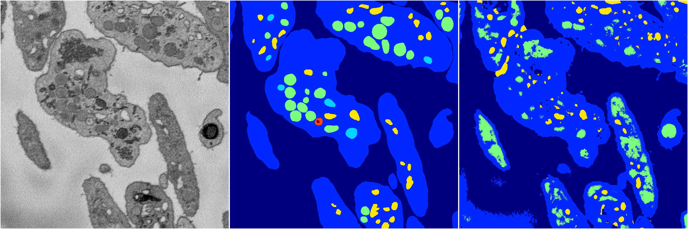
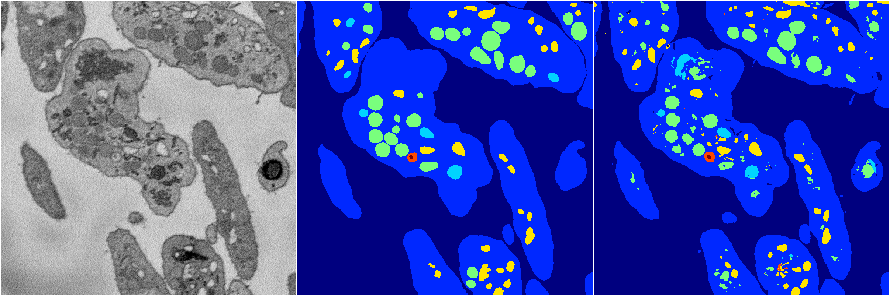
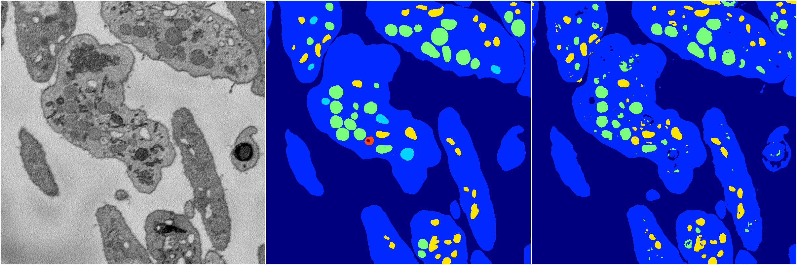
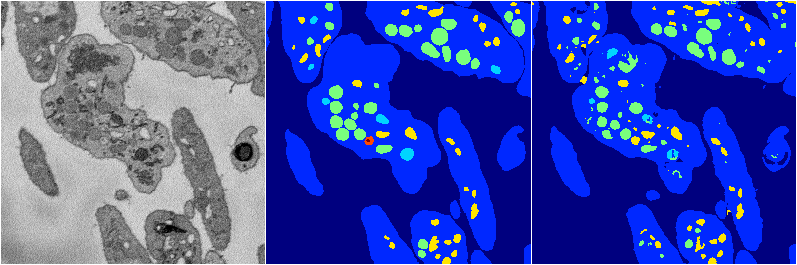

[Back](..)&nbsp;&nbsp;&nbsp;&nbsp;&nbsp;[Home](https://leapmanlab.github.io/snapshots)

---

<a href="3"><h2>random_2d_ed / 1210 / 78 / 3</h2></a>
Created 16 Dec 2018, 10:15:15

<i>Click for more details</i>

**ari**: 0.8127. **miou**: 0.5532. **accuracy**: 0.9292. **n_params**: 35358173.0000. 

---

<a href="4"><h2>random_2d_ed / 1210 / 78 / 4</h2></a>
Created 16 Dec 2018, 10:15:15

<i>Click for more details</i>

**ari**: 0.6568. **miou**: 0.2937. **accuracy**: 0.8434. **n_params**: 35358173.0000. 

---

<a href="2"><h2>random_2d_ed / 1210 / 78 / 2</h2></a>
Created 16 Dec 2018, 10:15:15

<i>Click for more details</i>

**ari**: 0.8063. **miou**: 0.5528. **accuracy**: 0.9261. **n_params**: 35358173.0000. 

---

<a href="0"><h2>random_2d_ed / 1210 / 78 / 0</h2></a>
Created 16 Dec 2018, 10:15:15

<i>Click for more details</i>

**ari**: 0.8033. **miou**: 0.4094. **accuracy**: 0.9248. **n_params**: 35358173.0000. 

---

<a href="1"><h2>random_2d_ed / 1210 / 78 / 1</h2></a>
Created 16 Dec 2018, 10:15:15

<i>Click for more details</i>

**ari**: 0.8061. **miou**: 0.5011. **accuracy**: 0.9267. **n_params**: 35358173.0000. 

---

[Back](..)&nbsp;&nbsp;&nbsp;&nbsp;&nbsp;[Home](https://leapmanlab.github.io/snapshots)

---