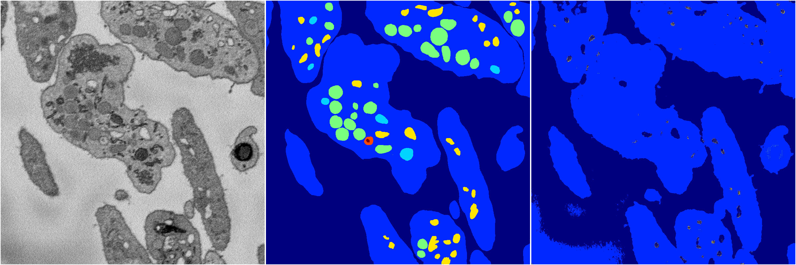
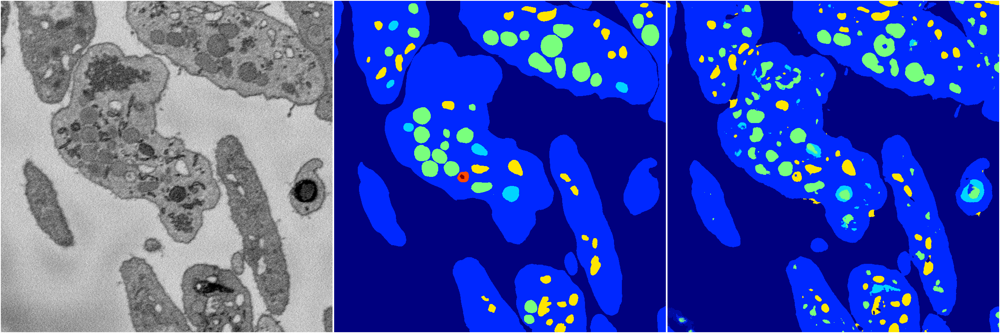

[Back](..)&nbsp;&nbsp;&nbsp;&nbsp;&nbsp;[Home](https://leapmanlab.github.io/snapshots)

---

<a href="1"><h2>random_2d_ed / 1210 / 79 / 1</h2></a>
Created 21 Dec 2018, 01:15:55

<i>Click for more details</i>

**ari**: 0.6425. **miou**: 0.2402. **accuracy**: 0.8671. **n_params**: 1154929.0000. 

---

<a href="4"><h2>random_2d_ed / 1210 / 79 / 4</h2></a>
Created 21 Dec 2018, 01:15:55

<i>Click for more details</i>

**ari**: 0.7876. **miou**: 0.4422. **accuracy**: 0.9115. **n_params**: 1154929.0000. 

---

<a href="2"><h2>random_2d_ed / 1210 / 79 / 2</h2></a>
Created 21 Dec 2018, 01:15:55

<i>Click for more details</i>

**ari**: 0.7743. **miou**: 0.4706. **accuracy**: 0.9049. **n_params**: 1154929.0000. 

---

<a href="0"><h2>random_2d_ed / 1210 / 79 / 0</h2></a>
Created 21 Dec 2018, 01:15:55

<i>Click for more details</i>

**ari**: 0.7914. **miou**: 0.4812. **accuracy**: 0.9135. **n_params**: 1154929.0000. 

---

<a href="3"><h2>random_2d_ed / 1210 / 79 / 3</h2></a>
Created 21 Dec 2018, 01:15:55

<i>Click for more details</i>

**ari**: 0.7523. **miou**: 0.5071. **accuracy**: 0.8924. **n_params**: 1154929.0000. 

---

[Back](..)&nbsp;&nbsp;&nbsp;&nbsp;&nbsp;[Home](https://leapmanlab.github.io/snapshots)

---