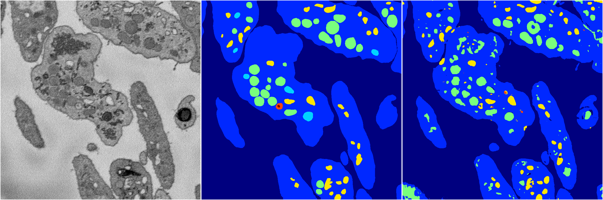
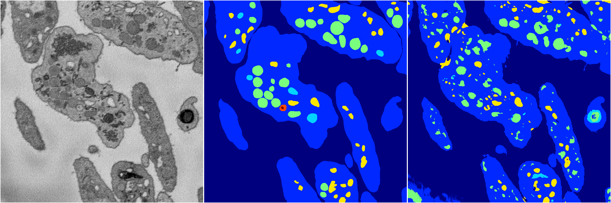
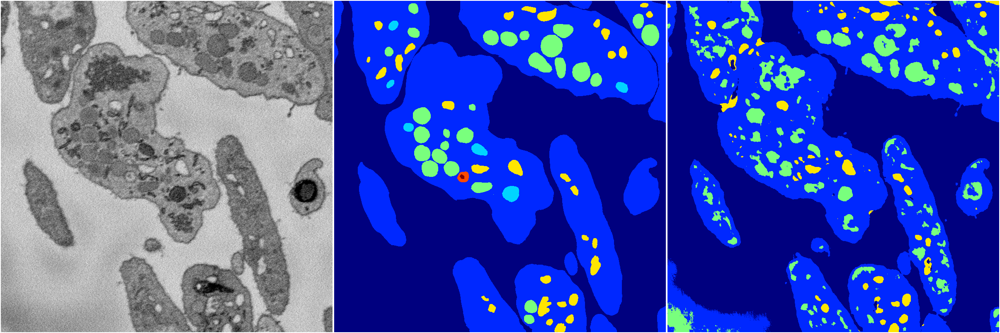
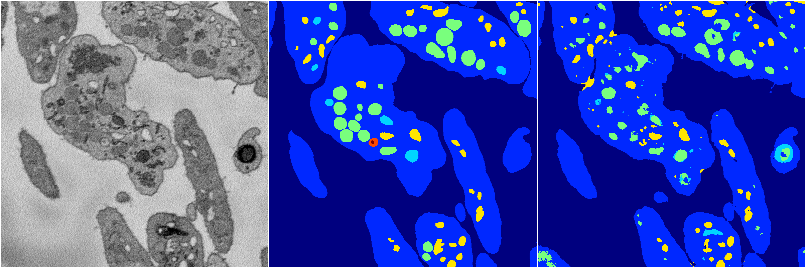
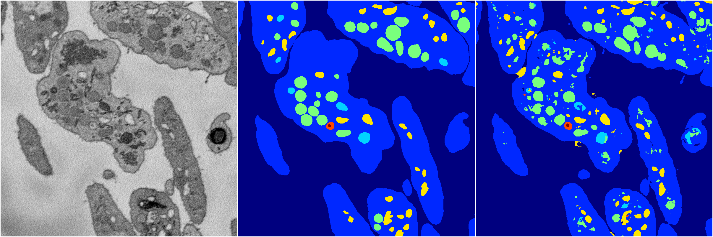

[Back](..)&nbsp;&nbsp;&nbsp;&nbsp;&nbsp;[Home](https://leapmanlab.github.io/snapshots)

---

<a href="4"><h2>random_2d_ed / 1210 / 8 / 4</h2></a>
Created 17 Dec 2018, 02:57:32

<i>Click for more details</i>

**ari**: 0.7810. **miou**: 0.4078. **accuracy**: 0.9045. **n_params**: 8785339.0000. 

---

<a href="3"><h2>random_2d_ed / 1210 / 8 / 3</h2></a>
Created 17 Dec 2018, 02:57:32

<i>Click for more details</i>

**ari**: 0.7467. **miou**: 0.3692. **accuracy**: 0.8888. **n_params**: 8785339.0000. 

---

<a href="2"><h2>random_2d_ed / 1210 / 8 / 2</h2></a>
Created 17 Dec 2018, 02:57:32

<i>Click for more details</i>

**ari**: 0.7145. **miou**: 0.3524. **accuracy**: 0.8754. **n_params**: 8785339.0000. 

---

<a href="1"><h2>random_2d_ed / 1210 / 8 / 1</h2></a>
Created 17 Dec 2018, 02:57:32

<i>Click for more details</i>

**ari**: 0.7798. **miou**: 0.3958. **accuracy**: 0.9050. **n_params**: 8785339.0000. 

---

<a href="0"><h2>random_2d_ed / 1210 / 8 / 0</h2></a>
Created 17 Dec 2018, 02:57:32

<i>Click for more details</i>

**ari**: 0.7839. **miou**: 0.5500. **accuracy**: 0.9127. **n_params**: 8785339.0000. 

---

[Back](..)&nbsp;&nbsp;&nbsp;&nbsp;&nbsp;[Home](https://leapmanlab.github.io/snapshots)

---