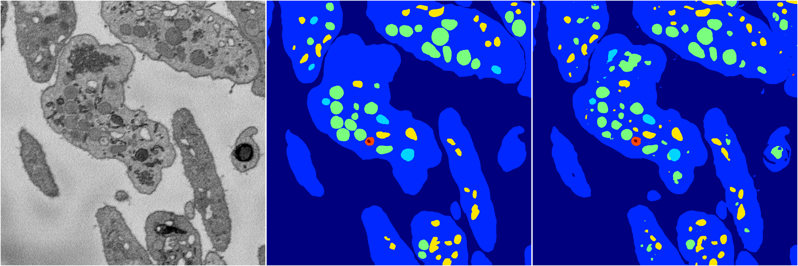
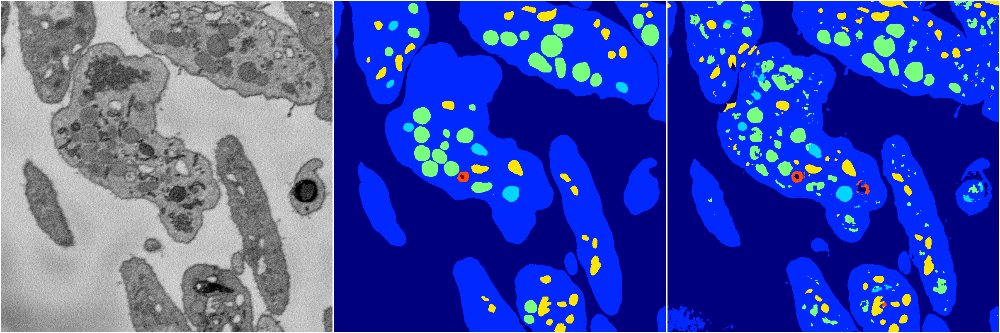
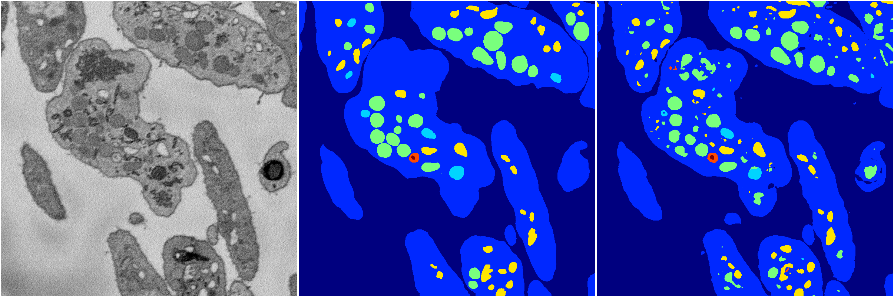
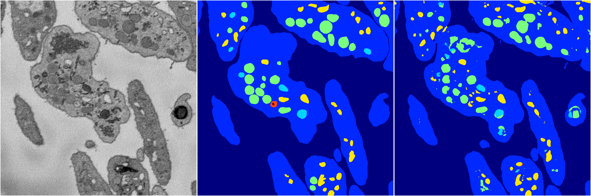
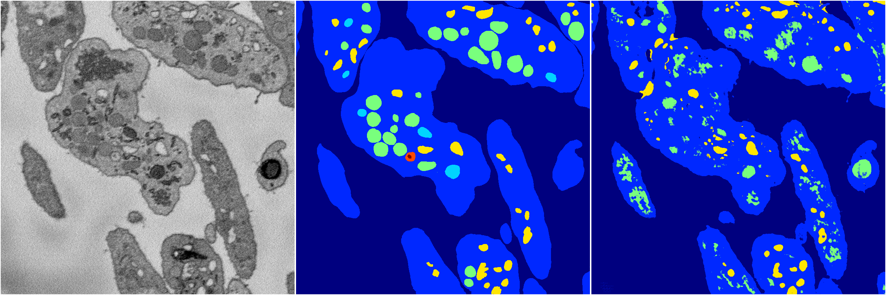

[Back](..)&nbsp;&nbsp;&nbsp;&nbsp;&nbsp;[Home](https://leapmanlab.github.io/snapshots)

---

<a href="0"><h2>random_2d_ed / 1210 / 80 / 0</h2></a>
Created 21 Dec 2018, 01:15:55

<i>Click for more details</i>

**ari**: 0.8238. **miou**: 0.5683. **accuracy**: 0.9316. **n_params**: 9291678.0000. 

---

<a href="3"><h2>random_2d_ed / 1210 / 80 / 3</h2></a>
Created 21 Dec 2018, 01:15:55

<i>Click for more details</i>

**ari**: 0.7999. **miou**: 0.4799. **accuracy**: 0.9186. **n_params**: 9291678.0000. 

---

<a href="1"><h2>random_2d_ed / 1210 / 80 / 1</h2></a>
Created 21 Dec 2018, 01:15:55

<i>Click for more details</i>

**ari**: 0.8094. **miou**: 0.5519. **accuracy**: 0.9254. **n_params**: 9291678.0000. 

---

<a href="4"><h2>random_2d_ed / 1210 / 80 / 4</h2></a>
Created 21 Dec 2018, 01:15:55

<i>Click for more details</i>

**ari**: 0.8240. **miou**: 0.4706. **accuracy**: 0.9296. **n_params**: 9291678.0000. 

---

<a href="2"><h2>random_2d_ed / 1210 / 80 / 2</h2></a>
Created 21 Dec 2018, 01:15:55

<i>Click for more details</i>

**ari**: 0.7591. **miou**: 0.3397. **accuracy**: 0.8930. **n_params**: 9291678.0000. 

---

[Back](..)&nbsp;&nbsp;&nbsp;&nbsp;&nbsp;[Home](https://leapmanlab.github.io/snapshots)

---