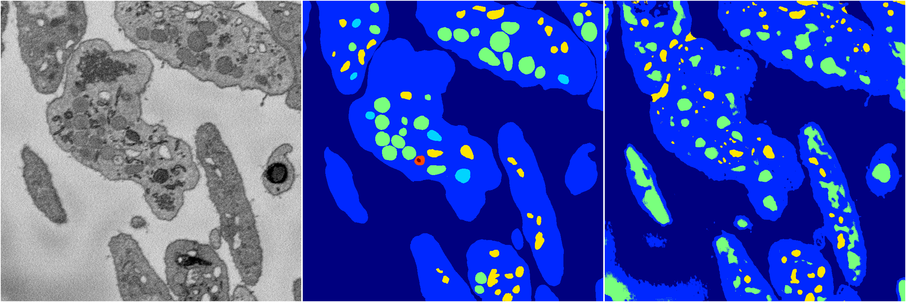
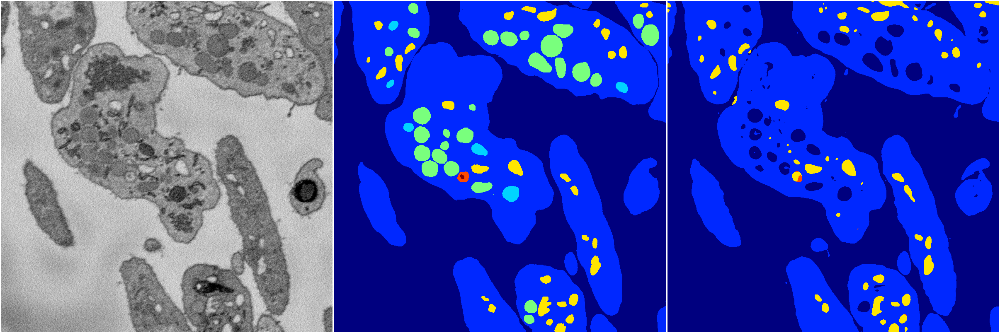
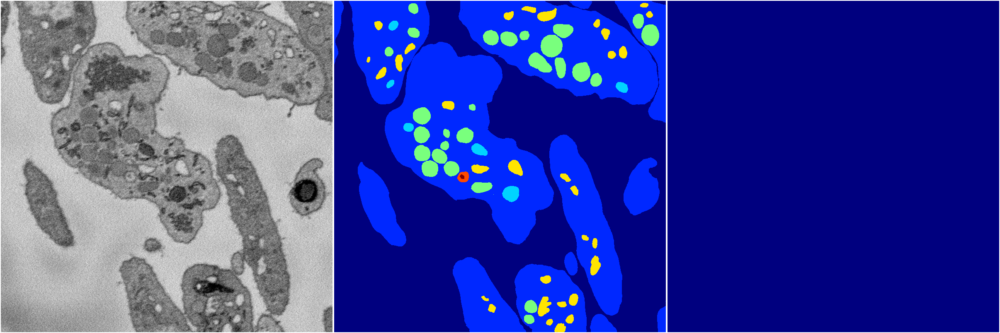
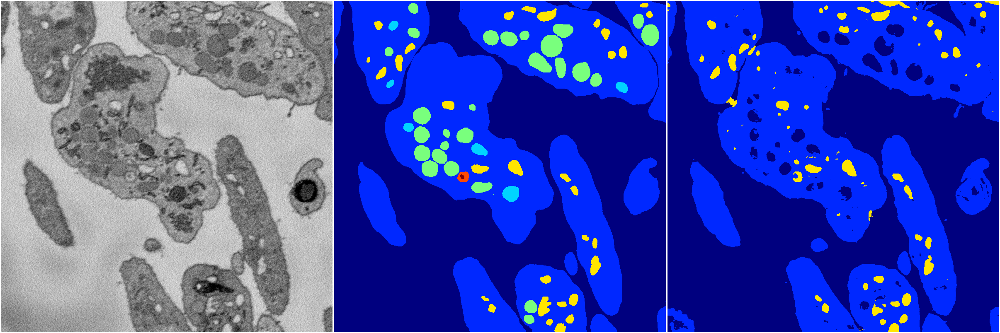

[Back](..)&nbsp;&nbsp;&nbsp;&nbsp;&nbsp;[Home](https://leapmanlab.github.io/snapshots)

---

<a href="3"><h2>random_2d_ed / 1210 / 81 / 3</h2></a>
Created 17 Dec 2018, 02:57:35

<i>Click for more details</i>

**ari**: 0.6770. **miou**: 0.3233. **accuracy**: 0.8591. **n_params**: 21764125.0000. 

---

<a href="4"><h2>random_2d_ed / 1210 / 81 / 4</h2></a>
Created 17 Dec 2018, 02:57:35

<i>Click for more details</i>

**ari**: 0.7860. **miou**: 0.3727. **accuracy**: 0.9179. **n_params**: 21764125.0000. 

---

<a href="2"><h2>random_2d_ed / 1210 / 81 / 2</h2></a>
Created 17 Dec 2018, 02:57:35

<i>Click for more details</i>

**ari**: 0.0000. **miou**: 0.0694. **accuracy**: 0.4859. **n_params**: 21764125.0000. 

---

<a href="1"><h2>random_2d_ed / 1210 / 81 / 1</h2></a>
Created 17 Dec 2018, 02:57:35

<i>Click for more details</i>

**ari**: 0.8157. **miou**: 0.4205. **accuracy**: 0.9265. **n_params**: 21764125.0000. 

---

<a href="0"><h2>random_2d_ed / 1210 / 81 / 0</h2></a>
Created 17 Dec 2018, 02:57:35

<i>Click for more details</i>

**ari**: 0.7819. **miou**: 0.3357. **accuracy**: 0.9177. **n_params**: 21764125.0000. 

---

[Back](..)&nbsp;&nbsp;&nbsp;&nbsp;&nbsp;[Home](https://leapmanlab.github.io/snapshots)

---