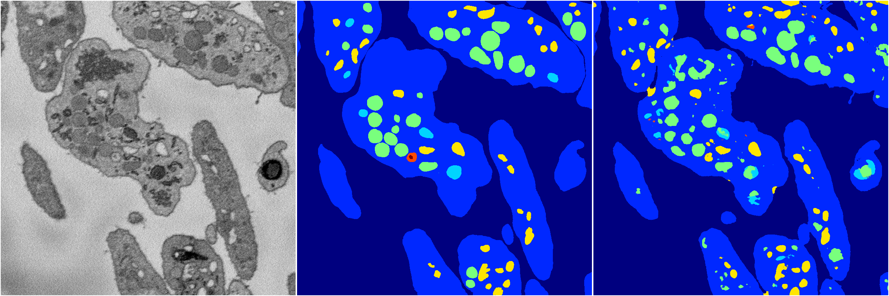
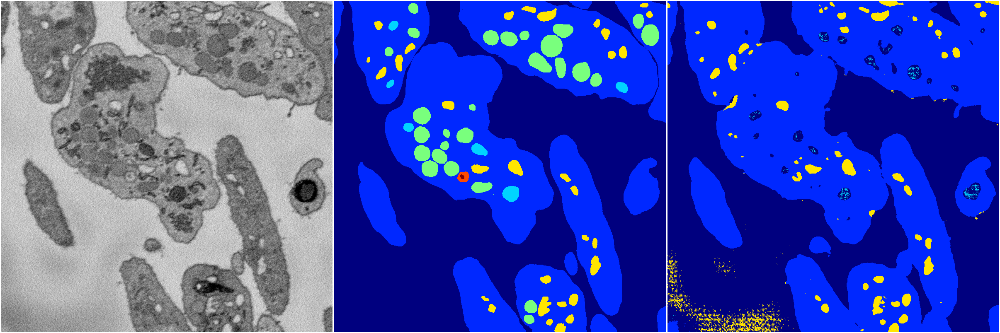
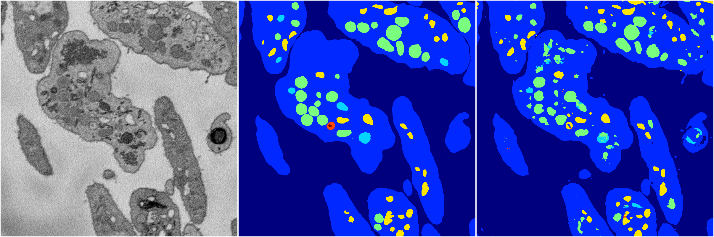
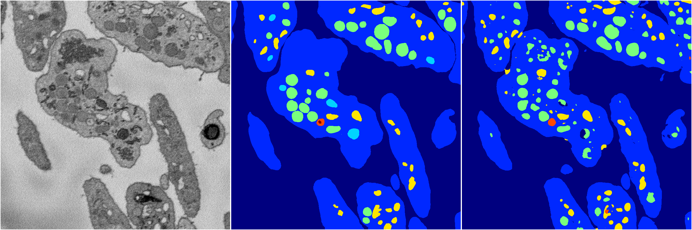

[Back](..)&nbsp;&nbsp;&nbsp;&nbsp;&nbsp;[Home](https://leapmanlab.github.io/snapshots)

---

<a href="4"><h2>random_2d_ed / 1210 / 82 / 4</h2></a>
Created 16 Dec 2018, 10:15:16

<i>Click for more details</i>

**ari**: 0.7946. **miou**: 0.4530. **accuracy**: 0.9134. **n_params**: 2127827.0000. 

---

<a href="2"><h2>random_2d_ed / 1210 / 82 / 2</h2></a>
Created 16 Dec 2018, 10:15:16

<i>Click for more details</i>

**ari**: 0.7685. **miou**: 0.5241. **accuracy**: 0.8991. **n_params**: 2127827.0000. 

---

<a href="3"><h2>random_2d_ed / 1210 / 82 / 3</h2></a>
Created 16 Dec 2018, 10:15:16

<i>Click for more details</i>

**ari**: 0.6771. **miou**: 0.3213. **accuracy**: 0.8815. **n_params**: 2127827.0000. 

---

<a href="1"><h2>random_2d_ed / 1210 / 82 / 1</h2></a>
Created 16 Dec 2018, 10:15:16

<i>Click for more details</i>

**ari**: 0.8139. **miou**: 0.5024. **accuracy**: 0.9264. **n_params**: 2127827.0000. 

---

<a href="0"><h2>random_2d_ed / 1210 / 82 / 0</h2></a>
Created 16 Dec 2018, 10:15:16

<i>Click for more details</i>

**ari**: 0.7959. **miou**: 0.4369. **accuracy**: 0.9143. **n_params**: 2127827.0000. 

---

[Back](..)&nbsp;&nbsp;&nbsp;&nbsp;&nbsp;[Home](https://leapmanlab.github.io/snapshots)

---