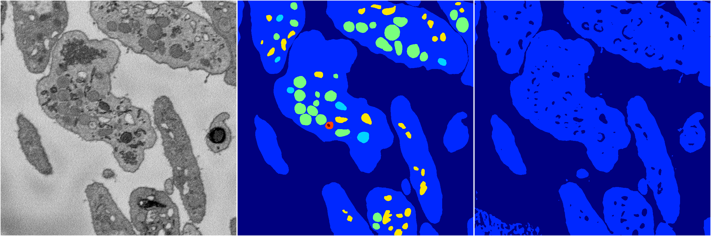
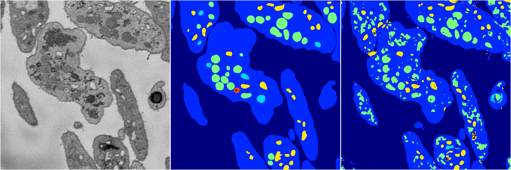
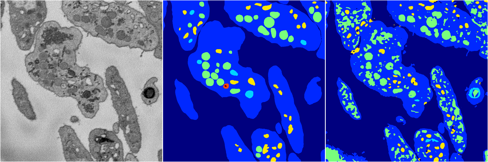
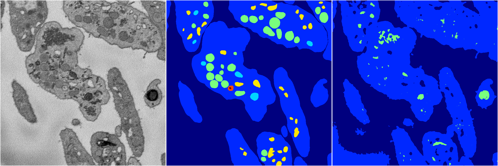
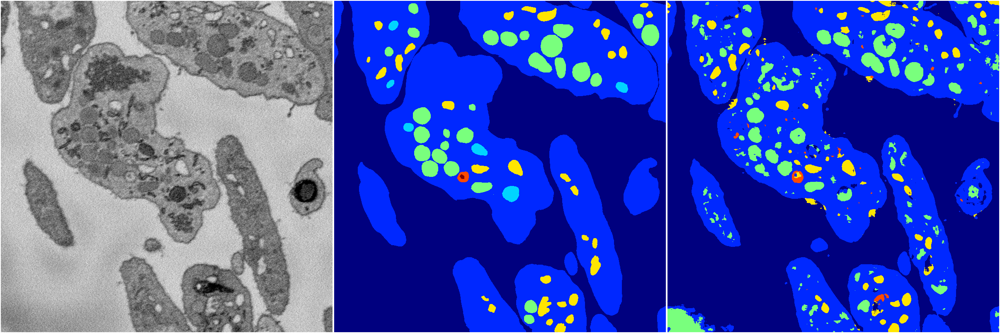

[Back](..)&nbsp;&nbsp;&nbsp;&nbsp;&nbsp;[Home](https://leapmanlab.github.io/snapshots)

---

<a href="4"><h2>random_2d_ed / 1210 / 83 / 4</h2></a>
Created 14 Dec 2018, 11:38:30

<i>Click for more details</i>

**ari**: 0.7200. **miou**: 0.2457. **accuracy**: 0.8871. **n_params**: 1211171.0000. 

---

<a href="1"><h2>random_2d_ed / 1210 / 83 / 1</h2></a>
Created 14 Dec 2018, 11:38:30

<i>Click for more details</i>

**ari**: 0.7331. **miou**: 0.3804. **accuracy**: 0.8775. **n_params**: 1211171.0000. 

---

<a href="3"><h2>random_2d_ed / 1210 / 83 / 3</h2></a>
Created 14 Dec 2018, 11:38:30

<i>Click for more details</i>

**ari**: 0.6894. **miou**: 0.3582. **accuracy**: 0.8520. **n_params**: 1211171.0000. 

---

<a href="2"><h2>random_2d_ed / 1210 / 83 / 2</h2></a>
Created 14 Dec 2018, 11:38:30

<i>Click for more details</i>

**ari**: 0.6470. **miou**: 0.2439. **accuracy**: 0.8564. **n_params**: 1211171.0000. 

---

<a href="0"><h2>random_2d_ed / 1210 / 83 / 0</h2></a>
Created 14 Dec 2018, 11:38:30

<i>Click for more details</i>

**ari**: 0.7600. **miou**: 0.4033. **accuracy**: 0.8972. **n_params**: 1211171.0000. 

---

[Back](..)&nbsp;&nbsp;&nbsp;&nbsp;&nbsp;[Home](https://leapmanlab.github.io/snapshots)

---