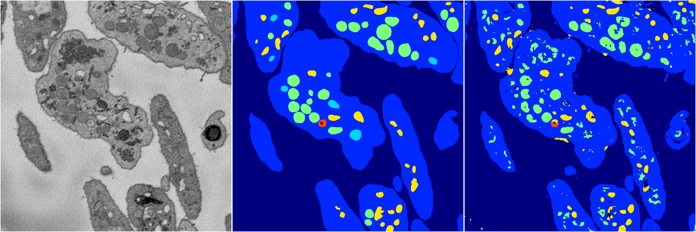
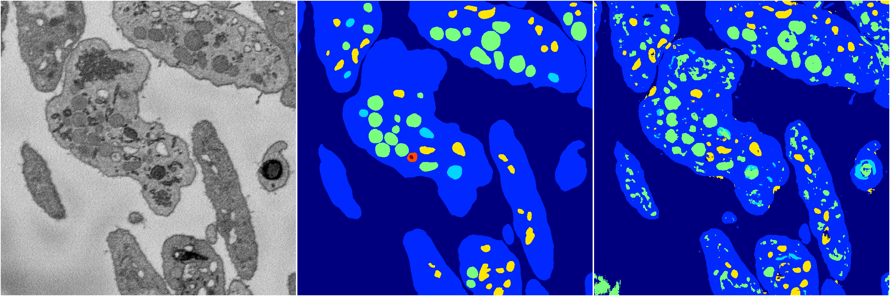
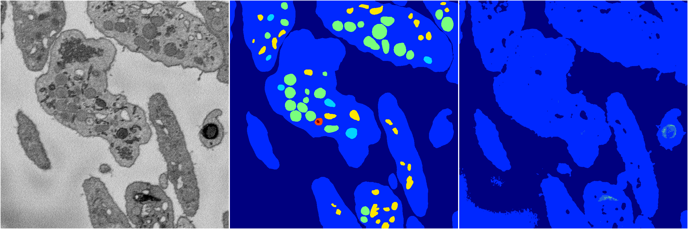

[Back](..)&nbsp;&nbsp;&nbsp;&nbsp;&nbsp;[Home](https://leapmanlab.github.io/snapshots)

---

<a href="4"><h2>random_2d_ed / 1210 / 84 / 4</h2></a>
Created 21 Dec 2018, 14:17:39

<i>Click for more details</i>

**ari**: 0.7611. **miou**: 0.4079. **accuracy**: 0.8976. **n_params**: 638789.0000. 

---

<a href="3"><h2>random_2d_ed / 1210 / 84 / 3</h2></a>
Created 21 Dec 2018, 14:17:39

<i>Click for more details</i>

**ari**: 0.7487. **miou**: 0.4428. **accuracy**: 0.8879. **n_params**: 638789.0000. 

---

<a href="1"><h2>random_2d_ed / 1210 / 84 / 1</h2></a>
Created 21 Dec 2018, 14:17:39

<i>Click for more details</i>

**ari**: 0.6401. **miou**: 0.2357. **accuracy**: 0.8650. **n_params**: 638789.0000. 

---

<a href="2"><h2>random_2d_ed / 1210 / 84 / 2</h2></a>
Created 21 Dec 2018, 14:17:39

<i>Click for more details</i>

**ari**: 0.6479. **miou**: 0.2365. **accuracy**: 0.8672. **n_params**: 638789.0000. 

---

<a href="0"><h2>random_2d_ed / 1210 / 84 / 0</h2></a>
Created 21 Dec 2018, 14:17:39

<i>Click for more details</i>

**ari**: 0.7563. **miou**: 0.3911. **accuracy**: 0.8888. **n_params**: 638789.0000. 

---

[Back](..)&nbsp;&nbsp;&nbsp;&nbsp;&nbsp;[Home](https://leapmanlab.github.io/snapshots)

---