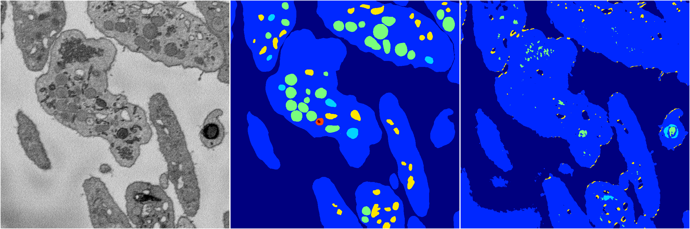
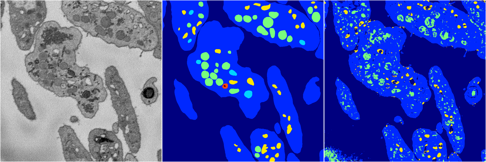
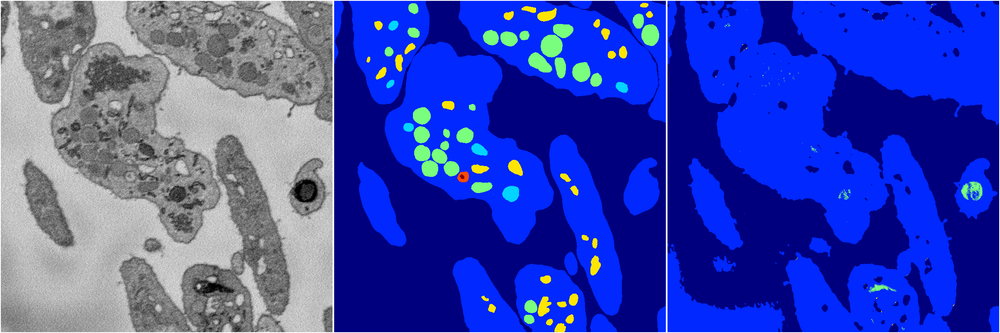

[Back](..)&nbsp;&nbsp;&nbsp;&nbsp;&nbsp;[Home](https://leapmanlab.github.io/snapshots)

---

<a href="0"><h2>random_2d_ed / 1210 / 85 / 0</h2></a>
Created 21 Dec 2018, 01:15:55

<i>Click for more details</i>

**ari**: 0.7112. **miou**: 0.3423. **accuracy**: 0.8763. **n_params**: 985535.0000. 

---

<a href="3"><h2>random_2d_ed / 1210 / 85 / 3</h2></a>
Created 21 Dec 2018, 01:15:55

<i>Click for more details</i>

**ari**: 0.6453. **miou**: 0.2539. **accuracy**: 0.8580. **n_params**: 985535.0000. 

---

<a href="1"><h2>random_2d_ed / 1210 / 85 / 1</h2></a>
Created 21 Dec 2018, 01:15:55

<i>Click for more details</i>

**ari**: 0.7102. **miou**: 0.3457. **accuracy**: 0.8702. **n_params**: 985535.0000. 

---

<a href="4"><h2>random_2d_ed / 1210 / 85 / 4</h2></a>
Created 21 Dec 2018, 01:15:55

<i>Click for more details</i>

**ari**: 0.7042. **miou**: 0.3309. **accuracy**: 0.8692. **n_params**: 985535.0000. 

---

<a href="2"><h2>random_2d_ed / 1210 / 85 / 2</h2></a>
Created 21 Dec 2018, 01:15:55

<i>Click for more details</i>

**ari**: 0.6531. **miou**: 0.2378. **accuracy**: 0.8640. **n_params**: 985535.0000. 

---

[Back](..)&nbsp;&nbsp;&nbsp;&nbsp;&nbsp;[Home](https://leapmanlab.github.io/snapshots)

---