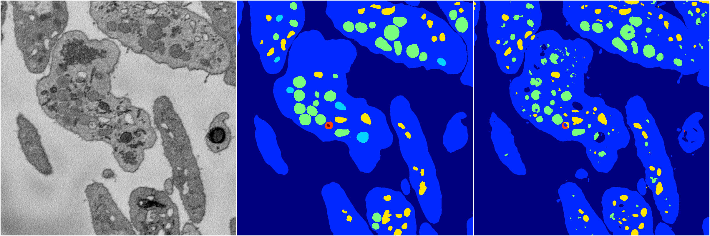
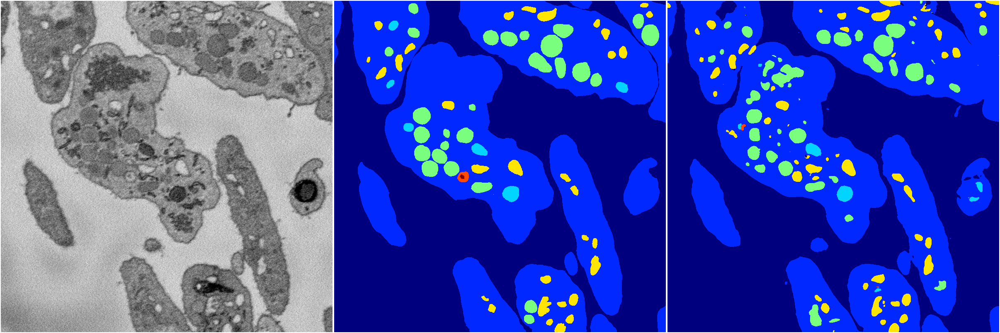
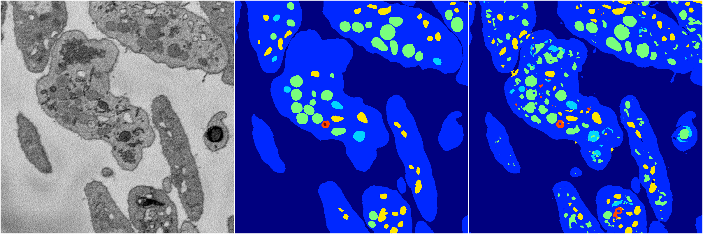

[Back](..)&nbsp;&nbsp;&nbsp;&nbsp;&nbsp;[Home](https://leapmanlab.github.io/snapshots)

---

<a href="3"><h2>random_2d_ed / 1210 / 86 / 3</h2></a>
Created 14 Dec 2018, 11:38:30

<i>Click for more details</i>

**ari**: 0.7887. **miou**: 0.4200. **accuracy**: 0.9126. **n_params**: 14884858.0000. 

---

<a href="4"><h2>random_2d_ed / 1210 / 86 / 4</h2></a>
Created 14 Dec 2018, 11:38:30

<i>Click for more details</i>

**ari**: 0.8007. **miou**: 0.5341. **accuracy**: 0.9196. **n_params**: 14884858.0000. 

---

<a href="2"><h2>random_2d_ed / 1210 / 86 / 2</h2></a>
Created 14 Dec 2018, 11:38:30

<i>Click for more details</i>

**ari**: 0.8025. **miou**: 0.4257. **accuracy**: 0.9213. **n_params**: 14884858.0000. 

---

<a href="1"><h2>random_2d_ed / 1210 / 86 / 1</h2></a>
Created 14 Dec 2018, 11:38:30

<i>Click for more details</i>

**ari**: 0.8061. **miou**: 0.4617. **accuracy**: 0.9229. **n_params**: 14884858.0000. 

---

<a href="0"><h2>random_2d_ed / 1210 / 86 / 0</h2></a>
Created 14 Dec 2018, 11:38:30

<i>Click for more details</i>

**ari**: 0.7911. **miou**: 0.4738. **accuracy**: 0.9104. **n_params**: 14884858.0000. 

---

[Back](..)&nbsp;&nbsp;&nbsp;&nbsp;&nbsp;[Home](https://leapmanlab.github.io/snapshots)

---