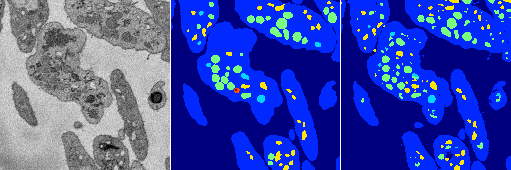
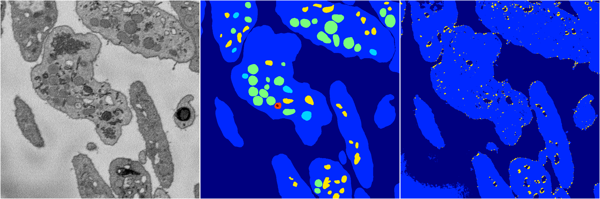
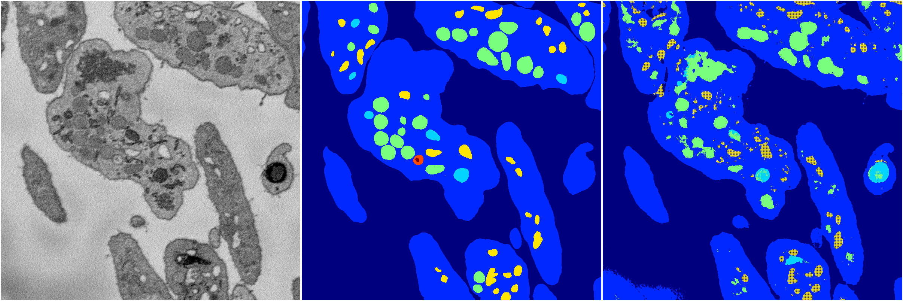
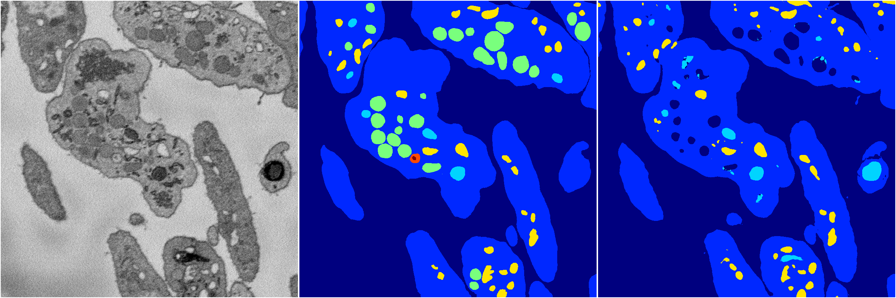
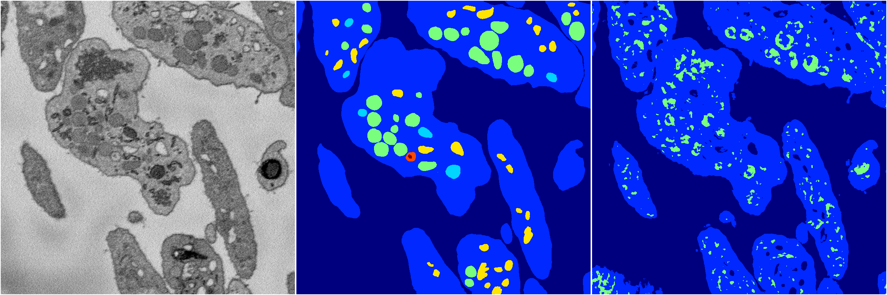

[Back](..)&nbsp;&nbsp;&nbsp;&nbsp;&nbsp;[Home](https://leapmanlab.github.io/snapshots)

---

<a href="4"><h2>random_2d_ed / 1210 / 87 / 4</h2></a>
Created 14 Dec 2018, 11:38:30

<i>Click for more details</i>

**ari**: 0.8070. **miou**: 0.4469. **accuracy**: 0.9226. **n_params**: 81117998.0000. 

---

<a href="3"><h2>random_2d_ed / 1210 / 87 / 3</h2></a>
Created 14 Dec 2018, 11:38:30

<i>Click for more details</i>

**ari**: 0.7043. **miou**: 0.2647. **accuracy**: 0.8872. **n_params**: 81117998.0000. 

---

<a href="1"><h2>random_2d_ed / 1210 / 87 / 1</h2></a>
Created 14 Dec 2018, 11:38:30

<i>Click for more details</i>

**ari**: 0.7556. **miou**: 0.3845. **accuracy**: 0.8983. **n_params**: 81117998.0000. 

---

<a href="2"><h2>random_2d_ed / 1210 / 87 / 2</h2></a>
Created 14 Dec 2018, 11:38:30

<i>Click for more details</i>

**ari**: 0.7952. **miou**: 0.4021. **accuracy**: 0.9199. **n_params**: 81117998.0000. 

---

<a href="0"><h2>random_2d_ed / 1210 / 87 / 0</h2></a>
Created 14 Dec 2018, 11:38:30

<i>Click for more details</i>

**ari**: 0.7208. **miou**: 0.2710. **accuracy**: 0.8815. **n_params**: 81117998.0000. 

---

[Back](..)&nbsp;&nbsp;&nbsp;&nbsp;&nbsp;[Home](https://leapmanlab.github.io/snapshots)

---