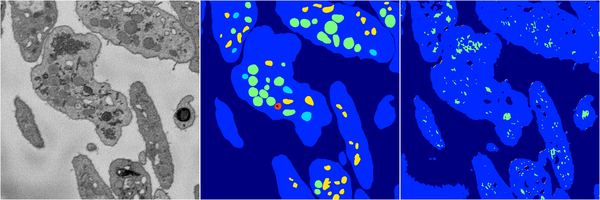
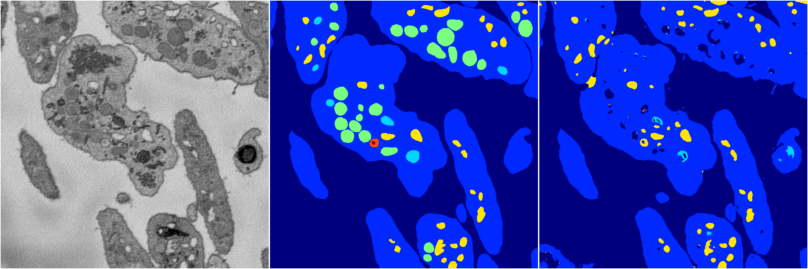
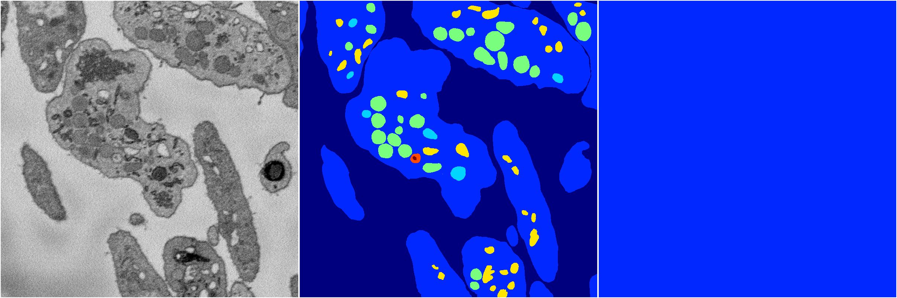
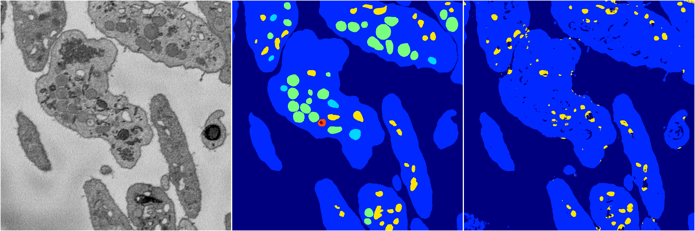

[Back](..)&nbsp;&nbsp;&nbsp;&nbsp;&nbsp;[Home](https://leapmanlab.github.io/snapshots)

---

<a href="4"><h2>random_2d_ed / 1210 / 88 / 4</h2></a>
Created 21 Dec 2018, 14:17:40

<i>Click for more details</i>

**ari**: 0.7873. **miou**: 0.3830. **accuracy**: 0.9157. **n_params**: 79628551.0000. 

---

<a href="3"><h2>random_2d_ed / 1210 / 88 / 3</h2></a>
Created 21 Dec 2018, 14:17:40

<i>Click for more details</i>

**ari**: 0.6800. **miou**: 0.2532. **accuracy**: 0.8781. **n_params**: 79628551.0000. 

---

<a href="1"><h2>random_2d_ed / 1210 / 88 / 1</h2></a>
Created 21 Dec 2018, 14:17:40

<i>Click for more details</i>

**ari**: 0.7779. **miou**: 0.3657. **accuracy**: 0.9198. **n_params**: 79628551.0000. 

---

<a href="2"><h2>random_2d_ed / 1210 / 88 / 2</h2></a>
Created 21 Dec 2018, 14:17:40

<i>Click for more details</i>

**ari**: -0.0000. **miou**: 0.0656. **accuracy**: 0.4594. **n_params**: 79628551.0000. 

---

<a href="0"><h2>random_2d_ed / 1210 / 88 / 0</h2></a>
Created 21 Dec 2018, 14:17:40

<i>Click for more details</i>

**ari**: 0.7504. **miou**: 0.3134. **accuracy**: 0.9108. **n_params**: 79628551.0000. 

---

[Back](..)&nbsp;&nbsp;&nbsp;&nbsp;&nbsp;[Home](https://leapmanlab.github.io/snapshots)

---