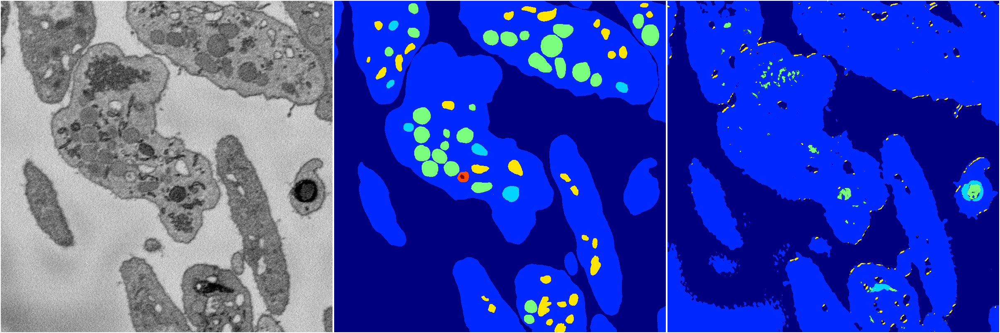
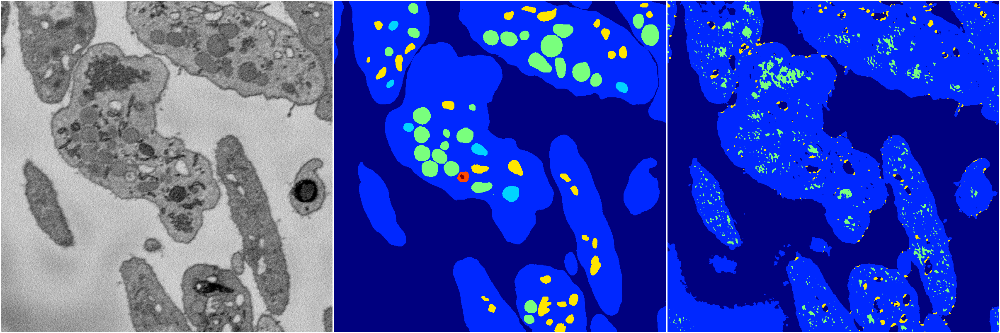
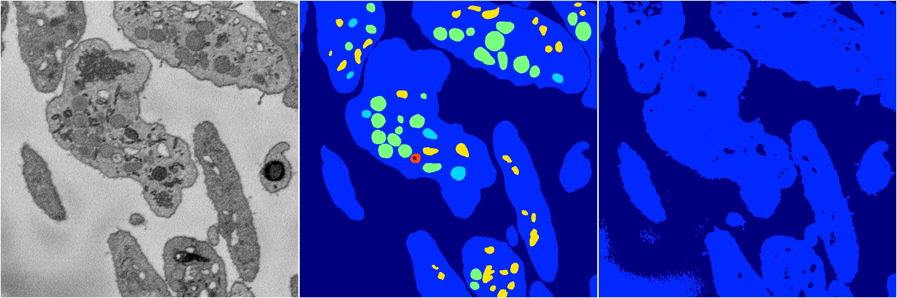

[Back](..)&nbsp;&nbsp;&nbsp;&nbsp;&nbsp;[Home](https://leapmanlab.github.io/snapshots)

---

<a href="4"><h2>random_2d_ed / 1210 / 89 / 4</h2></a>
Created 21 Dec 2018, 14:17:40

<i>Click for more details</i>

**ari**: 0.6354. **miou**: 0.2436. **accuracy**: 0.8528. **n_params**: 291979.0000. 

---

<a href="3"><h2>random_2d_ed / 1210 / 89 / 3</h2></a>
Created 21 Dec 2018, 14:17:40

<i>Click for more details</i>

**ari**: 0.6459. **miou**: 0.2696. **accuracy**: 0.8508. **n_params**: 291979.0000. 

---

<a href="2"><h2>random_2d_ed / 1210 / 89 / 2</h2></a>
Created 21 Dec 2018, 14:17:40

<i>Click for more details</i>

**ari**: 0.6738. **miou**: 0.2909. **accuracy**: 0.8647. **n_params**: 291979.0000. 

---

<a href="1"><h2>random_2d_ed / 1210 / 89 / 1</h2></a>
Created 21 Dec 2018, 14:17:40

<i>Click for more details</i>

**ari**: 0.6325. **miou**: 0.2351. **accuracy**: 0.8619. **n_params**: 291979.0000. 

---

<a href="0"><h2>random_2d_ed / 1210 / 89 / 0</h2></a>
Created 21 Dec 2018, 14:17:40

<i>Click for more details</i>

**ari**: 0.6307. **miou**: 0.2348. **accuracy**: 0.8612. **n_params**: 291979.0000. 

---

[Back](..)&nbsp;&nbsp;&nbsp;&nbsp;&nbsp;[Home](https://leapmanlab.github.io/snapshots)

---