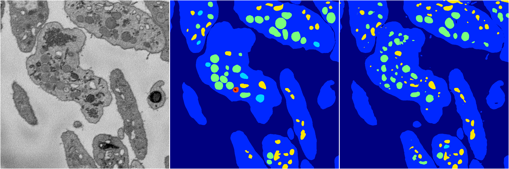
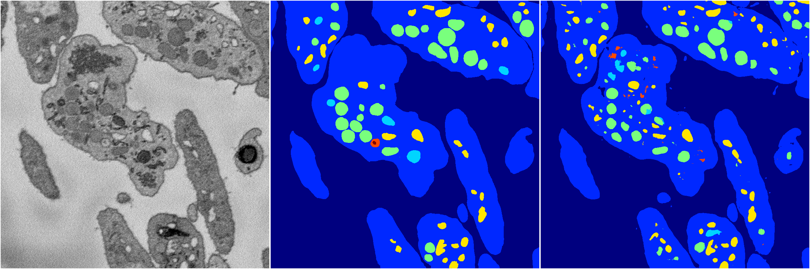
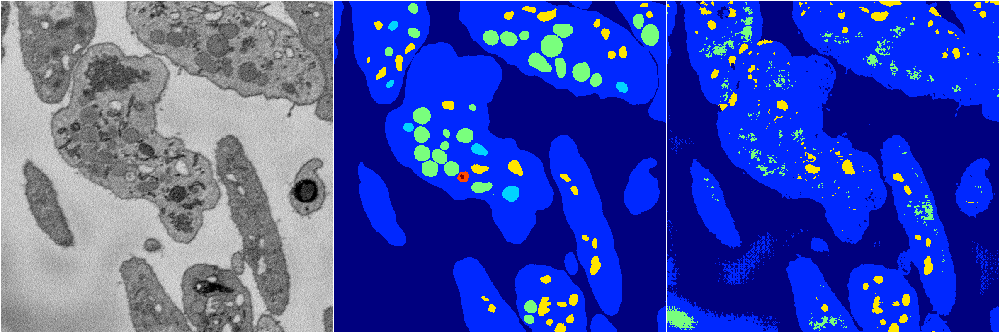
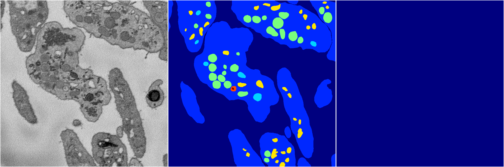
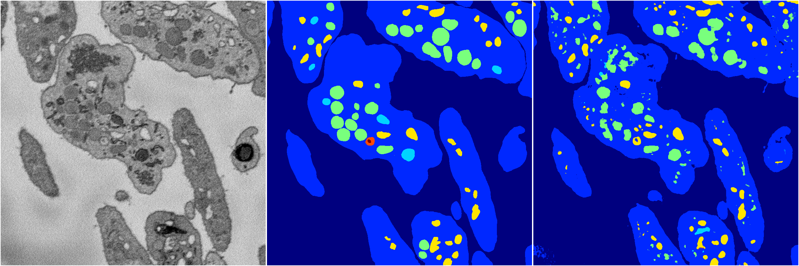

[Back](..)&nbsp;&nbsp;&nbsp;&nbsp;&nbsp;[Home](https://leapmanlab.github.io/snapshots)

---

<a href="4"><h2>random_2d_ed / 1210 / 9 / 4</h2></a>
Created 13 Dec 2018, 16:45:47

<i>Click for more details</i>

**ari**: 0.7915. **miou**: 0.4280. **accuracy**: 0.9293. **n_params**: 167629255.0000. 

---

<a href="2"><h2>random_2d_ed / 1210 / 9 / 2</h2></a>
Created 13 Dec 2018, 16:45:47

<i>Click for more details</i>

**ari**: 0.7793. **miou**: 0.4328. **accuracy**: 0.9231. **n_params**: 167629255.0000. 

---

<a href="3"><h2>random_2d_ed / 1210 / 9 / 3</h2></a>
Created 13 Dec 2018, 16:45:47

<i>Click for more details</i>

**ari**: 0.6687. **miou**: 0.3295. **accuracy**: 0.8850. **n_params**: 167629255.0000. 

---

<a href="1"><h2>random_2d_ed / 1210 / 9 / 1</h2></a>
Created 13 Dec 2018, 16:45:47

<i>Click for more details</i>

**ari**: 0.0174. **miou**: 0.0668. **accuracy**: 0.4676. **n_params**: 167629255.0000. 

---

<a href="0"><h2>random_2d_ed / 1210 / 9 / 0</h2></a>
Created 13 Dec 2018, 16:45:47

<i>Click for more details</i>

**ari**: 0.7452. **miou**: 0.3852. **accuracy**: 0.9072. **n_params**: 167629255.0000. 

---

[Back](..)&nbsp;&nbsp;&nbsp;&nbsp;&nbsp;[Home](https://leapmanlab.github.io/snapshots)

---