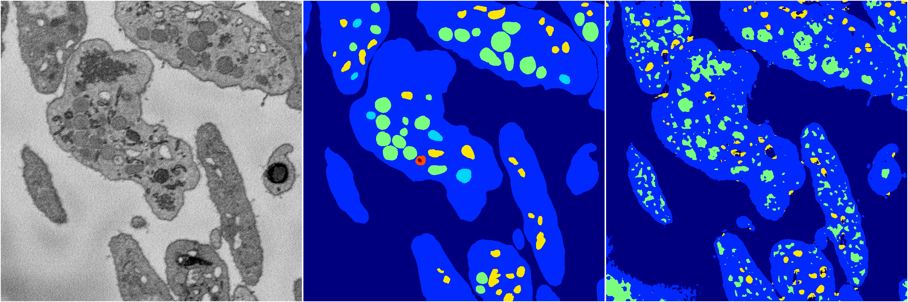
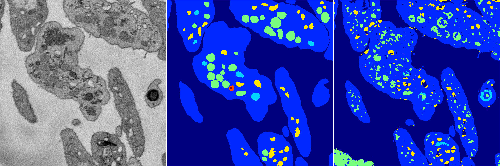
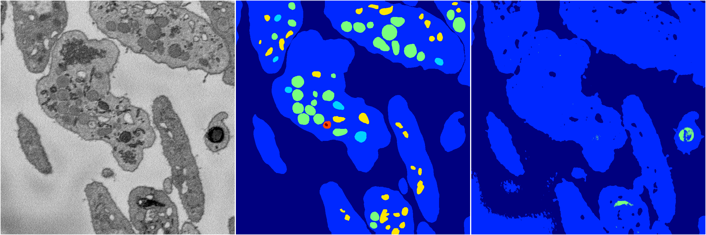
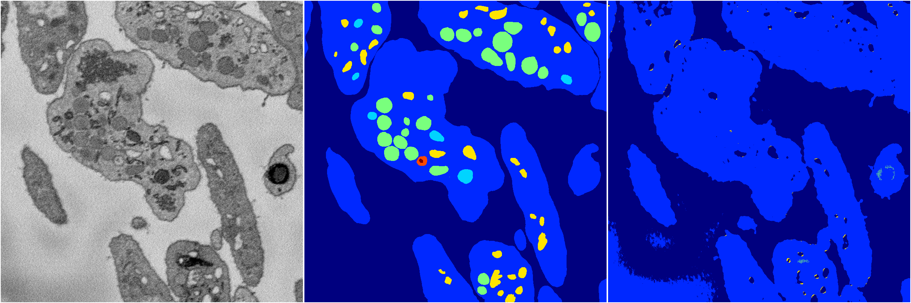

[Back](..)&nbsp;&nbsp;&nbsp;&nbsp;&nbsp;[Home](https://leapmanlab.github.io/snapshots)

---

<a href="1"><h2>random_2d_ed / 1210 / 90 / 1</h2></a>
Created 14 Dec 2018, 11:38:30

<i>Click for more details</i>

**ari**: 0.6992. **miou**: 0.3259. **accuracy**: 0.8634. **n_params**: 436528.0000. 

---

<a href="2"><h2>random_2d_ed / 1210 / 90 / 2</h2></a>
Created 14 Dec 2018, 11:38:30

<i>Click for more details</i>

**ari**: 0.7327. **miou**: 0.3922. **accuracy**: 0.8831. **n_params**: 436528.0000. 

---

<a href="3"><h2>random_2d_ed / 1210 / 90 / 3</h2></a>
Created 14 Dec 2018, 11:38:30

<i>Click for more details</i>

**ari**: 0.6336. **miou**: 0.2349. **accuracy**: 0.8606. **n_params**: 436528.0000. 

---

<a href="4"><h2>random_2d_ed / 1210 / 90 / 4</h2></a>
Created 14 Dec 2018, 11:38:30

<i>Click for more details</i>

**ari**: 0.6409. **miou**: 0.2400. **accuracy**: 0.8640. **n_params**: 436528.0000. 

---

<a href="0"><h2>random_2d_ed / 1210 / 90 / 0</h2></a>
Created 14 Dec 2018, 11:38:30

<i>Click for more details</i>

**ari**: 0.7201. **miou**: 0.4065. **accuracy**: 0.8730. **n_params**: 436528.0000. 

---

[Back](..)&nbsp;&nbsp;&nbsp;&nbsp;&nbsp;[Home](https://leapmanlab.github.io/snapshots)

---