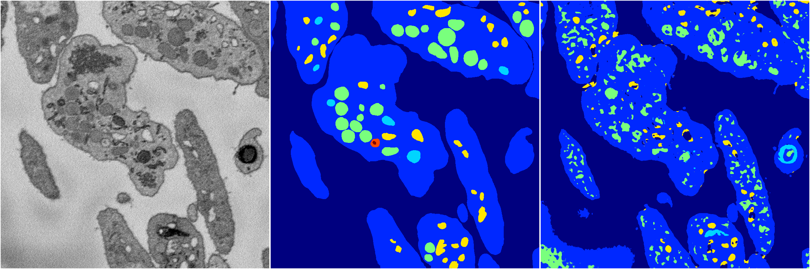
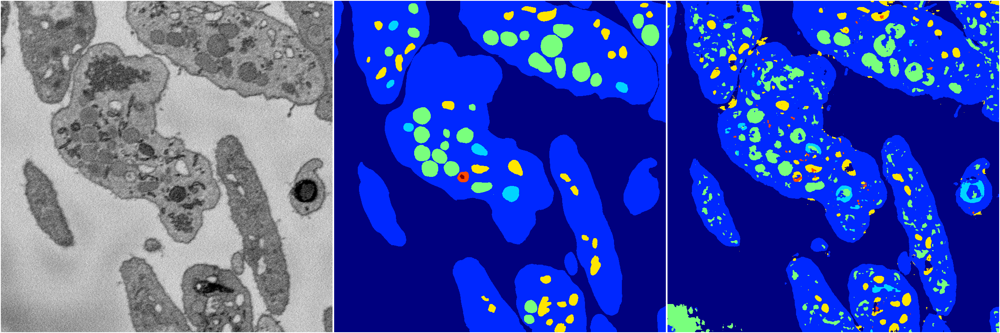
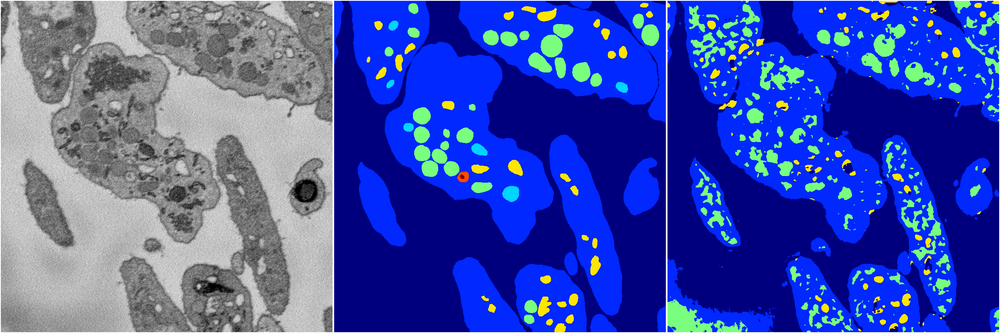
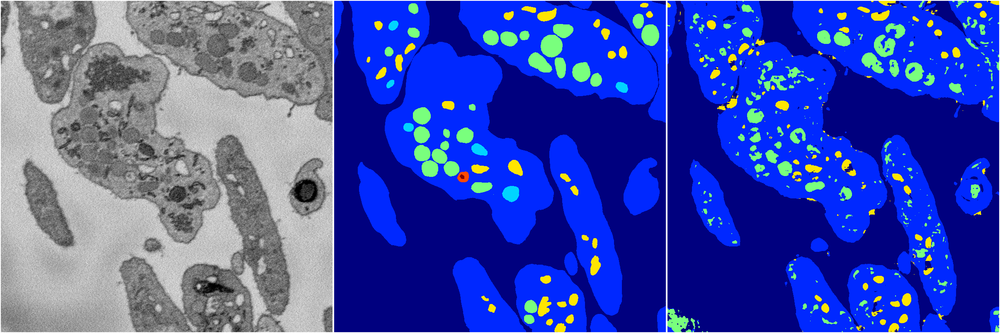

[Back](..)&nbsp;&nbsp;&nbsp;&nbsp;&nbsp;[Home](https://leapmanlab.github.io/snapshots)

---

<a href="2"><h2>random_2d_ed / 1210 / 91 / 2</h2></a>
Created 21 Dec 2018, 14:17:40

<i>Click for more details</i>

**ari**: 0.7212. **miou**: 0.4337. **accuracy**: 0.8733. **n_params**: 1446587.0000. 

---

<a href="4"><h2>random_2d_ed / 1210 / 91 / 4</h2></a>
Created 21 Dec 2018, 14:17:40

<i>Click for more details</i>

**ari**: 0.6839. **miou**: 0.3319. **accuracy**: 0.8628. **n_params**: 1446587.0000. 

---

<a href="3"><h2>random_2d_ed / 1210 / 91 / 3</h2></a>
Created 21 Dec 2018, 14:17:40

<i>Click for more details</i>

**ari**: 0.7404. **miou**: 0.4185. **accuracy**: 0.8849. **n_params**: 1446587.0000. 

---

<a href="0"><h2>random_2d_ed / 1210 / 91 / 0</h2></a>
Created 21 Dec 2018, 14:17:40

<i>Click for more details</i>

**ari**: 0.6718. **miou**: 0.3299. **accuracy**: 0.8486. **n_params**: 1446587.0000. 

---

<a href="1"><h2>random_2d_ed / 1210 / 91 / 1</h2></a>
Created 21 Dec 2018, 14:17:40

<i>Click for more details</i>

**ari**: 0.7535. **miou**: 0.3617. **accuracy**: 0.8909. **n_params**: 1446587.0000. 

---

[Back](..)&nbsp;&nbsp;&nbsp;&nbsp;&nbsp;[Home](https://leapmanlab.github.io/snapshots)

---