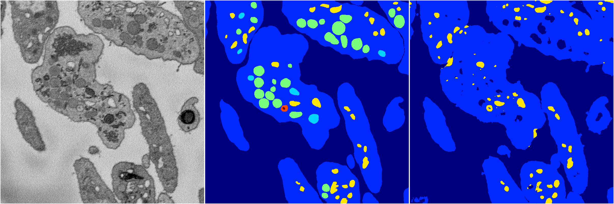
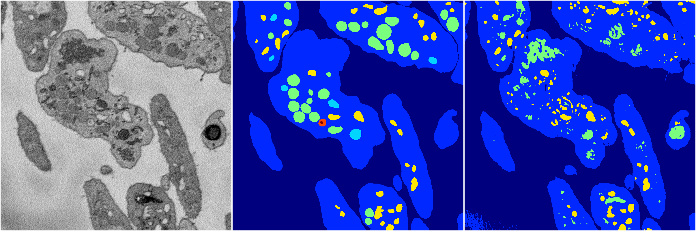
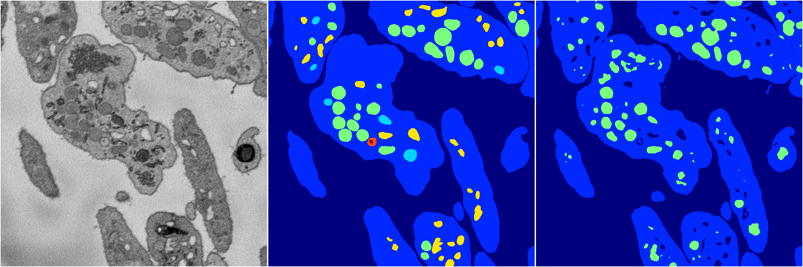
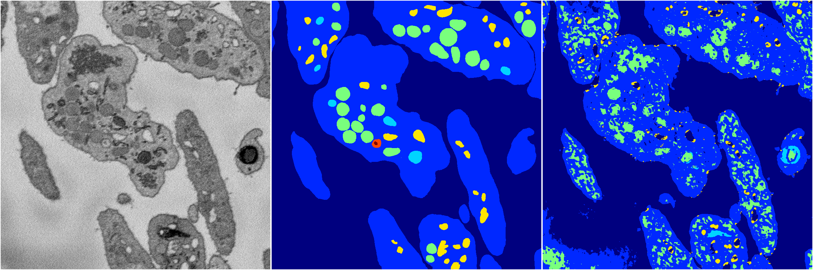
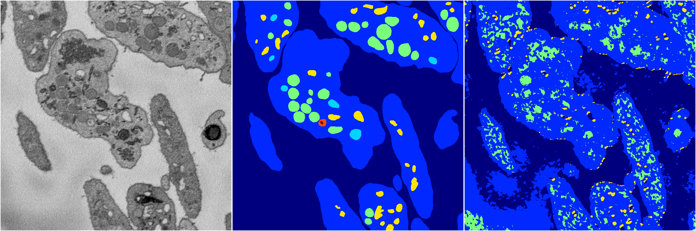

[Back](..)&nbsp;&nbsp;&nbsp;&nbsp;&nbsp;[Home](https://leapmanlab.github.io/snapshots)

---

<a href="4"><h2>random_2d_ed / 1210 / 92 / 4</h2></a>
Created 14 Dec 2018, 11:38:31

<i>Click for more details</i>

**ari**: 0.6191. **miou**: 0.3196. **accuracy**: 0.8862. **n_params**: 44441806.0000. 

---

<a href="1"><h2>random_2d_ed / 1210 / 92 / 1</h2></a>
Created 14 Dec 2018, 11:38:31

<i>Click for more details</i>

**ari**: 0.6883. **miou**: 0.3340. **accuracy**: 0.8929. **n_params**: 44441806.0000. 

---

<a href="3"><h2>random_2d_ed / 1210 / 92 / 3</h2></a>
Created 14 Dec 2018, 11:38:31

<i>Click for more details</i>

**ari**: 0.7221. **miou**: 0.3038. **accuracy**: 0.9016. **n_params**: 44441806.0000. 

---

<a href="2"><h2>random_2d_ed / 1210 / 92 / 2</h2></a>
Created 14 Dec 2018, 11:38:30

<i>Click for more details</i>

**ari**: 0.5835. **miou**: 0.2940. **accuracy**: 0.8371. **n_params**: 44441806.0000. 

---

<a href="0"><h2>random_2d_ed / 1210 / 92 / 0</h2></a>
Created 14 Dec 2018, 11:38:30

<i>Click for more details</i>

**ari**: 0.4296. **miou**: 0.2556. **accuracy**: 0.7807. **n_params**: 44441806.0000. 

---

[Back](..)&nbsp;&nbsp;&nbsp;&nbsp;&nbsp;[Home](https://leapmanlab.github.io/snapshots)

---