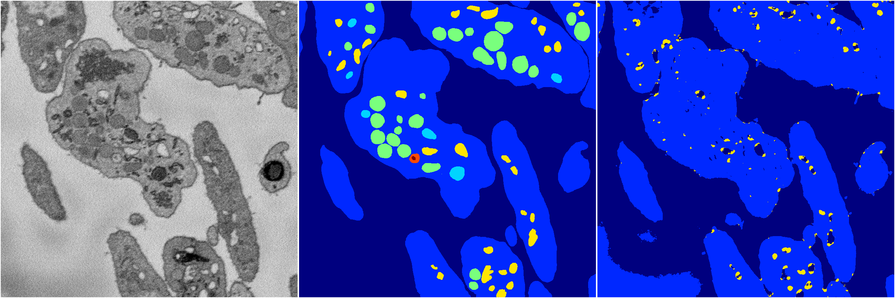
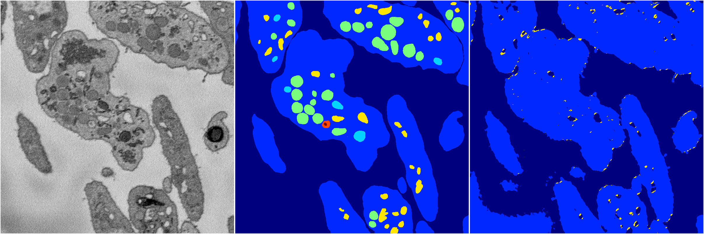
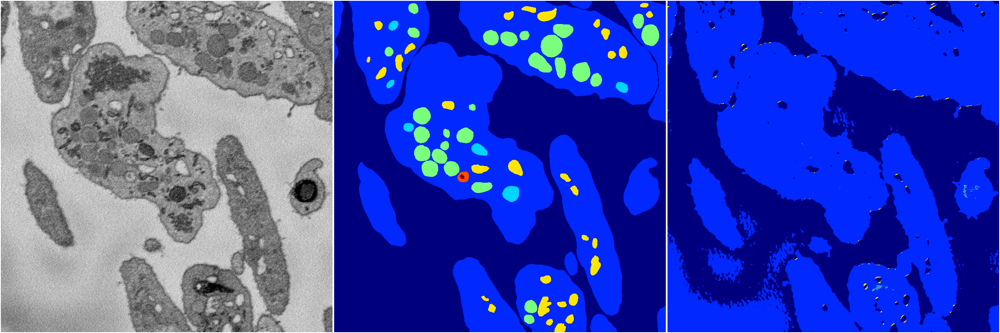
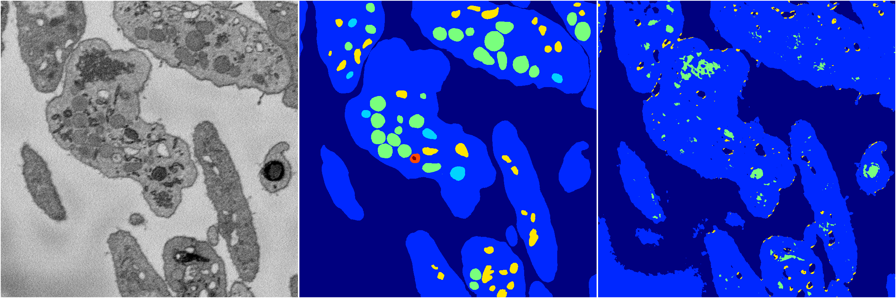

[Back](..)&nbsp;&nbsp;&nbsp;&nbsp;&nbsp;[Home](https://leapmanlab.github.io/snapshots)

---

<a href="4"><h2>random_2d_ed / 1210 / 93 / 4</h2></a>
Created 14 Dec 2018, 11:38:30

<i>Click for more details</i>

**ari**: 0.6761. **miou**: 0.2766. **accuracy**: 0.8740. **n_params**: 231687.0000. 

---

<a href="3"><h2>random_2d_ed / 1210 / 93 / 3</h2></a>
Created 14 Dec 2018, 11:38:30

<i>Click for more details</i>

**ari**: 0.6682. **miou**: 0.3096. **accuracy**: 0.8478. **n_params**: 231687.0000. 

---

<a href="2"><h2>random_2d_ed / 1210 / 93 / 2</h2></a>
Created 14 Dec 2018, 11:38:30

<i>Click for more details</i>

**ari**: 0.6465. **miou**: 0.2501. **accuracy**: 0.8648. **n_params**: 231687.0000. 

---

<a href="1"><h2>random_2d_ed / 1210 / 93 / 1</h2></a>
Created 14 Dec 2018, 11:38:30

<i>Click for more details</i>

**ari**: 0.6034. **miou**: 0.2343. **accuracy**: 0.8520. **n_params**: 231687.0000. 

---

<a href="0"><h2>random_2d_ed / 1210 / 93 / 0</h2></a>
Created 14 Dec 2018, 11:38:30

<i>Click for more details</i>

**ari**: 0.6456. **miou**: 0.2560. **accuracy**: 0.8527. **n_params**: 231687.0000. 

---

[Back](..)&nbsp;&nbsp;&nbsp;&nbsp;&nbsp;[Home](https://leapmanlab.github.io/snapshots)

---