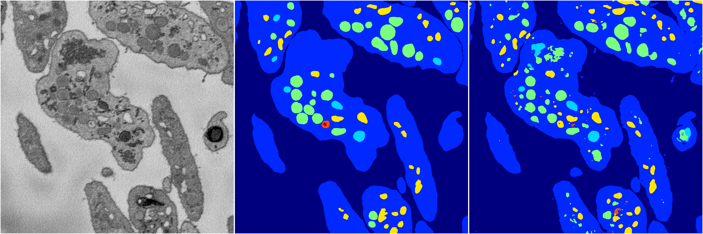
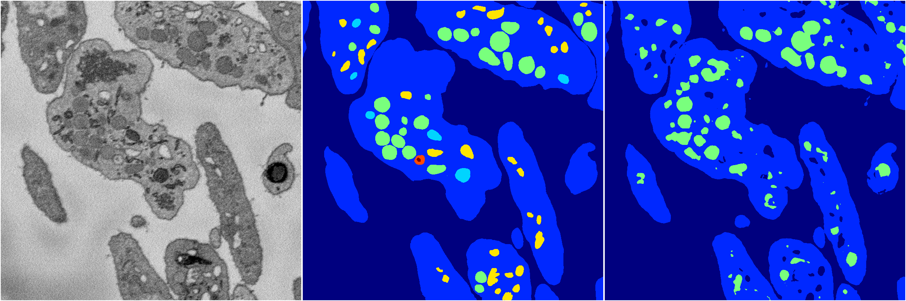
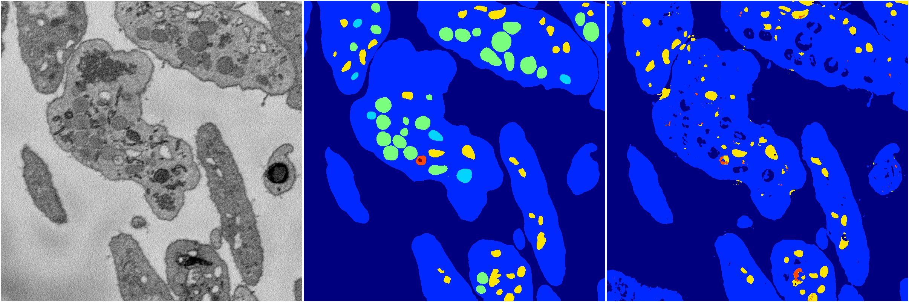
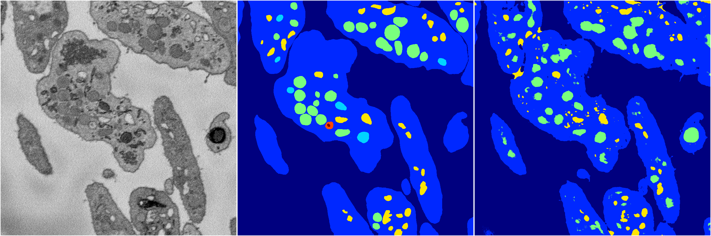

[Back](..)&nbsp;&nbsp;&nbsp;&nbsp;&nbsp;[Home](https://leapmanlab.github.io/snapshots)

---

<a href="4"><h2>random_2d_ed / 1210 / 94 / 4</h2></a>
Created 16 Dec 2018, 10:15:16

<i>Click for more details</i>

**ari**: 0.8148. **miou**: 0.4888. **accuracy**: 0.9266. **n_params**: 22545268.0000. 

---

<a href="2"><h2>random_2d_ed / 1210 / 94 / 2</h2></a>
Created 16 Dec 2018, 10:15:16

<i>Click for more details</i>

**ari**: 0.7729. **miou**: 0.2979. **accuracy**: 0.9013. **n_params**: 22545268.0000. 

---

<a href="1"><h2>random_2d_ed / 1210 / 94 / 1</h2></a>
Created 16 Dec 2018, 10:15:16

<i>Click for more details</i>

**ari**: 0.8115. **miou**: 0.5002. **accuracy**: 0.9252. **n_params**: 22545268.0000. 

---

<a href="0"><h2>random_2d_ed / 1210 / 94 / 0</h2></a>
Created 16 Dec 2018, 10:15:16

<i>Click for more details</i>

**ari**: 0.7725. **miou**: 0.3669. **accuracy**: 0.9133. **n_params**: 22545268.0000. 

---

<a href="3"><h2>random_2d_ed / 1210 / 94 / 3</h2></a>
Created 16 Dec 2018, 10:15:16

<i>Click for more details</i>

**ari**: 0.7729. **miou**: 0.3563. **accuracy**: 0.9010. **n_params**: 22545268.0000. 

---

[Back](..)&nbsp;&nbsp;&nbsp;&nbsp;&nbsp;[Home](https://leapmanlab.github.io/snapshots)

---