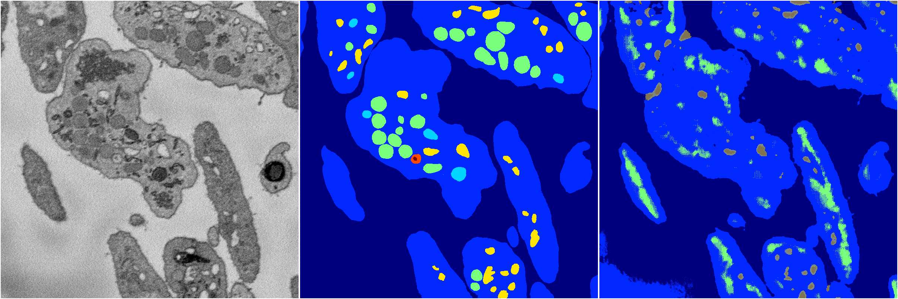
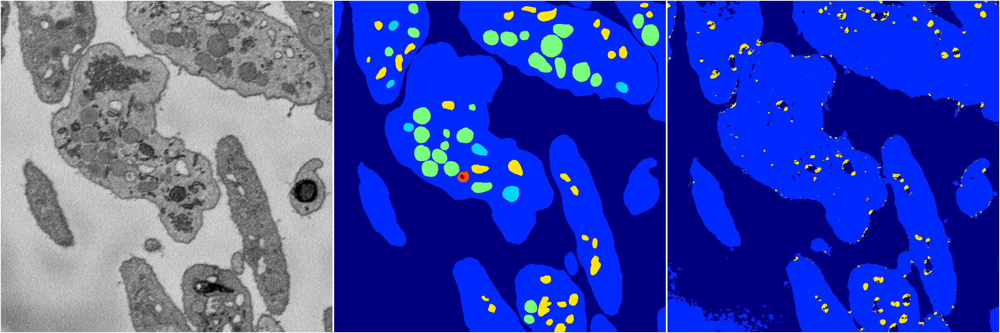
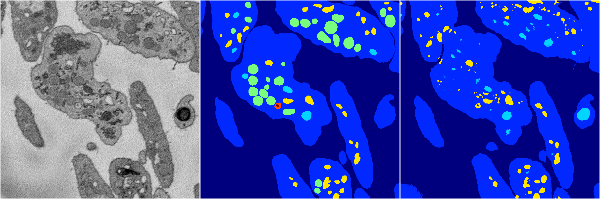

[Back](..)&nbsp;&nbsp;&nbsp;&nbsp;&nbsp;[Home](https://leapmanlab.github.io/snapshots)

---

<a href="2"><h2>random_2d_ed / 1210 / 95 / 2</h2></a>
Created 16 Dec 2018, 10:15:16

<i>Click for more details</i>

**ari**: 0.6815. **miou**: 0.2788. **accuracy**: 0.8650. **n_params**: 8755384.0000. 

---

<a href="4"><h2>random_2d_ed / 1210 / 95 / 4</h2></a>
Created 16 Dec 2018, 10:15:16

<i>Click for more details</i>

**ari**: 0.8032. **miou**: 0.4465. **accuracy**: 0.9230. **n_params**: 8755384.0000. 

---

<a href="0"><h2>random_2d_ed / 1210 / 95 / 0</h2></a>
Created 16 Dec 2018, 10:15:16

<i>Click for more details</i>

**ari**: 0.8177. **miou**: 0.5150. **accuracy**: 0.9310. **n_params**: 8755384.0000. 

---

<a href="3"><h2>random_2d_ed / 1210 / 95 / 3</h2></a>
Created 16 Dec 2018, 10:15:16

<i>Click for more details</i>

**ari**: 0.7416. **miou**: 0.2867. **accuracy**: 0.9022. **n_params**: 8755384.0000. 

---

<a href="1"><h2>random_2d_ed / 1210 / 95 / 1</h2></a>
Created 16 Dec 2018, 10:15:16

<i>Click for more details</i>

**ari**: 0.8026. **miou**: 0.3834. **accuracy**: 0.9216. **n_params**: 8755384.0000. 

---

[Back](..)&nbsp;&nbsp;&nbsp;&nbsp;&nbsp;[Home](https://leapmanlab.github.io/snapshots)

---