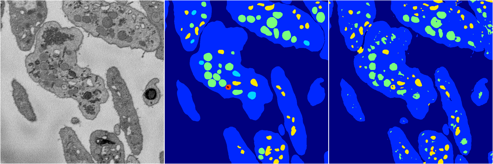
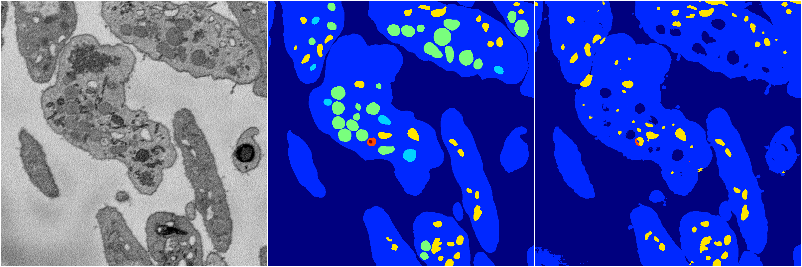
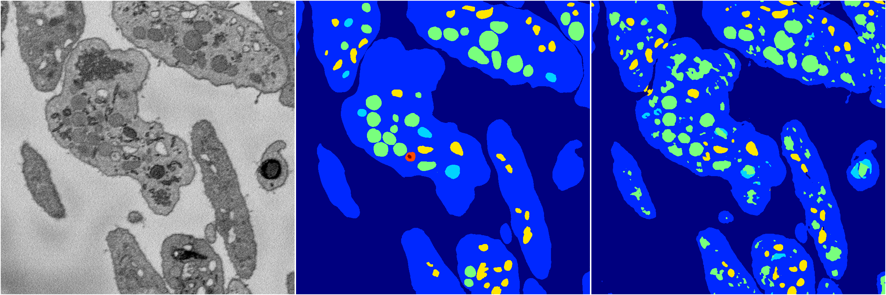

[Back](..)&nbsp;&nbsp;&nbsp;&nbsp;&nbsp;[Home](https://leapmanlab.github.io/snapshots)

---

<a href="0"><h2>random_2d_ed / 1210 / 96 / 0</h2></a>
Created 21 Dec 2018, 01:15:55

<i>Click for more details</i>

**ari**: 0.8001. **miou**: 0.3990. **accuracy**: 0.9153. **n_params**: 1459642.0000. 

---

<a href="3"><h2>random_2d_ed / 1210 / 96 / 3</h2></a>
Created 21 Dec 2018, 01:15:55

<i>Click for more details</i>

**ari**: 0.7897. **miou**: 0.4511. **accuracy**: 0.9128. **n_params**: 1459642.0000. 

---

<a href="1"><h2>random_2d_ed / 1210 / 96 / 1</h2></a>
Created 21 Dec 2018, 01:15:55

<i>Click for more details</i>

**ari**: 0.7130. **miou**: 0.3548. **accuracy**: 0.8913. **n_params**: 1459642.0000. 

---

<a href="4"><h2>random_2d_ed / 1210 / 96 / 4</h2></a>
Created 21 Dec 2018, 01:15:55

<i>Click for more details</i>

**ari**: 0.8054. **miou**: 0.5549. **accuracy**: 0.9209. **n_params**: 1459642.0000. 

---

<a href="2"><h2>random_2d_ed / 1210 / 96 / 2</h2></a>
Created 21 Dec 2018, 01:15:55

<i>Click for more details</i>

**ari**: 0.7682. **miou**: 0.4193. **accuracy**: 0.8976. **n_params**: 1459642.0000. 

---

[Back](..)&nbsp;&nbsp;&nbsp;&nbsp;&nbsp;[Home](https://leapmanlab.github.io/snapshots)

---