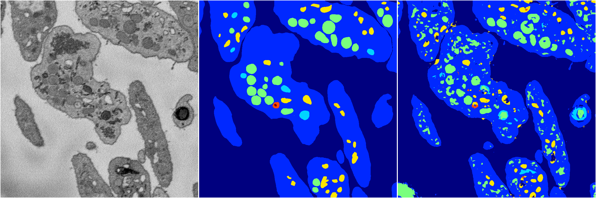
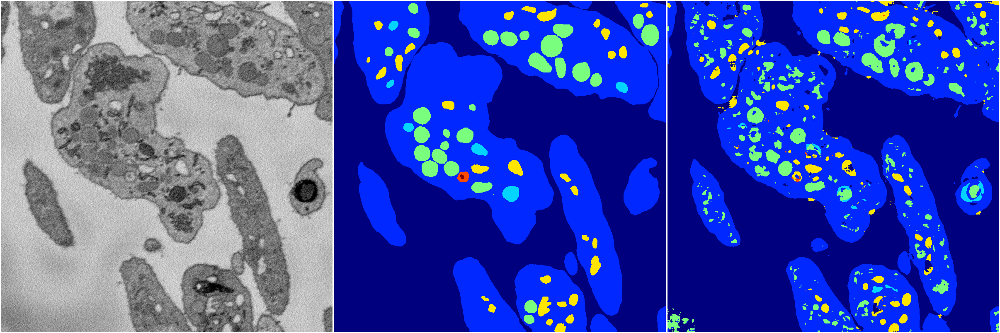
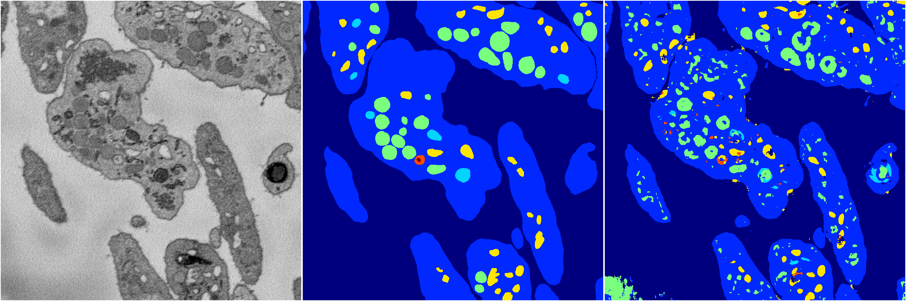

[Back](..)&nbsp;&nbsp;&nbsp;&nbsp;&nbsp;[Home](https://leapmanlab.github.io/snapshots)

---

<a href="4"><h2>random_2d_ed / 1210 / 97 / 4</h2></a>
Created 17 Dec 2018, 02:57:36

<i>Click for more details</i>

**ari**: 0.7427. **miou**: 0.4235. **accuracy**: 0.8845. **n_params**: 1258805.0000. 

---

<a href="3"><h2>random_2d_ed / 1210 / 97 / 3</h2></a>
Created 17 Dec 2018, 02:57:36

<i>Click for more details</i>

**ari**: 0.7480. **miou**: 0.4193. **accuracy**: 0.8870. **n_params**: 1258805.0000. 

---

<a href="2"><h2>random_2d_ed / 1210 / 97 / 2</h2></a>
Created 17 Dec 2018, 02:57:36

<i>Click for more details</i>

**ari**: 0.7554. **miou**: 0.4175. **accuracy**: 0.8927. **n_params**: 1258805.0000. 

---

<a href="1"><h2>random_2d_ed / 1210 / 97 / 1</h2></a>
Created 17 Dec 2018, 02:57:36

<i>Click for more details</i>

**ari**: 0.7630. **miou**: 0.4309. **accuracy**: 0.8970. **n_params**: 1258805.0000. 

---

<a href="0"><h2>random_2d_ed / 1210 / 97 / 0</h2></a>
Created 17 Dec 2018, 02:57:36

<i>Click for more details</i>

**ari**: 0.7229. **miou**: 0.4303. **accuracy**: 0.8693. **n_params**: 1258805.0000. 

---

[Back](..)&nbsp;&nbsp;&nbsp;&nbsp;&nbsp;[Home](https://leapmanlab.github.io/snapshots)

---