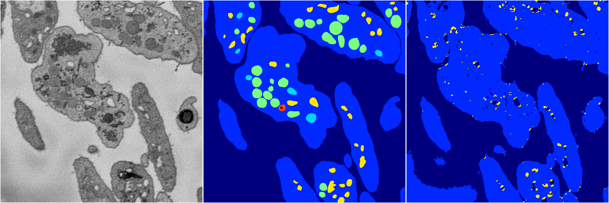
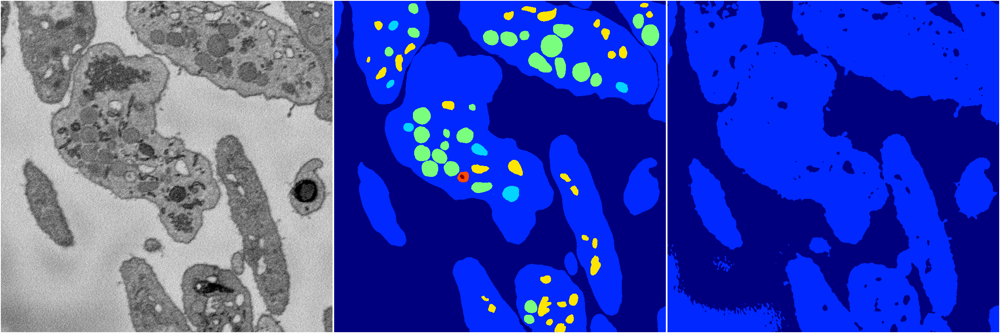
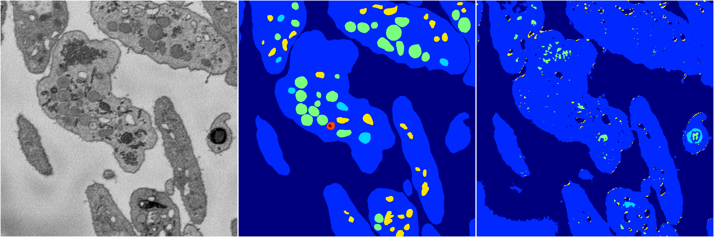
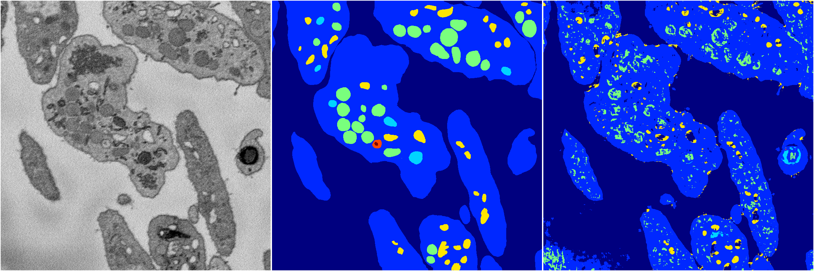

[Back](..)&nbsp;&nbsp;&nbsp;&nbsp;&nbsp;[Home](https://leapmanlab.github.io/snapshots)

---

<a href="4"><h2>random_2d_ed / 1210 / 98 / 4</h2></a>
Created 16 Dec 2018, 10:15:16

<i>Click for more details</i>

**ari**: 0.6723. **miou**: 0.2729. **accuracy**: 0.8723. **n_params**: 285935.0000. 

---

<a href="3"><h2>random_2d_ed / 1210 / 98 / 3</h2></a>
Created 16 Dec 2018, 10:15:16

<i>Click for more details</i>

**ari**: 0.6408. **miou**: 0.2363. **accuracy**: 0.8642. **n_params**: 285935.0000. 

---

<a href="2"><h2>random_2d_ed / 1210 / 98 / 2</h2></a>
Created 16 Dec 2018, 10:15:16

<i>Click for more details</i>

**ari**: 0.6646. **miou**: 0.2526. **accuracy**: 0.8617. **n_params**: 285935.0000. 

---

<a href="0"><h2>random_2d_ed / 1210 / 98 / 0</h2></a>
Created 16 Dec 2018, 10:15:16

<i>Click for more details</i>

**ari**: 0.6923. **miou**: 0.3153. **accuracy**: 0.8678. **n_params**: 285935.0000. 

---

<a href="1"><h2>random_2d_ed / 1210 / 98 / 1</h2></a>
Created 16 Dec 2018, 10:15:16

<i>Click for more details</i>

**ari**: 0.6396. **miou**: 0.2358. **accuracy**: 0.8635. **n_params**: 285935.0000. 

---

[Back](..)&nbsp;&nbsp;&nbsp;&nbsp;&nbsp;[Home](https://leapmanlab.github.io/snapshots)

---