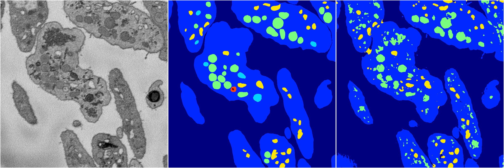
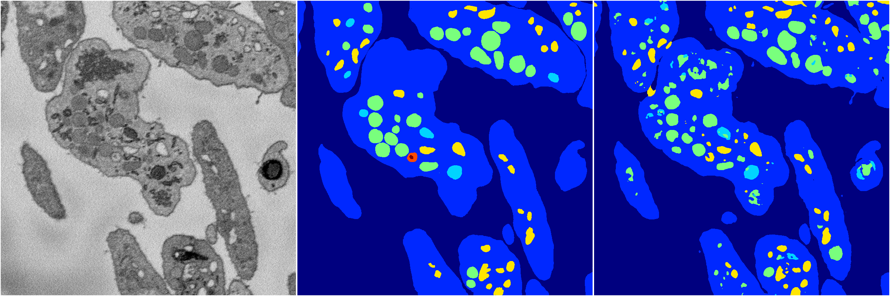
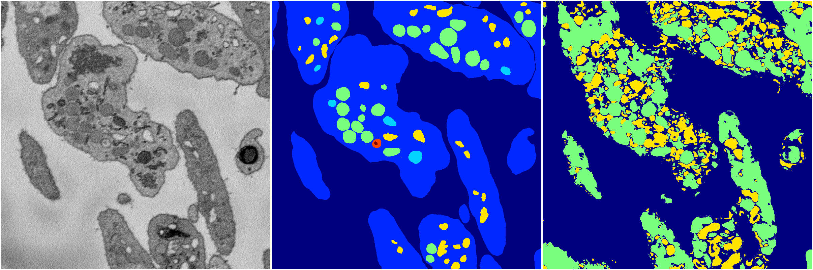
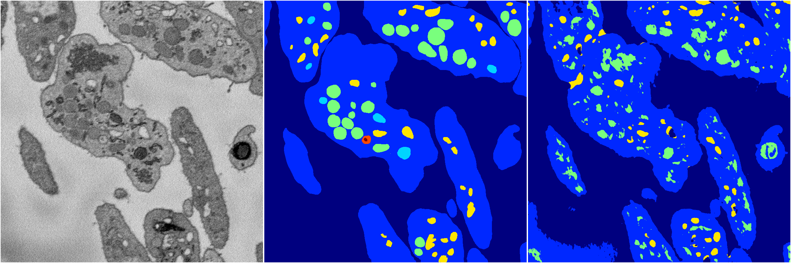

[Back](..)&nbsp;&nbsp;&nbsp;&nbsp;&nbsp;[Home](https://leapmanlab.github.io/snapshots)

---

<a href="4"><h2>random_2d_ed / 1210 / 99 / 4</h2></a>
Created 21 Dec 2018, 14:17:40

<i>Click for more details</i>

**ari**: 0.7885. **miou**: 0.3737. **accuracy**: 0.9094. **n_params**: 2205043.0000. 

---

<a href="1"><h2>random_2d_ed / 1210 / 99 / 1</h2></a>
Created 21 Dec 2018, 14:17:40

<i>Click for more details</i>

**ari**: 0.8151. **miou**: 0.4573. **accuracy**: 0.9242. **n_params**: 2205043.0000. 

---

<a href="2"><h2>random_2d_ed / 1210 / 99 / 2</h2></a>
Created 21 Dec 2018, 14:17:40

<i>Click for more details</i>

**ari**: 0.2882. **miou**: 0.1373. **accuracy**: 0.5011. **n_params**: 2205043.0000. 

---

<a href="3"><h2>random_2d_ed / 1210 / 99 / 3</h2></a>
Created 21 Dec 2018, 14:17:40

<i>Click for more details</i>

**ari**: 0.8013. **miou**: 0.4501. **accuracy**: 0.9168. **n_params**: 2205043.0000. 

---

<a href="0"><h2>random_2d_ed / 1210 / 99 / 0</h2></a>
Created 21 Dec 2018, 14:17:40

<i>Click for more details</i>

**ari**: 0.7276. **miou**: 0.3298. **accuracy**: 0.8834. **n_params**: 2205043.0000. 

---

[Back](..)&nbsp;&nbsp;&nbsp;&nbsp;&nbsp;[Home](https://leapmanlab.github.io/snapshots)

---