[Back](..)&nbsp;&nbsp;&nbsp;&nbsp;&nbsp;[Home](https://leapmanlab.github.io/snapshots)

---

<a href="99"><h2>random_2d_ed / 1210 / 99</h2></a>
Created 17 Dec 2018, 23:35:08

<i>Click image for more details</i>

5 nets

**ari**: min 0.2882. max 0.8151. mean 0.6841.  ([best net](99/1))

**miou**: min 0.1373. max 0.4573. mean 0.3496.  ([best net](99/1))

**accuracy**: min 0.5011. max 0.9242. mean 0.8270.  ([best net](99/1))

**n_params**: min 2205043.0000. max 2205043.0000. mean 2205043.0000.  ([best net](99/0))

---

<a href="97"><h2>random_2d_ed / 1210 / 97</h2></a>
Created 17 Dec 2018, 23:35:08

<i>Click image for more details</i>

5 nets

**ari**: min 0.7229. max 0.7630. mean 0.7464.  ([best net](97/1))

**miou**: min 0.4175. max 0.4309. mean 0.4243.  ([best net](97/1))

**accuracy**: min 0.8693. max 0.8970. mean 0.8861.  ([best net](97/1))

**n_params**: min 1258805.0000. max 1258805.0000. mean 1258805.0000.  ([best net](97/0))

---

<a href="98"><h2>random_2d_ed / 1210 / 98</h2></a>
Created 17 Dec 2018, 23:35:08

<i>Click image for more details</i>

5 nets

**ari**: min 0.6396. max 0.6923. mean 0.6619.  ([best net](98/0))

**miou**: min 0.2358. max 0.3153. mean 0.2626.  ([best net](98/0))

**accuracy**: min 0.8617. max 0.8723. mean 0.8659.  ([best net](98/4))

**n_params**: min 285935.0000. max 285935.0000. mean 285935.0000.  ([best net](98/1))

---

<a href="95"><h2>random_2d_ed / 1210 / 95</h2></a>
Created 17 Dec 2018, 23:35:08

<i>Click image for more details</i>

5 nets

**ari**: min 0.6815. max 0.8177. mean 0.7693.  ([best net](95/0))

**miou**: min 0.2788. max 0.5150. mean 0.3821.  ([best net](95/0))

**accuracy**: min 0.8650. max 0.9310. mean 0.9085.  ([best net](95/0))

**n_params**: min 8755384.0000. max 8755384.0000. mean 8755384.0000.  ([best net](95/1))

---

<a href="96"><h2>random_2d_ed / 1210 / 96</h2></a>
Created 17 Dec 2018, 23:35:08

<a href="96">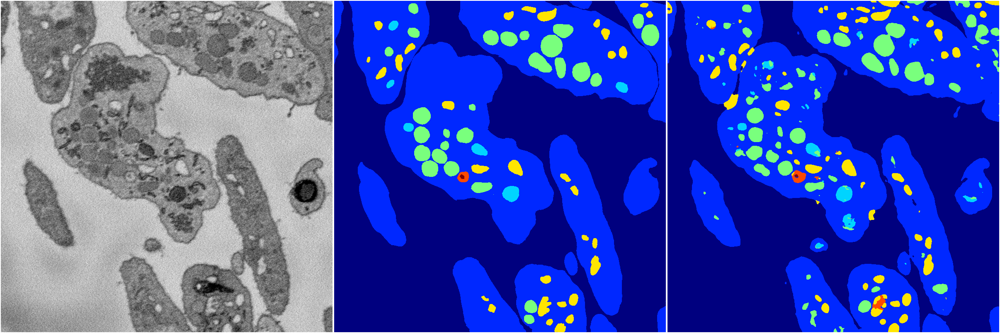</a>
<i>Click image for more details</i>

5 nets

**ari**: min 0.7130. max 0.8054. mean 0.7753.  ([best net](96/4))

**miou**: min 0.3548. max 0.5549. mean 0.4358.  ([best net](96/4))

**accuracy**: min 0.8913. max 0.9209. mean 0.9076.  ([best net](96/4))

**n_params**: min 1459642.0000. max 1459642.0000. mean 1459642.0000.  ([best net](96/0))

---

<a href="94"><h2>random_2d_ed / 1210 / 94</h2></a>
Created 17 Dec 2018, 23:35:07

<i>Click image for more details</i>

5 nets

**ari**: min 0.7725. max 0.8148. mean 0.7889.  ([best net](94/4))

**miou**: min 0.2979. max 0.5002. mean 0.4020.  ([best net](94/1))

**accuracy**: min 0.9010. max 0.9266. mean 0.9135.  ([best net](94/4))

**n_params**: min 22545268.0000. max 22545268.0000. mean 22545268.0000.  ([best net](94/3))

---

<a href="92"><h2>random_2d_ed / 1210 / 92</h2></a>
Created 17 Dec 2018, 23:35:07

<i>Click image for more details</i>

5 nets

**ari**: min 0.4296. max 0.7221. mean 0.6085.  ([best net](92/3))

**miou**: min 0.2556. max 0.3340. mean 0.3014.  ([best net](92/1))

**accuracy**: min 0.7807. max 0.9016. mean 0.8597.  ([best net](92/3))

**n_params**: min 44441806.0000. max 44441806.0000. mean 44441806.0000.  ([best net](92/0))

---

<a href="93"><h2>random_2d_ed / 1210 / 93</h2></a>
Created 17 Dec 2018, 23:35:07

<a href="93">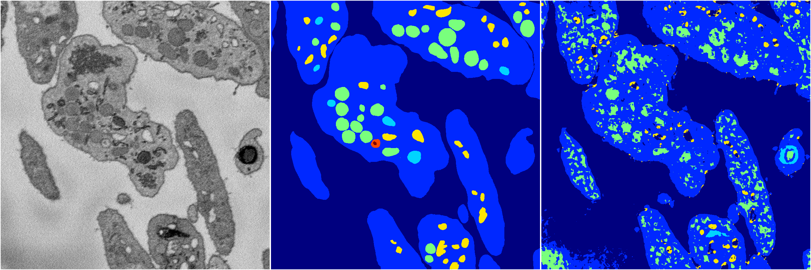</a>
<i>Click image for more details</i>

5 nets

**ari**: min 0.6034. max 0.6761. mean 0.6480.  ([best net](93/4))

**miou**: min 0.2343. max 0.3096. mean 0.2653.  ([best net](93/3))

**accuracy**: min 0.8478. max 0.8740. mean 0.8582.  ([best net](93/4))

**n_params**: min 231687.0000. max 231687.0000. mean 231687.0000.  ([best net](93/0))

---

<a href="91"><h2>random_2d_ed / 1210 / 91</h2></a>
Created 17 Dec 2018, 23:35:07

<i>Click image for more details</i>

5 nets

**ari**: min 0.6718. max 0.7535. mean 0.7142.  ([best net](91/1))

**miou**: min 0.3299. max 0.4337. mean 0.3751.  ([best net](91/2))

**accuracy**: min 0.8486. max 0.8909. mean 0.8721.  ([best net](91/1))

**n_params**: min 1446587.0000. max 1446587.0000. mean 1446587.0000.  ([best net](91/1))

---

<a href="88"><h2>random_2d_ed / 1210 / 88</h2></a>
Created 17 Dec 2018, 23:35:07

<i>Click image for more details</i>

5 nets

**ari**: min -0.0000. max 0.7873. mean 0.5991.  ([best net](88/4))

**miou**: min 0.0656. max 0.3830. mean 0.2762.  ([best net](88/4))

**accuracy**: min 0.4594. max 0.9198. mean 0.8167.  ([best net](88/1))

**n_params**: min 79628551.0000. max 79628551.0000. mean 79628551.0000.  ([best net](88/0))

---

<a href="89"><h2>random_2d_ed / 1210 / 89</h2></a>
Created 17 Dec 2018, 23:35:07

<a href="89">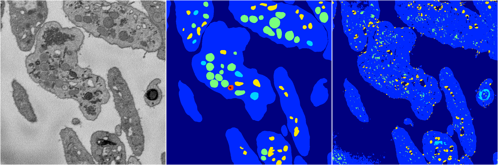</a>
<i>Click image for more details</i>

5 nets

**ari**: min 0.6307. max 0.6738. mean 0.6437.  ([best net](89/2))

**miou**: min 0.2348. max 0.2909. mean 0.2548.  ([best net](89/2))

**accuracy**: min 0.8508. max 0.8647. mean 0.8583.  ([best net](89/2))

**n_params**: min 291979.0000. max 291979.0000. mean 291979.0000.  ([best net](89/0))

---

<a href="90"><h2>random_2d_ed / 1210 / 90</h2></a>
Created 17 Dec 2018, 23:35:07

<a href="90">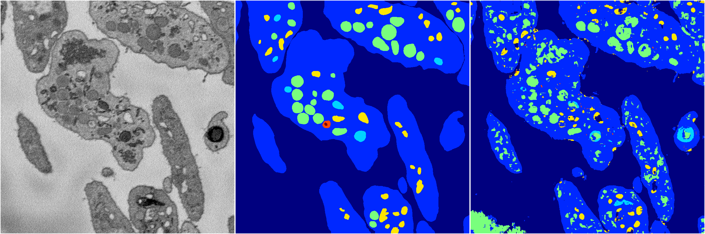</a>
<i>Click image for more details</i>

5 nets

**ari**: min 0.6336. max 0.7327. mean 0.6853.  ([best net](90/2))

**miou**: min 0.2349. max 0.4065. mean 0.3199.  ([best net](90/0))

**accuracy**: min 0.8606. max 0.8831. mean 0.8688.  ([best net](90/2))

**n_params**: min 436528.0000. max 436528.0000. mean 436528.0000.  ([best net](90/0))

---

<a href="87"><h2>random_2d_ed / 1210 / 87</h2></a>
Created 17 Dec 2018, 23:35:07

<i>Click image for more details</i>

5 nets

**ari**: min 0.7043. max 0.8070. mean 0.7566.  ([best net](87/4))

**miou**: min 0.2647. max 0.4469. mean 0.3538.  ([best net](87/4))

**accuracy**: min 0.8815. max 0.9226. mean 0.9019.  ([best net](87/4))

**n_params**: min 81117998.0000. max 81117998.0000. mean 81117998.0000.  ([best net](87/0))

---

<a href="86"><h2>random_2d_ed / 1210 / 86</h2></a>
Created 17 Dec 2018, 23:35:07

<i>Click image for more details</i>

5 nets

**ari**: min 0.7887. max 0.8061. mean 0.7978.  ([best net](86/1))

**miou**: min 0.4200. max 0.5341. mean 0.4631.  ([best net](86/4))

**accuracy**: min 0.9104. max 0.9229. mean 0.9174.  ([best net](86/1))

**n_params**: min 14884858.0000. max 14884858.0000. mean 14884858.0000.  ([best net](86/0))

---

<a href="85"><h2>random_2d_ed / 1210 / 85</h2></a>
Created 17 Dec 2018, 23:35:07

<a href="85">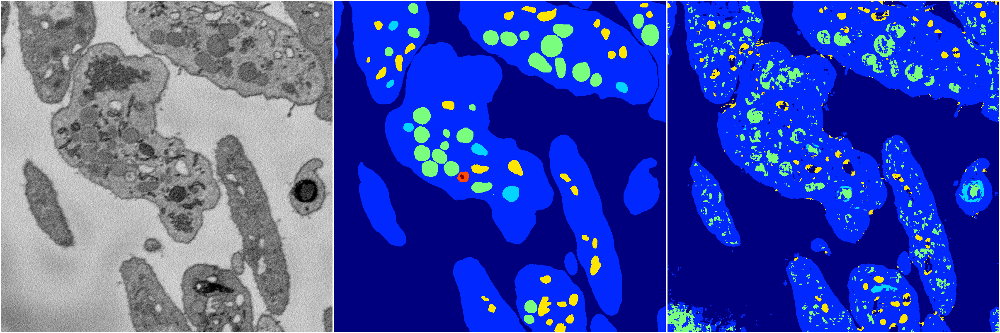</a>
<i>Click image for more details</i>

5 nets

**ari**: min 0.6453. max 0.7112. mean 0.6848.  ([best net](85/0))

**miou**: min 0.2378. max 0.3457. mean 0.3021.  ([best net](85/1))

**accuracy**: min 0.8580. max 0.8763. mean 0.8675.  ([best net](85/0))

**n_params**: min 985535.0000. max 985535.0000. mean 985535.0000.  ([best net](85/0))

---

<a href="84"><h2>random_2d_ed / 1210 / 84</h2></a>
Created 17 Dec 2018, 23:35:07

<i>Click image for more details</i>

5 nets

**ari**: min 0.6401. max 0.7611. mean 0.7108.  ([best net](84/4))

**miou**: min 0.2357. max 0.4428. mean 0.3428.  ([best net](84/3))

**accuracy**: min 0.8650. max 0.8976. mean 0.8813.  ([best net](84/4))

**n_params**: min 638789.0000. max 638789.0000. mean 638789.0000.  ([best net](84/0))

---

<a href="83"><h2>random_2d_ed / 1210 / 83</h2></a>
Created 17 Dec 2018, 23:35:07

<i>Click image for more details</i>

5 nets

**ari**: min 0.6470. max 0.7600. mean 0.7099.  ([best net](83/0))

**miou**: min 0.2439. max 0.4033. mean 0.3263.  ([best net](83/0))

**accuracy**: min 0.8520. max 0.8972. mean 0.8740.  ([best net](83/0))

**n_params**: min 1211171.0000. max 1211171.0000. mean 1211171.0000.  ([best net](83/0))

---

<a href="82"><h2>random_2d_ed / 1210 / 82</h2></a>
Created 17 Dec 2018, 23:35:07

<i>Click image for more details</i>

5 nets

**ari**: min 0.6771. max 0.8139. mean 0.7700.  ([best net](82/1))

**miou**: min 0.3213. max 0.5241. mean 0.4475.  ([best net](82/2))

**accuracy**: min 0.8815. max 0.9264. mean 0.9069.  ([best net](82/1))

**n_params**: min 2127827.0000. max 2127827.0000. mean 2127827.0000.  ([best net](82/0))

---

<a href="81"><h2>random_2d_ed / 1210 / 81</h2></a>
Created 17 Dec 2018, 23:35:07

<a href="81">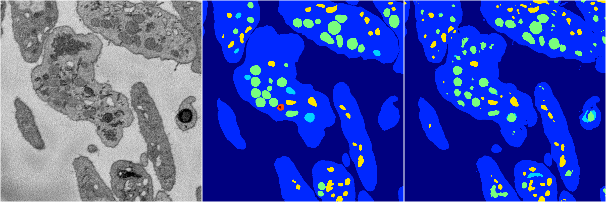</a>
<i>Click image for more details</i>

5 nets

**ari**: min 0.0000. max 0.8157. mean 0.6121.  ([best net](81/1))

**miou**: min 0.0694. max 0.4205. mean 0.3043.  ([best net](81/1))

**accuracy**: min 0.4859. max 0.9265. mean 0.8214.  ([best net](81/1))

**n_params**: min 21764125.0000. max 21764125.0000. mean 21764125.0000.  ([best net](81/0))

---

<a href="80"><h2>random_2d_ed / 1210 / 80</h2></a>
Created 17 Dec 2018, 23:35:07

<i>Click image for more details</i>

5 nets

**ari**: min 0.7591. max 0.8240. mean 0.8032.  ([best net](80/4))

**miou**: min 0.3397. max 0.5683. mean 0.4821.  ([best net](80/0))

**accuracy**: min 0.8930. max 0.9316. mean 0.9196.  ([best net](80/0))

**n_params**: min 9291678.0000. max 9291678.0000. mean 9291678.0000.  ([best net](80/0))

---

<a href="78"><h2>random_2d_ed / 1210 / 78</h2></a>
Created 17 Dec 2018, 23:35:07

<a href="78">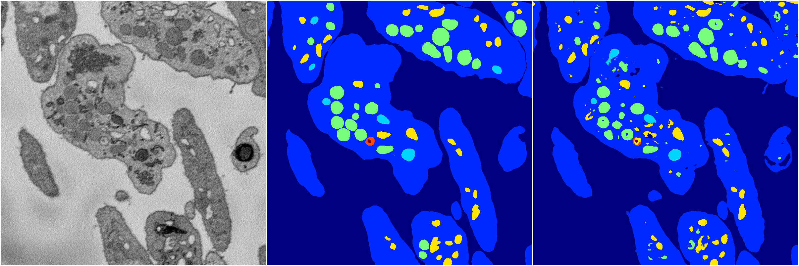</a>
<i>Click image for more details</i>

5 nets

**ari**: min 0.6568. max 0.8127. mean 0.7770.  ([best net](78/3))

**miou**: min 0.2937. max 0.5532. mean 0.4621.  ([best net](78/3))

**accuracy**: min 0.8434. max 0.9292. mean 0.9100.  ([best net](78/3))

**n_params**: min 35358173.0000. max 35358173.0000. mean 35358173.0000.  ([best net](78/1))

---

<a href="79"><h2>random_2d_ed / 1210 / 79</h2></a>
Created 17 Dec 2018, 23:35:07

<i>Click image for more details</i>

5 nets

**ari**: min 0.6425. max 0.7914. mean 0.7496.  ([best net](79/0))

**miou**: min 0.2402. max 0.5071. mean 0.4283.  ([best net](79/3))

**accuracy**: min 0.8671. max 0.9135. mean 0.8979.  ([best net](79/0))

**n_params**: min 1154929.0000. max 1154929.0000. mean 1154929.0000.  ([best net](79/0))

---

<a href="76"><h2>random_2d_ed / 1210 / 76</h2></a>
Created 17 Dec 2018, 23:35:07

<i>Click image for more details</i>

5 nets

**ari**: min 0.8073. max 0.8137. mean 0.8106.  ([best net](76/0))

**miou**: min 0.4054. max 0.5684. mean 0.4841.  ([best net](76/2))

**accuracy**: min 0.9229. max 0.9270. mean 0.9245.  ([best net](76/2))

**n_params**: min 59950744.0000. max 59950744.0000. mean 59950744.0000.  ([best net](76/0))

---

<a href="77"><h2>random_2d_ed / 1210 / 77</h2></a>
Created 17 Dec 2018, 23:35:07

<i>Click image for more details</i>

5 nets

**ari**: min 0.6371. max 0.7871. mean 0.7376.  ([best net](77/0))

**miou**: min 0.2761. max 0.4285. mean 0.3728.  ([best net](77/1))

**accuracy**: min 0.8461. max 0.9215. mean 0.8964.  ([best net](77/0))

**n_params**: min 42185389.0000. max 42185389.0000. mean 42185389.0000.  ([best net](77/1))

---

<a href="74"><h2>random_2d_ed / 1210 / 74</h2></a>
Created 17 Dec 2018, 23:35:07

<i>Click image for more details</i>

5 nets

**ari**: min 0.6503. max 0.7716. mean 0.7455.  ([best net](74/4))

**miou**: min 0.2872. max 0.4368. mean 0.3865.  ([best net](74/1))

**accuracy**: min 0.8604. max 0.9210. mean 0.9059.  ([best net](74/3))

**n_params**: min 49953371.0000. max 49953371.0000. mean 49953371.0000.  ([best net](74/2))

---

<a href="75"><h2>random_2d_ed / 1210 / 75</h2></a>
Created 17 Dec 2018, 23:35:07

<i>Click image for more details</i>

5 nets

**ari**: min 0.7841. max 0.8200. mean 0.8014.  ([best net](75/4))

**miou**: min 0.3739. max 0.5102. mean 0.4093.  ([best net](75/4))

**accuracy**: min 0.9115. max 0.9293. mean 0.9183.  ([best net](75/4))

**n_params**: min 7997183.0000. max 7997183.0000. mean 7997183.0000.  ([best net](75/0))

---

<a href="73"><h2>random_2d_ed / 1210 / 73</h2></a>
Created 17 Dec 2018, 23:35:07

<a href="73">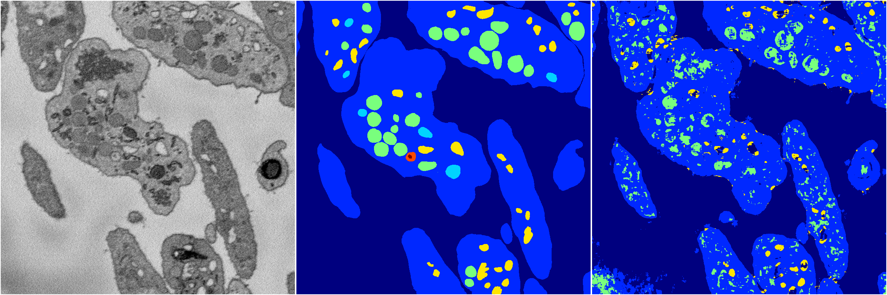</a>
<i>Click image for more details</i>

5 nets

**ari**: min 0.2594. max 0.7052. mean 0.5782.  ([best net](73/0))

**miou**: min 0.1436. max 0.3379. mean 0.2485.  ([best net](73/0))

**accuracy**: min 0.6362. max 0.8700. mean 0.8176.  ([best net](73/0))

**n_params**: min 849934.0000. max 849934.0000. mean 849934.0000.  ([best net](73/0))

---

<a href="72"><h2>random_2d_ed / 1210 / 72</h2></a>
Created 17 Dec 2018, 23:35:06

<a href="72">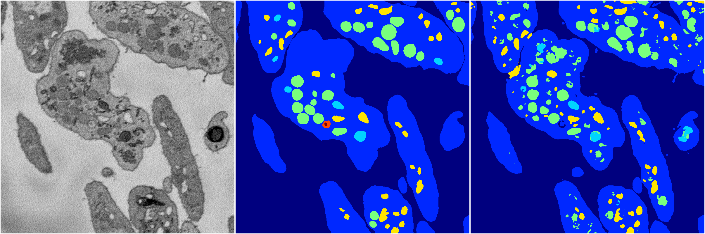</a>
<i>Click image for more details</i>

5 nets

**ari**: min 0.7392. max 0.8088. mean 0.7670.  ([best net](72/2))

**miou**: min 0.3123. max 0.4513. mean 0.3514.  ([best net](72/2))

**accuracy**: min 0.8840. max 0.9220. mean 0.9040.  ([best net](72/2))

**n_params**: min 2208110.0000. max 2208110.0000. mean 2208110.0000.  ([best net](72/0))

---

<a href="71"><h2>random_2d_ed / 1210 / 71</h2></a>
Created 17 Dec 2018, 23:35:06

<a href="71">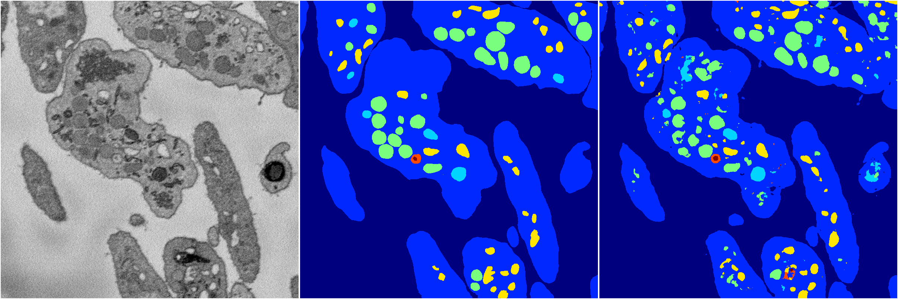</a>
<i>Click image for more details</i>

5 nets

**ari**: min 0.7166. max 0.8136. mean 0.7759.  ([best net](71/0))

**miou**: min 0.3252. max 0.5387. mean 0.4170.  ([best net](71/3))

**accuracy**: min 0.8741. max 0.9272. mean 0.9071.  ([best net](71/0))

**n_params**: min 3721395.0000. max 3721395.0000. mean 3721395.0000.  ([best net](71/0))

---

<a href="70"><h2>random_2d_ed / 1210 / 70</h2></a>
Created 17 Dec 2018, 23:35:06

<i>Click image for more details</i>

5 nets

**ari**: min 0.5074. max 0.5726. mean 0.5407.  ([best net](70/4))

**miou**: min 0.2400. max 0.2913. mean 0.2652.  ([best net](70/4))

**accuracy**: min 0.8753. max 0.8856. mean 0.8784.  ([best net](70/4))

**n_params**: min 8151091.0000. max 8151091.0000. mean 8151091.0000.  ([best net](70/1))

---

<a href="68"><h2>random_2d_ed / 1210 / 68</h2></a>
Created 17 Dec 2018, 23:35:06

<a href="68">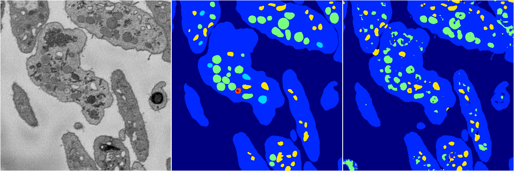</a>
<i>Click image for more details</i>

5 nets

**ari**: min 0.5588. max 0.7028. mean 0.6328.  ([best net](68/2))

**miou**: min 0.3211. max 0.3980. mean 0.3587.  ([best net](68/2))

**accuracy**: min 0.8605. max 0.9202. mean 0.8962.  ([best net](68/3))

**n_params**: min 110541902.0000. max 110541902.0000. mean 110541902.0000.  ([best net](68/1))

---

<a href="69"><h2>random_2d_ed / 1210 / 69</h2></a>
Created 17 Dec 2018, 23:35:06

<i>Click image for more details</i>

5 nets

**ari**: min 0.6695. max 0.7821. mean 0.7378.  ([best net](69/0))

**miou**: min 0.2814. max 0.4920. mean 0.3732.  ([best net](69/0))

**accuracy**: min 0.8733. max 0.9066. mean 0.8919.  ([best net](69/4))

**n_params**: min 1059188.0000. max 1059188.0000. mean 1059188.0000.  ([best net](69/0))

---

<a href="67"><h2>random_2d_ed / 1210 / 67</h2></a>
Created 17 Dec 2018, 23:35:06

<i>Click image for more details</i>

5 nets

**ari**: min 0.0000. max 0.8245. mean 0.6553.  ([best net](67/4))

**miou**: min 0.0691. max 0.5917. mean 0.4524.  ([best net](67/1))

**accuracy**: min 0.4837. max 0.9322. mean 0.8405.  ([best net](67/4))

**n_params**: min 16138544.0000. max 16138544.0000. mean 16138544.0000.  ([best net](67/0))

---

<a href="66"><h2>random_2d_ed / 1210 / 66</h2></a>
Created 17 Dec 2018, 23:35:06

<i>Click image for more details</i>

5 nets

**ari**: min -0.0000. max 0.7974. mean 0.6143.  ([best net](66/4))

**miou**: min 0.0694. max 0.4425. mean 0.2899.  ([best net](66/4))

**accuracy**: min 0.4857. max 0.9232. mean 0.8277.  ([best net](66/4))

**n_params**: min 69375063.0000. max 69375063.0000. mean 69375063.0000.  ([best net](66/1))

---

<a href="65"><h2>random_2d_ed / 1210 / 65</h2></a>
Created 17 Dec 2018, 23:35:06

<i>Click image for more details</i>

5 nets

**ari**: min 0.6792. max 0.8214. mean 0.7882.  ([best net](65/3))

**miou**: min 0.2634. max 0.5803. mean 0.4661.  ([best net](65/4))

**accuracy**: min 0.8724. max 0.9291. mean 0.9171.  ([best net](65/3))

**n_params**: min 13644535.0000. max 13644535.0000. mean 13644535.0000.  ([best net](65/0))

---

<a href="64"><h2>random_2d_ed / 1210 / 64</h2></a>
Created 17 Dec 2018, 23:35:06

<i>Click image for more details</i>

5 nets

**ari**: min 0.6532. max 0.7667. mean 0.7389.  ([best net](64/2))

**miou**: min 0.2705. max 0.4997. mean 0.4011.  ([best net](64/4))

**accuracy**: min 0.8690. max 0.8988. mean 0.8892.  ([best net](64/4))

**n_params**: min 1181003.0000. max 1181003.0000. mean 1181003.0000.  ([best net](64/0))

---

<a href="63"><h2>random_2d_ed / 1210 / 63</h2></a>
Created 17 Dec 2018, 23:35:06

<i>Click image for more details</i>

5 nets

**ari**: min 0.7235. max 0.8006. mean 0.7753.  ([best net](63/0))

**miou**: min 0.2934. max 0.5462. mean 0.4190.  ([best net](63/0))

**accuracy**: min 0.8937. max 0.9196. mean 0.9086.  ([best net](63/0))

**n_params**: min 1829719.0000. max 1829719.0000. mean 1829719.0000.  ([best net](63/0))

---

<a href="61"><h2>random_2d_ed / 1210 / 61</h2></a>
Created 17 Dec 2018, 23:35:06

<i>Click image for more details</i>

5 nets

**ari**: min 0.7176. max 0.7875. mean 0.7474.  ([best net](61/3))

**miou**: min 0.3276. max 0.4181. mean 0.3534.  ([best net](61/3))

**accuracy**: min 0.8709. max 0.9172. mean 0.8977.  ([best net](61/1))

**n_params**: min 20472004.0000. max 20472004.0000. mean 20472004.0000.  ([best net](61/4))

---

<a href="62"><h2>random_2d_ed / 1210 / 62</h2></a>
Created 17 Dec 2018, 23:35:06

<i>Click image for more details</i>

5 nets

**ari**: min 0.6883. max 0.7997. mean 0.7448.  ([best net](62/1))

**miou**: min 0.2429. max 0.4520. mean 0.3423.  ([best net](62/1))

**accuracy**: min 0.8784. max 0.9237. mean 0.9040.  ([best net](62/1))

**n_params**: min 33376211.0000. max 33376211.0000. mean 33376211.0000.  ([best net](62/1))

---

<a href="60"><h2>random_2d_ed / 1210 / 60</h2></a>
Created 17 Dec 2018, 23:35:06

<a href="60">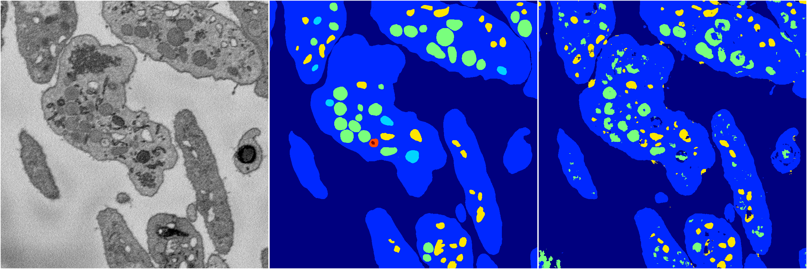</a>
<i>Click image for more details</i>

5 nets

**ari**: min 0.6539. max 0.7727. mean 0.7313.  ([best net](60/0))

**miou**: min 0.2519. max 0.3845. mean 0.3429.  ([best net](60/0))

**accuracy**: min 0.8600. max 0.9058. mean 0.8885.  ([best net](60/0))

**n_params**: min 2430729.0000. max 2430729.0000. mean 2430729.0000.  ([best net](60/0))

---

<a href="59"><h2>random_2d_ed / 1210 / 59</h2></a>
Created 17 Dec 2018, 23:35:06

<i>Click image for more details</i>

5 nets

**ari**: min 0.6428. max 0.7771. mean 0.7060.  ([best net](59/4))

**miou**: min 0.2367. max 0.4092. mean 0.3283.  ([best net](59/2))

**accuracy**: min 0.8645. max 0.9032. mean 0.8796.  ([best net](59/4))

**n_params**: min 1848767.0000. max 1848767.0000. mean 1848767.0000.  ([best net](59/0))

---

<a href="58"><h2>random_2d_ed / 1210 / 58</h2></a>
Created 17 Dec 2018, 23:35:06

<i>Click image for more details</i>

5 nets

**ari**: min 0.7444. max 0.8148. mean 0.7894.  ([best net](58/0))

**miou**: min 0.3739. max 0.4641. mean 0.4149.  ([best net](58/0))

**accuracy**: min 0.9030. max 0.9269. mean 0.9168.  ([best net](58/0))

**n_params**: min 30084549.0000. max 30084549.0000. mean 30084549.0000.  ([best net](58/1))

---

<a href="57"><h2>random_2d_ed / 1210 / 57</h2></a>
Created 17 Dec 2018, 23:35:06

<i>Click image for more details</i>

5 nets

**ari**: min 0.6891. max 0.7989. mean 0.7603.  ([best net](57/1))

**miou**: min 0.3269. max 0.4788. mean 0.4025.  ([best net](57/0))

**accuracy**: min 0.8783. max 0.9284. mean 0.9105.  ([best net](57/1))

**n_params**: min 58444407.0000. max 58444407.0000. mean 58444407.0000.  ([best net](57/1))

---

<a href="56"><h2>random_2d_ed / 1210 / 56</h2></a>
Created 17 Dec 2018, 23:35:06

<a href="56">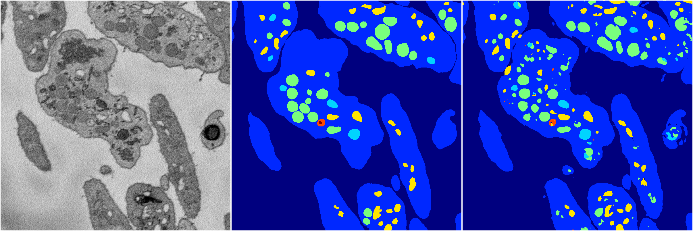</a>
<i>Click image for more details</i>

5 nets

**ari**: min 0.7290. max 0.7986. mean 0.7679.  ([best net](56/2))

**miou**: min 0.2959. max 0.4873. mean 0.3923.  ([best net](56/2))

**accuracy**: min 0.8959. max 0.9190. mean 0.9066.  ([best net](56/2))

**n_params**: min 7830378.0000. max 7830378.0000. mean 7830378.0000.  ([best net](56/0))

---

<a href="54"><h2>random_2d_ed / 1210 / 54</h2></a>
Created 17 Dec 2018, 23:35:06

<a href="54">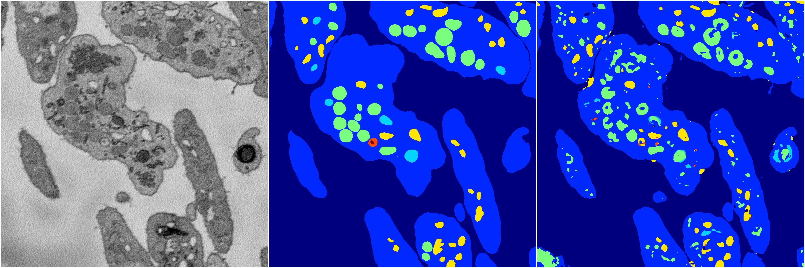</a>
<i>Click image for more details</i>

5 nets

**ari**: min 0.2464. max 0.7779. mean 0.6190.  ([best net](54/4))

**miou**: min 0.1025. max 0.4237. mean 0.3029.  ([best net](54/4))

**accuracy**: min 0.4525. max 0.9043. mean 0.7924.  ([best net](54/4))

**n_params**: min 1519826.0000. max 1519826.0000. mean 1519826.0000.  ([best net](54/0))

---

<a href="55"><h2>random_2d_ed / 1210 / 55</h2></a>
Created 17 Dec 2018, 23:35:06

<a href="55">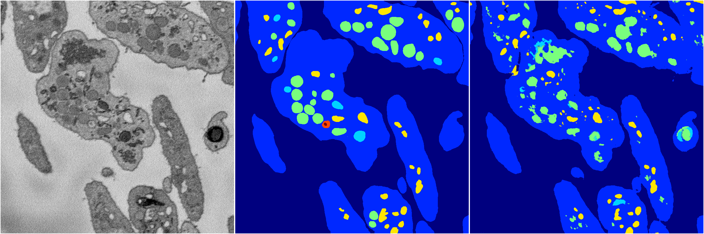</a>
<i>Click image for more details</i>

5 nets

**ari**: min -0.0000. max 0.8071. mean 0.5604.  ([best net](55/2))

**miou**: min 0.0686. max 0.4124. mean 0.2794.  ([best net](55/0))

**accuracy**: min 0.4799. max 0.9200. mean 0.7998.  ([best net](55/2))

**n_params**: min 13980982.0000. max 13980982.0000. mean 13980982.0000.  ([best net](55/1))

---

<a href="53"><h2>random_2d_ed / 1210 / 53</h2></a>
Created 17 Dec 2018, 23:35:06

<a href="53">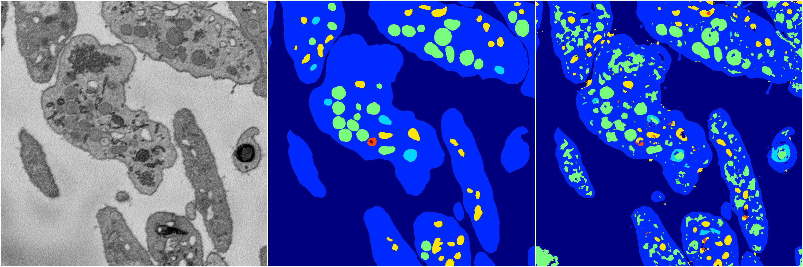</a>
<i>Click image for more details</i>

5 nets

**ari**: min 0.6826. max 0.7549. mean 0.7235.  ([best net](53/3))

**miou**: min 0.2654. max 0.4137. mean 0.3700.  ([best net](53/1))

**accuracy**: min 0.8657. max 0.8929. mean 0.8789.  ([best net](53/3))

**n_params**: min 1676845.0000. max 1676845.0000. mean 1676845.0000.  ([best net](53/1))

---

<a href="52"><h2>random_2d_ed / 1210 / 52</h2></a>
Created 17 Dec 2018, 23:35:06

<i>Click image for more details</i>

5 nets

**ari**: min 0.6281. max 0.7865. mean 0.7324.  ([best net](52/2))

**miou**: min 0.2838. max 0.5229. mean 0.4152.  ([best net](52/2))

**accuracy**: min 0.8385. max 0.9107. mean 0.8894.  ([best net](52/2))

**n_params**: min 1145374.0000. max 1145374.0000. mean 1145374.0000.  ([best net](52/1))

---

<a href="51"><h2>random_2d_ed / 1210 / 51</h2></a>
Created 17 Dec 2018, 23:35:05

<i>Click image for more details</i>

5 nets

**ari**: min 0.3354. max 0.8168. mean 0.7179.  ([best net](51/1))

**miou**: min 0.2038. max 0.5838. mean 0.4403.  ([best net](51/2))

**accuracy**: min 0.7123. max 0.9299. mean 0.8837.  ([best net](51/1))

**n_params**: min 15841305.0000. max 15841305.0000. mean 15841305.0000.  ([best net](51/1))

---

<a href="50"><h2>random_2d_ed / 1210 / 50</h2></a>
Created 17 Dec 2018, 23:35:05

<a href="50">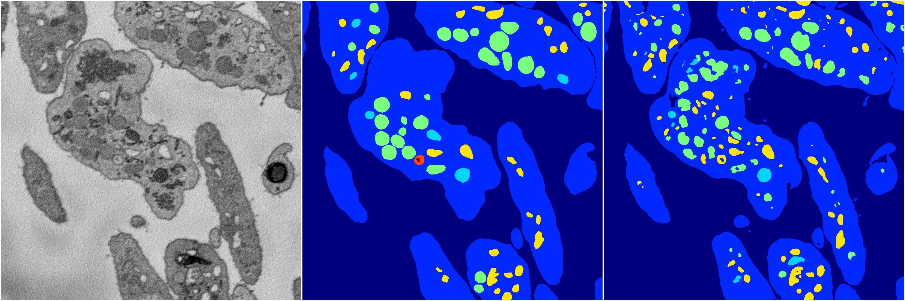</a>
<i>Click image for more details</i>

5 nets

**ari**: min 0.6341. max 0.7309. mean 0.6897.  ([best net](50/1))

**miou**: min 0.3024. max 0.4006. mean 0.3386.  ([best net](50/1))

**accuracy**: min 0.8602. max 0.9073. mean 0.8896.  ([best net](50/1))

**n_params**: min 32516923.0000. max 32516923.0000. mean 32516923.0000.  ([best net](50/0))

---

<a href="49"><h2>random_2d_ed / 1210 / 49</h2></a>
Created 17 Dec 2018, 23:35:05

<a href="49">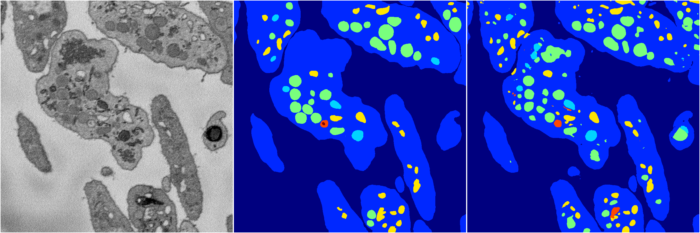</a>
<i>Click image for more details</i>

5 nets

**ari**: min 0.6538. max 0.8147. mean 0.7529.  ([best net](49/2))

**miou**: min 0.2812. max 0.4917. mean 0.3761.  ([best net](49/0))

**accuracy**: min 0.8452. max 0.9255. mean 0.8978.  ([best net](49/2))

**n_params**: min 8899337.0000. max 8899337.0000. mean 8899337.0000.  ([best net](49/0))

---

<a href="48"><h2>random_2d_ed / 1210 / 48</h2></a>
Created 17 Dec 2018, 23:35:05

<i>Click image for more details</i>

5 nets

**ari**: min 0.6916. max 0.8218. mean 0.7759.  ([best net](48/3))

**miou**: min 0.2800. max 0.5097. mean 0.4040.  ([best net](48/4))

**accuracy**: min 0.8717. max 0.9306. mean 0.9102.  ([best net](48/3))

**n_params**: min 15614745.0000. max 15614745.0000. mean 15614745.0000.  ([best net](48/0))

---

<a href="47"><h2>random_2d_ed / 1210 / 47</h2></a>
Created 17 Dec 2018, 23:35:05

<i>Click image for more details</i>

5 nets

**ari**: min 0.6705. max 0.8210. mean 0.7671.  ([best net](47/2))

**miou**: min 0.2385. max 0.5699. mean 0.4056.  ([best net](47/2))

**accuracy**: min 0.8770. max 0.9310. mean 0.9085.  ([best net](47/2))

**n_params**: min 10285548.0000. max 10285548.0000. mean 10285548.0000.  ([best net](47/0))

---

<a href="46"><h2>random_2d_ed / 1210 / 46</h2></a>
Created 17 Dec 2018, 23:35:05

<i>Click image for more details</i>

4 nets

**ari**: min -0.0000. max 0.7730. mean 0.5137.  ([best net](46/4))

**miou**: min 0.0663. max 0.3800. mean 0.2397.  ([best net](46/4))

**accuracy**: min 0.4638. max 0.9091. mean 0.7806.  ([best net](46/4))

**n_params**: min 209610976.0000. max 209610976.0000. mean 209610976.0000.  ([best net](46/0))

---

<a href="45"><h2>random_2d_ed / 1210 / 45</h2></a>
Created 17 Dec 2018, 23:35:05

<a href="45">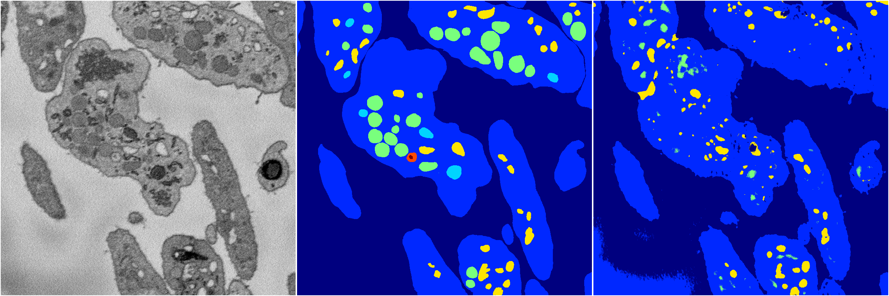</a>
<i>Click image for more details</i>

5 nets

**ari**: min 0.2557. max 0.5721. mean 0.4157.  ([best net](45/0))

**miou**: min 0.1904. max 0.3125. mean 0.2378.  ([best net](45/0))

**accuracy**: min 0.7749. max 0.8801. mean 0.8356.  ([best net](45/0))

**n_params**: min 26904529.0000. max 26904529.0000. mean 26904529.0000.  ([best net](45/0))

---

<a href="44"><h2>random_2d_ed / 1210 / 44</h2></a>
Created 17 Dec 2018, 23:35:05

<i>Click image for more details</i>

5 nets

**ari**: min 0.6498. max 0.7823. mean 0.7257.  ([best net](44/2))

**miou**: min 0.2895. max 0.4487. mean 0.3680.  ([best net](44/2))

**accuracy**: min 0.8626. max 0.9088. mean 0.8852.  ([best net](44/2))

**n_params**: min 1626124.0000. max 1626124.0000. mean 1626124.0000.  ([best net](44/0))

---

<a href="43"><h2>random_2d_ed / 1210 / 43</h2></a>
Created 17 Dec 2018, 23:35:05

<a href="43">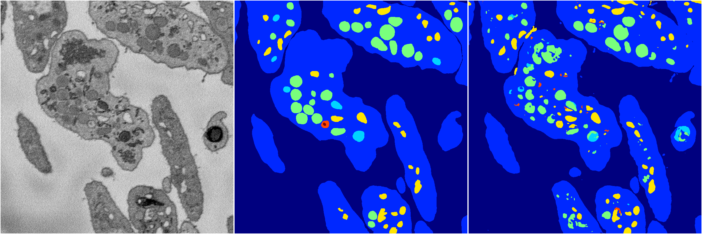</a>
<i>Click image for more details</i>

5 nets

**ari**: min 0.7732. max 0.8175. mean 0.8005.  ([best net](43/2))

**miou**: min 0.3422. max 0.4399. mean 0.4006.  ([best net](43/0))

**accuracy**: min 0.9121. max 0.9238. mean 0.9195.  ([best net](43/2))

**n_params**: min 23348310.0000. max 23348310.0000. mean 23348310.0000.  ([best net](43/0))

---

<a href="42"><h2>random_2d_ed / 1210 / 42</h2></a>
Created 17 Dec 2018, 23:35:05

<i>Click image for more details</i>

5 nets

**ari**: min 0.5590. max 0.5973. mean 0.5741.  ([best net](42/4))

**miou**: min 0.2402. max 0.3139. mean 0.2783.  ([best net](42/4))

**accuracy**: min 0.8571. max 0.8816. mean 0.8730.  ([best net](42/3))

**n_params**: min 32584963.0000. max 32584963.0000. mean 32584963.0000.  ([best net](42/0))

---

<a href="41"><h2>random_2d_ed / 1210 / 41</h2></a>
Created 17 Dec 2018, 23:35:05

<a href="41">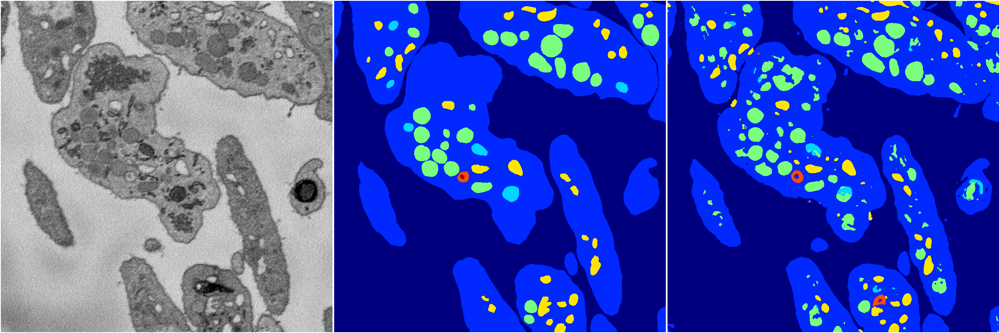</a>
<i>Click image for more details</i>

5 nets

**ari**: min 0.6634. max 0.7952. mean 0.7585.  ([best net](41/1))

**miou**: min 0.2834. max 0.5544. mean 0.4275.  ([best net](41/4))

**accuracy**: min 0.8680. max 0.9227. mean 0.9065.  ([best net](41/1))

**n_params**: min 29232314.0000. max 29232314.0000. mean 29232314.0000.  ([best net](41/3))

---

<a href="40"><h2>random_2d_ed / 1210 / 40</h2></a>
Created 17 Dec 2018, 23:35:05

<i>Click image for more details</i>

5 nets

**ari**: min 0.6506. max 0.7700. mean 0.7352.  ([best net](40/3))

**miou**: min 0.2371. max 0.4885. mean 0.3763.  ([best net](40/4))

**accuracy**: min 0.8683. max 0.9031. mean 0.8928.  ([best net](40/3))

**n_params**: min 413740.0000. max 413740.0000. mean 413740.0000.  ([best net](40/2))

---

<a href="39"><h2>random_2d_ed / 1210 / 39</h2></a>
Created 17 Dec 2018, 23:35:05

<i>Click image for more details</i>

5 nets

**ari**: min 0.7836. max 0.8219. mean 0.8073.  ([best net](39/2))

**miou**: min 0.4343. max 0.5823. mean 0.5071.  ([best net](39/2))

**accuracy**: min 0.9169. max 0.9327. mean 0.9252.  ([best net](39/2))

**n_params**: min 18660626.0000. max 18660626.0000. mean 18660626.0000.  ([best net](39/1))

---

<a href="38"><h2>random_2d_ed / 1210 / 38</h2></a>
Created 17 Dec 2018, 23:35:05

<a href="38">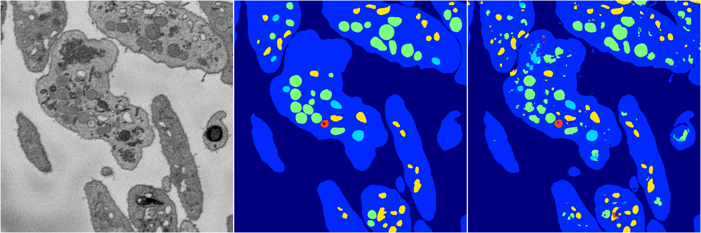</a>
<i>Click image for more details</i>

5 nets

**ari**: min 0.6598. max 0.8033. mean 0.7568.  ([best net](38/1))

**miou**: min 0.2494. max 0.5345. mean 0.4215.  ([best net](38/1))

**accuracy**: min 0.8791. max 0.9286. mean 0.9137.  ([best net](38/1))

**n_params**: min 64179977.0000. max 64179977.0000. mean 64179977.0000.  ([best net](38/0))

---

<a href="37"><h2>random_2d_ed / 1210 / 37</h2></a>
Created 17 Dec 2018, 23:35:05

<i>Click image for more details</i>

5 nets

**ari**: min 0.6472. max 0.8110. mean 0.7452.  ([best net](37/0))

**miou**: min 0.2368. max 0.4524. mean 0.3564.  ([best net](37/0))

**accuracy**: min 0.8786. max 0.9294. mean 0.9047.  ([best net](37/0))

**n_params**: min 16892864.0000. max 16892864.0000. mean 16892864.0000.  ([best net](37/1))

---

<a href="36"><h2>random_2d_ed / 1210 / 36</h2></a>
Created 17 Dec 2018, 23:35:05

<a href="36">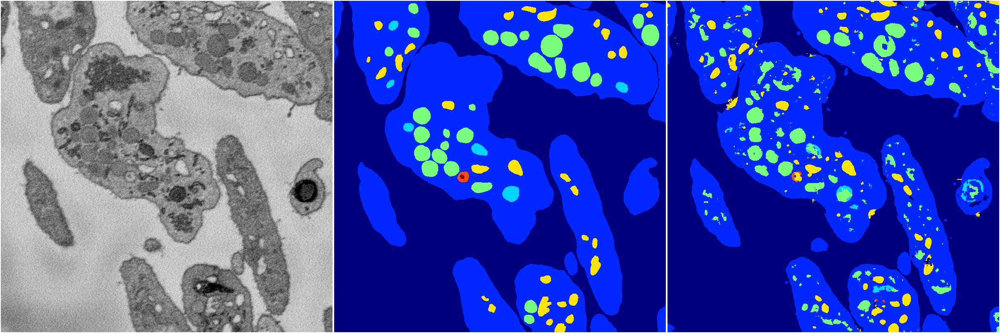</a>
<i>Click image for more details</i>

5 nets

**ari**: min 0.6530. max 0.7736. mean 0.7040.  ([best net](36/3))

**miou**: min 0.2372. max 0.4472. mean 0.3352.  ([best net](36/3))

**accuracy**: min 0.8640. max 0.9028. mean 0.8809.  ([best net](36/3))

**n_params**: min 499114.0000. max 499114.0000. mean 499114.0000.  ([best net](36/0))

---

<a href="34"><h2>random_2d_ed / 1210 / 34</h2></a>
Created 17 Dec 2018, 23:35:05

<i>Click image for more details</i>

5 nets

**ari**: min 0.6847. max 0.7908. mean 0.7270.  ([best net](34/1))

**miou**: min 0.2406. max 0.3776. mean 0.3073.  ([best net](34/1))

**accuracy**: min 0.8643. max 0.9180. mean 0.8919.  ([best net](34/0))

**n_params**: min 176986.0000. max 176986.0000. mean 176986.0000.  ([best net](34/1))

---

<a href="33"><h2>random_2d_ed / 1210 / 33</h2></a>
Created 17 Dec 2018, 23:35:05

<i>Click image for more details</i>

5 nets

**ari**: min 0.7783. max 0.8212. mean 0.8046.  ([best net](33/2))

**miou**: min 0.4039. max 0.5110. mean 0.4662.  ([best net](33/3))

**accuracy**: min 0.9033. max 0.9318. mean 0.9225.  ([best net](33/2))

**n_params**: min 44963904.0000. max 44963904.0000. mean 44963904.0000.  ([best net](33/0))

---

<a href="32"><h2>random_2d_ed / 1210 / 32</h2></a>
Created 17 Dec 2018, 23:35:05

<i>Click image for more details</i>

5 nets

**ari**: min 0.6660. max 0.7990. mean 0.7476.  ([best net](32/3))

**miou**: min 0.2969. max 0.5488. mean 0.4387.  ([best net](32/0))

**accuracy**: min 0.8590. max 0.9205. mean 0.8979.  ([best net](32/3))

**n_params**: min 4459788.0000. max 4459788.0000. mean 4459788.0000.  ([best net](32/0))

---

<a href="31"><h2>random_2d_ed / 1210 / 31</h2></a>
Created 17 Dec 2018, 23:35:05

<i>Click image for more details</i>

5 nets

**ari**: min 0.7990. max 0.8241. mean 0.8121.  ([best net](31/0))

**miou**: min 0.4204. max 0.5240. mean 0.4687.  ([best net](31/4))

**accuracy**: min 0.9198. max 0.9338. mean 0.9260.  ([best net](31/0))

**n_params**: min 52598179.0000. max 52598179.0000. mean 52598179.0000.  ([best net](31/0))

---

<a href="30"><h2>random_2d_ed / 1210 / 30</h2></a>
Created 17 Dec 2018, 23:35:05

<i>Click image for more details</i>

5 nets

**ari**: min 0.6325. max 0.7080. mean 0.6710.  ([best net](30/2))

**miou**: min 0.2337. max 0.3548. mean 0.2908.  ([best net](30/2))

**accuracy**: min 0.8600. max 0.8675. mean 0.8641.  ([best net](30/4))

**n_params**: min 456204.0000. max 456204.0000. mean 456204.0000.  ([best net](30/0))

---

<a href="29"><h2>random_2d_ed / 1210 / 29</h2></a>
Created 17 Dec 2018, 23:35:04

<i>Click image for more details</i>

5 nets

**ari**: min 0.6915. max 0.7862. mean 0.7566.  ([best net](29/1))

**miou**: min 0.3221. max 0.5209. mean 0.4369.  ([best net](29/0))

**accuracy**: min 0.8749. max 0.9116. mean 0.8971.  ([best net](29/1))

**n_params**: min 1002928.0000. max 1002928.0000. mean 1002928.0000.  ([best net](29/0))

---

<a href="28"><h2>random_2d_ed / 1210 / 28</h2></a>
Created 17 Dec 2018, 23:35:04

<i>Click image for more details</i>

5 nets

**ari**: min 0.6482. max 0.8022. mean 0.7667.  ([best net](28/3))

**miou**: min 0.2460. max 0.4487. mean 0.3977.  ([best net](28/0))

**accuracy**: min 0.8652. max 0.9241. mean 0.9105.  ([best net](28/0))

**n_params**: min 21265141.0000. max 21265141.0000. mean 21265141.0000.  ([best net](28/0))

---

<a href="26"><h2>random_2d_ed / 1210 / 26</h2></a>
Created 17 Dec 2018, 23:35:04

<a href="26">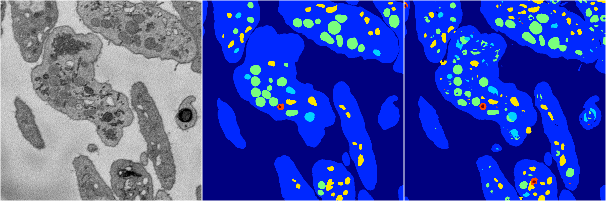</a>
<i>Click image for more details</i>

5 nets

**ari**: min 0.7215. max 0.8006. mean 0.7812.  ([best net](26/3))

**miou**: min 0.2987. max 0.5570. mean 0.4484.  ([best net](26/3))

**accuracy**: min 0.8733. max 0.9183. mean 0.9066.  ([best net](26/3))

**n_params**: min 4316592.0000. max 4316592.0000. mean 4316592.0000.  ([best net](26/1))

---

<a href="25"><h2>random_2d_ed / 1210 / 25</h2></a>
Created 17 Dec 2018, 23:35:04

<i>Click image for more details</i>

5 nets

**ari**: min 0.6444. max 0.7442. mean 0.7069.  ([best net](25/0))

**miou**: min 0.2539. max 0.3808. mean 0.3229.  ([best net](25/0))

**accuracy**: min 0.8596. max 0.8878. mean 0.8775.  ([best net](25/0))

**n_params**: min 436660.0000. max 436660.0000. mean 436660.0000.  ([best net](25/1))

---

<a href="24"><h2>random_2d_ed / 1210 / 24</h2></a>
Created 17 Dec 2018, 23:35:04

<i>Click image for more details</i>

5 nets

**ari**: min 0.6458. max 0.7660. mean 0.6917.  ([best net](24/4))

**miou**: min 0.2365. max 0.4192. mean 0.3182.  ([best net](24/4))

**accuracy**: min 0.8524. max 0.8978. mean 0.8718.  ([best net](24/4))

**n_params**: min 658000.0000. max 658000.0000. mean 658000.0000.  ([best net](24/1))

---

<a href="27"><h2>random_2d_ed / 1210 / 27</h2></a>
Created 17 Dec 2018, 23:35:04

<i>Click image for more details</i>

5 nets

**ari**: min 0.7273. max 0.8152. mean 0.7741.  ([best net](27/1))

**miou**: min 0.3352. max 0.4242. mean 0.3925.  ([best net](27/2))

**accuracy**: min 0.8844. max 0.9250. mean 0.9082.  ([best net](27/1))

**n_params**: min 16314706.0000. max 16314706.0000. mean 16314706.0000.  ([best net](27/0))

---

<a href="22"><h2>random_2d_ed / 1210 / 22</h2></a>
Created 17 Dec 2018, 23:35:04

<a href="22">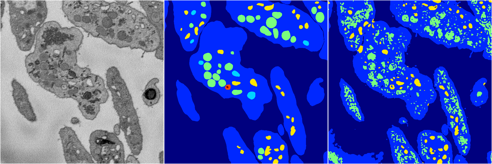</a>
<i>Click image for more details</i>

5 nets

**ari**: min 0.2999. max 0.6377. mean 0.5241.  ([best net](22/3))

**miou**: min 0.2836. max 0.3763. mean 0.3248.  ([best net](22/3))

**accuracy**: min 0.7927. max 0.9053. mean 0.8664.  ([best net](22/3))

**n_params**: min 57430773.0000. max 57430773.0000. mean 57430773.0000.  ([best net](22/0))

---

<a href="23"><h2>random_2d_ed / 1210 / 23</h2></a>
Created 17 Dec 2018, 23:35:04

<i>Click image for more details</i>

5 nets

**ari**: min 0.7543. max 0.7909. mean 0.7738.  ([best net](23/0))

**miou**: min 0.3703. max 0.4337. mean 0.3866.  ([best net](23/0))

**accuracy**: min 0.8919. max 0.9126. mean 0.9033.  ([best net](23/0))

**n_params**: min 20733906.0000. max 20733906.0000. mean 20733906.0000.  ([best net](23/0))

---

<a href="21"><h2>random_2d_ed / 1210 / 21</h2></a>
Created 17 Dec 2018, 23:35:04

<i>Click image for more details</i>

5 nets

**ari**: min 0.6942. max 0.8066. mean 0.7753.  ([best net](21/4))

**miou**: min 0.3305. max 0.5602. mean 0.4637.  ([best net](21/1))

**accuracy**: min 0.8710. max 0.9214. mean 0.9055.  ([best net](21/4))

**n_params**: min 3965798.0000. max 3965798.0000. mean 3965798.0000.  ([best net](21/2))

---

<a href="20"><h2>random_2d_ed / 1210 / 20</h2></a>
Created 17 Dec 2018, 23:35:04

<a href="20">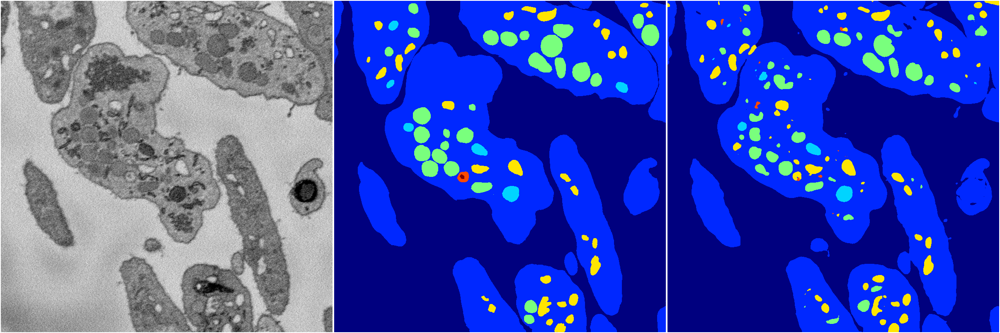</a>
<i>Click image for more details</i>

5 nets

**ari**: min 0.7085. max 0.8027. mean 0.7569.  ([best net](20/0))

**miou**: min 0.3183. max 0.4875. mean 0.3811.  ([best net](20/0))

**accuracy**: min 0.8842. max 0.9329. mean 0.9106.  ([best net](20/0))

**n_params**: min 154377280.0000. max 154377280.0000. mean 154377280.0000.  ([best net](20/0))

---

<a href="19"><h2>random_2d_ed / 1210 / 19</h2></a>
Created 17 Dec 2018, 23:35:04

<a href="19">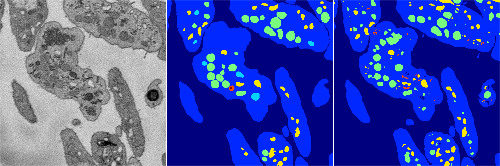</a>
<i>Click image for more details</i>

5 nets

**ari**: min 0.1685. max 0.7729. mean 0.5691.  ([best net](19/4))

**miou**: min 0.1481. max 0.3891. mean 0.2994.  ([best net](19/4))

**accuracy**: min 0.5107. max 0.9118. mean 0.8057.  ([best net](19/3))

**n_params**: min 9006913.0000. max 9006913.0000. mean 9006913.0000.  ([best net](19/0))

---

<a href="18"><h2>random_2d_ed / 1210 / 18</h2></a>
Created 17 Dec 2018, 23:35:04

<a href="18">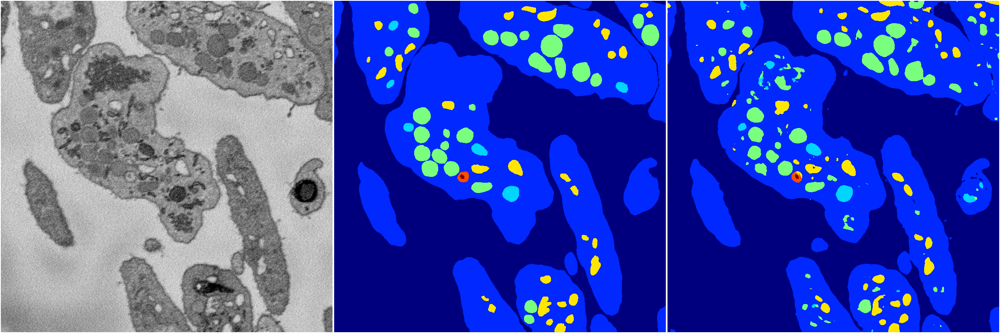</a>
<i>Click image for more details</i>

5 nets

**ari**: min 0.6327. max 0.8092. mean 0.7318.  ([best net](18/3))

**miou**: min 0.2532. max 0.5491. mean 0.3961.  ([best net](18/3))

**accuracy**: min 0.8420. max 0.9249. mean 0.8904.  ([best net](18/3))

**n_params**: min 28513233.0000. max 28513233.0000. mean 28513233.0000.  ([best net](18/0))

---

<a href="17"><h2>random_2d_ed / 1210 / 17</h2></a>
Created 17 Dec 2018, 23:35:04

<i>Click image for more details</i>

5 nets

**ari**: min 0.6777. max 0.7759. mean 0.7377.  ([best net](17/0))

**miou**: min 0.3535. max 0.4321. mean 0.3931.  ([best net](17/3))

**accuracy**: min 0.8398. max 0.9069. mean 0.8809.  ([best net](17/0))

**n_params**: min 929291.0000. max 929291.0000. mean 929291.0000.  ([best net](17/0))

---

<a href="16"><h2>random_2d_ed / 1210 / 16</h2></a>
Created 17 Dec 2018, 23:35:04

<a href="16">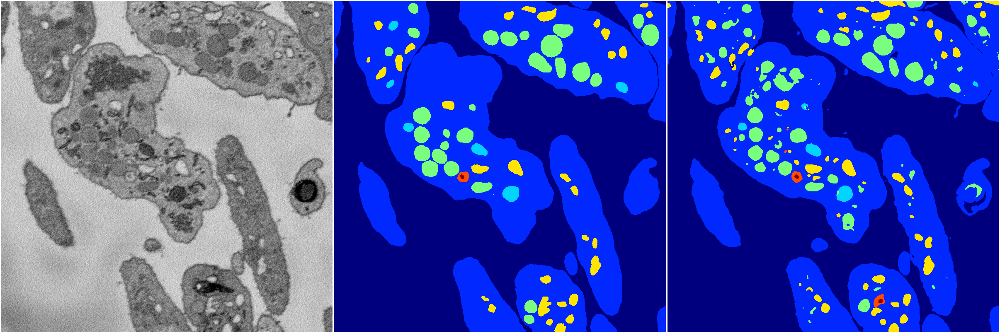</a>
<i>Click image for more details</i>

5 nets

**ari**: min 0.0000. max 0.8121. mean 0.6160.  ([best net](16/3))

**miou**: min 0.0691. max 0.5620. mean 0.3385.  ([best net](16/3))

**accuracy**: min 0.4836. max 0.9259. mean 0.8241.  ([best net](16/3))

**n_params**: min 15057909.0000. max 15057909.0000. mean 15057909.0000.  ([best net](16/0))

---

<a href="15"><h2>random_2d_ed / 1210 / 15</h2></a>
Created 17 Dec 2018, 23:35:04

<i>Click image for more details</i>

5 nets

**ari**: min 0.3910. max 0.7470. mean 0.6302.  ([best net](15/4))

**miou**: min 0.1304. max 0.4193. mean 0.2943.  ([best net](15/3))

**accuracy**: min 0.4426. max 0.8906. mean 0.7827.  ([best net](15/4))

**n_params**: min 1183171.0000. max 1183171.0000. mean 1183171.0000.  ([best net](15/0))

---

<a href="14"><h2>random_2d_ed / 1210 / 14</h2></a>
Created 17 Dec 2018, 23:35:04

<i>Click image for more details</i>

5 nets

**ari**: min 0.7362. max 0.8091. mean 0.7745.  ([best net](14/2))

**miou**: min 0.3532. max 0.4627. mean 0.3937.  ([best net](14/2))

**accuracy**: min 0.8889. max 0.9260. mean 0.9082.  ([best net](14/2))

**n_params**: min 10409771.0000. max 10409771.0000. mean 10409771.0000.  ([best net](14/0))

---

<a href="13"><h2>random_2d_ed / 1210 / 13</h2></a>
Created 17 Dec 2018, 23:35:04

<a href="13">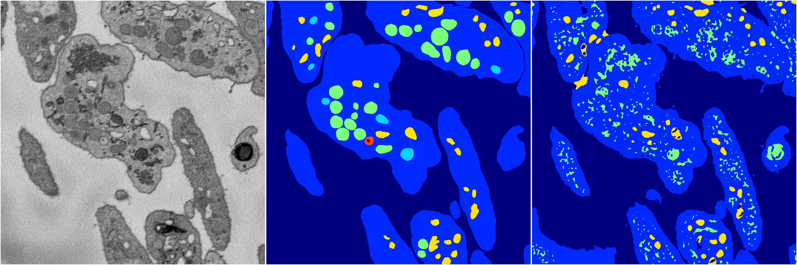</a>
<i>Click image for more details</i>

5 nets

**ari**: min 0.3781. max 0.5558. mean 0.5032.  ([best net](13/4))

**miou**: min 0.2219. max 0.3347. mean 0.2992.  ([best net](13/4))

**accuracy**: min 0.8425. max 0.8755. mean 0.8593.  ([best net](13/4))

**n_params**: min 46196228.0000. max 46196228.0000. mean 46196228.0000.  ([best net](13/0))

---

<a href="12"><h2>random_2d_ed / 1210 / 12</h2></a>
Created 17 Dec 2018, 23:35:04

<i>Click image for more details</i>

5 nets

**ari**: min 0.7007. max 0.8067. mean 0.7734.  ([best net](12/0))

**miou**: min 0.2992. max 0.4927. mean 0.4282.  ([best net](12/0))

**accuracy**: min 0.8808. max 0.9225. mean 0.9077.  ([best net](12/0))

**n_params**: min 14260710.0000. max 14260710.0000. mean 14260710.0000.  ([best net](12/0))

---

<a href="11"><h2>random_2d_ed / 1210 / 11</h2></a>
Created 17 Dec 2018, 23:35:03

<i>Click image for more details</i>

5 nets

**ari**: min 0.6366. max 0.7577. mean 0.6915.  ([best net](11/0))

**miou**: min 0.2353. max 0.4545. mean 0.3433.  ([best net](11/0))

**accuracy**: min 0.8593. max 0.8955. mean 0.8727.  ([best net](11/0))

**n_params**: min 271445.0000. max 271445.0000. mean 271445.0000.  ([best net](11/0))

---

<a href="10"><h2>random_2d_ed / 1210 / 10</h2></a>
Created 17 Dec 2018, 23:35:03

<i>Click image for more details</i>

5 nets

**ari**: min 0.3520. max 0.7952. mean 0.6939.  ([best net](10/2))

**miou**: min 0.2707. max 0.4115. mean 0.3622.  ([best net](10/1))

**accuracy**: min 0.7337. max 0.9233. mean 0.8813.  ([best net](10/2))

**n_params**: min 14119602.0000. max 14119602.0000. mean 14119602.0000.  ([best net](10/1))

---

<a href="9"><h2>random_2d_ed / 1210 / 9</h2></a>
Created 17 Dec 2018, 23:35:03

<i>Click image for more details</i>

5 nets

**ari**: min 0.0174. max 0.7915. mean 0.6004.  ([best net](9/4))

**miou**: min 0.0668. max 0.4328. mean 0.3285.  ([best net](9/2))

**accuracy**: min 0.4676. max 0.9293. mean 0.8224.  ([best net](9/4))

**n_params**: min 167629255.0000. max 167629255.0000. mean 167629255.0000.  ([best net](9/0))

---

<a href="8"><h2>random_2d_ed / 1210 / 8</h2></a>
Created 17 Dec 2018, 23:35:03

<i>Click image for more details</i>

5 nets

**ari**: min 0.7145. max 0.7839. mean 0.7612.  ([best net](8/0))

**miou**: min 0.3524. max 0.5500. mean 0.4150.  ([best net](8/0))

**accuracy**: min 0.8754. max 0.9127. mean 0.8973.  ([best net](8/0))

**n_params**: min 8785339.0000. max 8785339.0000. mean 8785339.0000.  ([best net](8/0))

---

<a href="7"><h2>random_2d_ed / 1210 / 7</h2></a>
Created 17 Dec 2018, 23:35:03

<a href="7">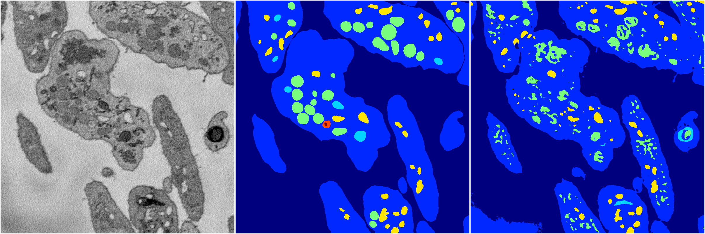</a>
<i>Click image for more details</i>

5 nets

**ari**: min 0.6404. max 0.7601. mean 0.7026.  ([best net](7/2))

**miou**: min 0.2466. max 0.3698. mean 0.3172.  ([best net](7/3))

**accuracy**: min 0.8377. max 0.9009. mean 0.8770.  ([best net](7/2))

**n_params**: min 3407898.0000. max 3407898.0000. mean 3407898.0000.  ([best net](7/3))

---

<a href="6"><h2>random_2d_ed / 1210 / 6</h2></a>
Created 17 Dec 2018, 23:35:03

<i>Click image for more details</i>

5 nets

**ari**: min 0.6408. max 0.7619. mean 0.6937.  ([best net](6/0))

**miou**: min 0.2670. max 0.4515. mean 0.3380.  ([best net](6/0))

**accuracy**: min 0.8621. max 0.9205. mean 0.8895.  ([best net](6/0))

**n_params**: min 183377231.0000. max 183377231.0000. mean 183377231.0000.  ([best net](6/0))

---

<a href="5"><h2>random_2d_ed / 1210 / 5</h2></a>
Created 17 Dec 2018, 23:35:03

<a href="5">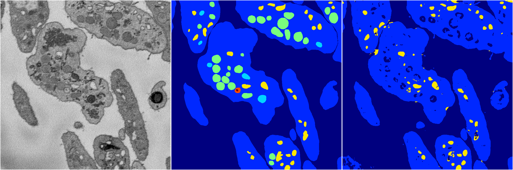</a>
<i>Click image for more details</i>

5 nets

**ari**: min 0.4739. max 0.7468. mean 0.6317.  ([best net](5/3))

**miou**: min 0.2098. max 0.3261. mean 0.2657.  ([best net](5/3))

**accuracy**: min 0.8126. max 0.8975. mean 0.8592.  ([best net](5/3))

**n_params**: min 108011.0000. max 108011.0000. mean 108011.0000.  ([best net](5/0))

---

<a href="4"><h2>random_2d_ed / 1210 / 4</h2></a>
Created 17 Dec 2018, 23:35:03

<i>Click image for more details</i>

5 nets

**ari**: min 0.6566. max 0.7843. mean 0.7304.  ([best net](4/3))

**miou**: min 0.2966. max 0.5236. mean 0.3903.  ([best net](4/3))

**accuracy**: min 0.8427. max 0.9102. mean 0.8828.  ([best net](4/3))

**n_params**: min 1056744.0000. max 1056744.0000. mean 1056744.0000.  ([best net](4/0))

---

<a href="3"><h2>random_2d_ed / 1210 / 3</h2></a>
Created 17 Dec 2018, 23:35:03

<i>Click image for more details</i>

5 nets

**ari**: min 0.1980. max 0.8088. mean 0.6781.  ([best net](3/2))

**miou**: min 0.2242. max 0.4475. mean 0.3819.  ([best net](3/2))

**accuracy**: min 0.6532. max 0.9242. mean 0.8675.  ([best net](3/2))

**n_params**: min 2874765.0000. max 2874765.0000. mean 2874765.0000.  ([best net](3/0))

---

<a href="2"><h2>random_2d_ed / 1210 / 2</h2></a>
Created 17 Dec 2018, 23:35:03

<i>Click image for more details</i>

5 nets

**ari**: min 0.7415. max 0.8138. mean 0.7836.  ([best net](2/1))

**miou**: min 0.3402. max 0.5596. mean 0.4330.  ([best net](2/4))

**accuracy**: min 0.8995. max 0.9310. mean 0.9168.  ([best net](2/1))

**n_params**: min 157031444.0000. max 157031444.0000. mean 157031444.0000.  ([best net](2/0))

---

<a href="1"><h2>random_2d_ed / 1210 / 1</h2></a>
Created 17 Dec 2018, 23:35:03

<i>Click image for more details</i>

5 nets

**ari**: min 0.6605. max 0.8106. mean 0.7748.  ([best net](1/2))

**miou**: min 0.2794. max 0.5853. mean 0.4699.  ([best net](1/0))

**accuracy**: min 0.8538. max 0.9258. mean 0.9077.  ([best net](1/2))

**n_params**: min 6273536.0000. max 6273536.0000. mean 6273536.0000.  ([best net](1/1))

---

<a href="0"><h2>random_2d_ed / 1210 / 0</h2></a>
Created 17 Dec 2018, 23:35:03

<i>Click image for more details</i>

5 nets

**ari**: min 0.6258. max 0.7520. mean 0.6652.  ([best net](0/1))

**miou**: min 0.2336. max 0.3614. mean 0.2813.  ([best net](0/1))

**accuracy**: min 0.8560. max 0.8930. mean 0.8668.  ([best net](0/1))

**n_params**: min 259856.0000. max 259856.0000. mean 259856.0000.  ([best net](0/0))

---

[Back](..)&nbsp;&nbsp;&nbsp;&nbsp;&nbsp;[Home](https://leapmanlab.github.io/snapshots)

---