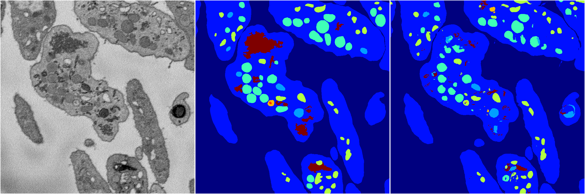
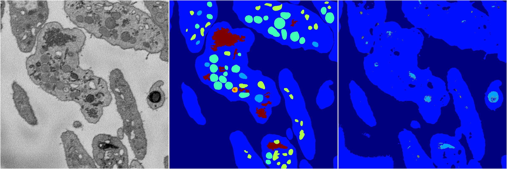
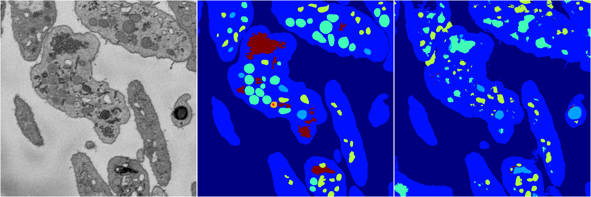

[Back](..)&nbsp;&nbsp;&nbsp;&nbsp;&nbsp;[Home](https://leapmanlab.github.io/snapshots)

---

<a href="3"><h2>random_2d_ed / 1216 / 0 / 3</h2></a>
Created 21 Dec 2018, 14:17:40

<i>Click for more details</i>

**ari**: 0.8091. **miou**: 0.5286. **accuracy**: 0.9176. **n_params**: 12260483.0000. 

---

<a href="4"><h2>random_2d_ed / 1216 / 0 / 4</h2></a>
Created 21 Dec 2018, 14:17:40

<i>Click for more details</i>

**ari**: 0.8128. **miou**: 0.5557. **accuracy**: 0.9206. **n_params**: 12260483.0000. 

---

<a href="1"><h2>random_2d_ed / 1216 / 0 / 1</h2></a>
Created 21 Dec 2018, 14:17:40

<i>Click for more details</i>

**ari**: 0.6323. **miou**: 0.2285. **accuracy**: 0.8524. **n_params**: 12260483.0000. 

---

<a href="2"><h2>random_2d_ed / 1216 / 0 / 2</h2></a>
Created 21 Dec 2018, 14:17:40

<i>Click for more details</i>

**ari**: 0.7182. **miou**: 0.3376. **accuracy**: 0.8722. **n_params**: 12260483.0000. 

---

<a href="0"><h2>random_2d_ed / 1216 / 0 / 0</h2></a>
Created 21 Dec 2018, 14:17:40

<i>Click for more details</i>

**ari**: 0.8149. **miou**: 0.5518. **accuracy**: 0.9200. **n_params**: 12260483.0000. 

---

[Back](..)&nbsp;&nbsp;&nbsp;&nbsp;&nbsp;[Home](https://leapmanlab.github.io/snapshots)

---