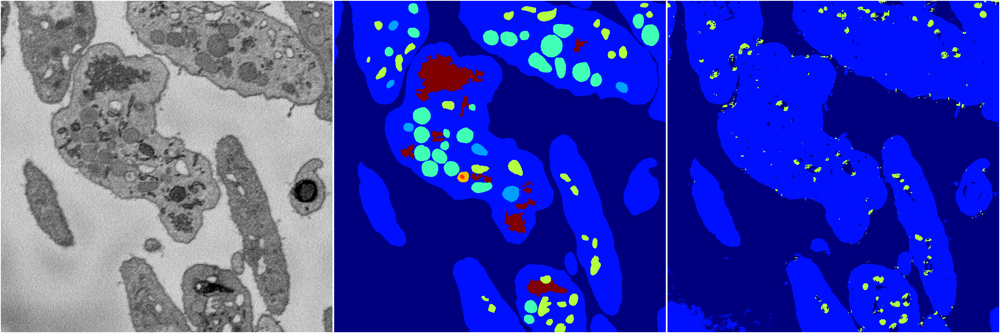
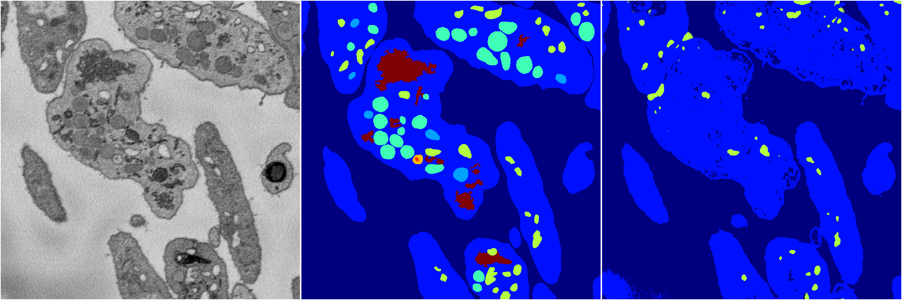
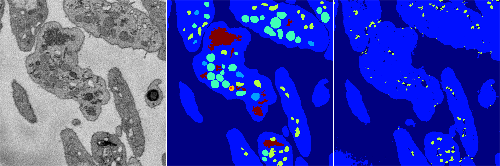
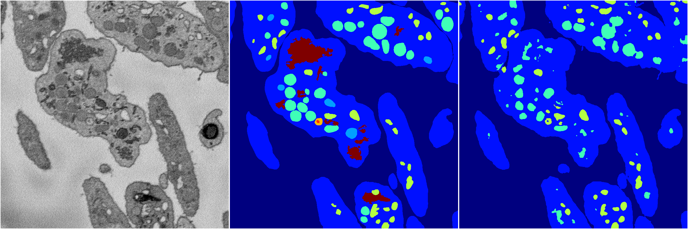

[Back](..)&nbsp;&nbsp;&nbsp;&nbsp;&nbsp;[Home](https://leapmanlab.github.io/snapshots)

---

<a href="0"><h2>random_2d_ed / 1216 / 1 / 0</h2></a>
Created 21 Dec 2018, 01:15:55

<i>Click for more details</i>

**ari**: 0.5633. **miou**: 0.2505. **accuracy**: 0.8700. **n_params**: 38733217.0000. 

---

<a href="3"><h2>random_2d_ed / 1216 / 1 / 3</h2></a>
Created 21 Dec 2018, 01:15:55

<i>Click for more details</i>

**ari**: 0.5444. **miou**: 0.2408. **accuracy**: 0.8551. **n_params**: 38733217.0000. 

---

<a href="1"><h2>random_2d_ed / 1216 / 1 / 1</h2></a>
Created 21 Dec 2018, 01:15:55

<i>Click for more details</i>

**ari**: 0.5646. **miou**: 0.2488. **accuracy**: 0.8698. **n_params**: 38733217.0000. 

---

<a href="4"><h2>random_2d_ed / 1216 / 1 / 4</h2></a>
Created 21 Dec 2018, 01:15:55

<i>Click for more details</i>

**ari**: 0.6965. **miou**: 0.3457. **accuracy**: 0.9019. **n_params**: 38733217.0000. 

---

<a href="2"><h2>random_2d_ed / 1216 / 1 / 2</h2></a>
Created 21 Dec 2018, 01:15:55

<i>Click for more details</i>

**ari**: 0.7157. **miou**: 0.4083. **accuracy**: 0.9084. **n_params**: 38733217.0000. 

---

[Back](..)&nbsp;&nbsp;&nbsp;&nbsp;&nbsp;[Home](https://leapmanlab.github.io/snapshots)

---