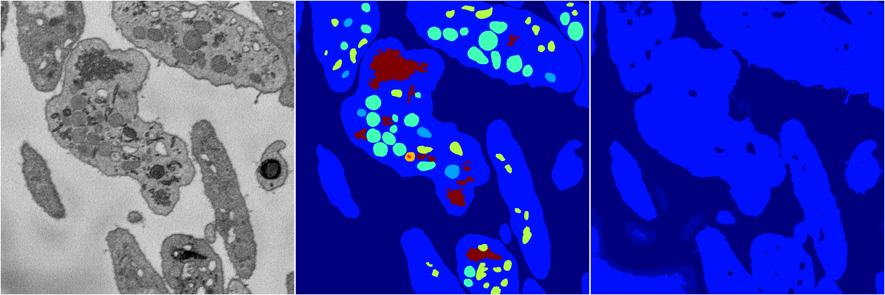
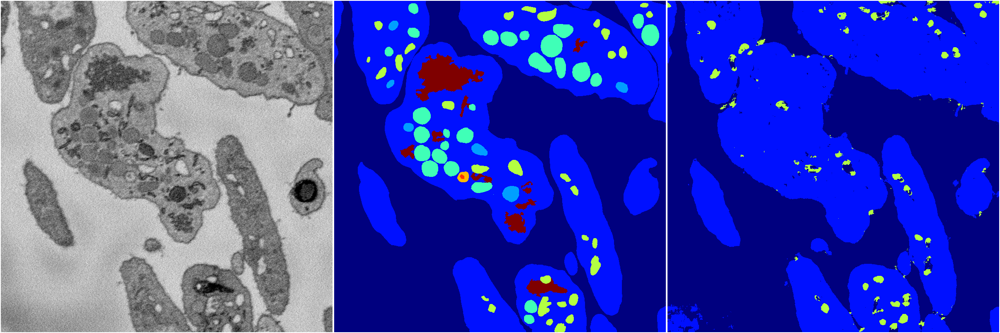
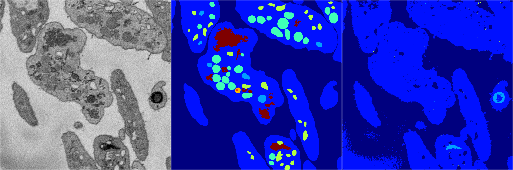
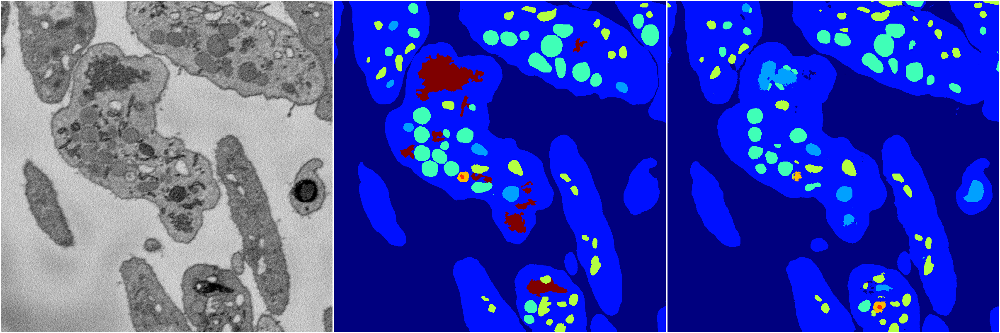

[Back](..)&nbsp;&nbsp;&nbsp;&nbsp;&nbsp;[Home](https://leapmanlab.github.io/snapshots)

---

<a href="0"><h2>random_2d_ed / 1216 / 10 / 0</h2></a>
Created 21 Dec 2018, 01:15:55

<i>Click for more details</i>

**ari**: 0.6166. **miou**: 0.2020. **accuracy**: 0.8525. **n_params**: 3350997.0000. 

---

<a href="3"><h2>random_2d_ed / 1216 / 10 / 3</h2></a>
Created 21 Dec 2018, 01:15:55

<i>Click for more details</i>

**ari**: 0.7190. **miou**: 0.2613. **accuracy**: 0.8831. **n_params**: 3350997.0000. 

---

<a href="1"><h2>random_2d_ed / 1216 / 10 / 1</h2></a>
Created 21 Dec 2018, 01:15:55

<i>Click for more details</i>

**ari**: 0.8142. **miou**: 0.5346. **accuracy**: 0.9186. **n_params**: 3350997.0000. 

---

<a href="4"><h2>random_2d_ed / 1216 / 10 / 4</h2></a>
Created 21 Dec 2018, 01:15:55

<i>Click for more details</i>

**ari**: 0.6336. **miou**: 0.2056. **accuracy**: 0.8551. **n_params**: 3350997.0000. 

---

<a href="2"><h2>random_2d_ed / 1216 / 10 / 2</h2></a>
Created 21 Dec 2018, 01:15:55

<i>Click for more details</i>

**ari**: 0.8124. **miou**: 0.5181. **accuracy**: 0.9175. **n_params**: 3350997.0000. 

---

[Back](..)&nbsp;&nbsp;&nbsp;&nbsp;&nbsp;[Home](https://leapmanlab.github.io/snapshots)

---