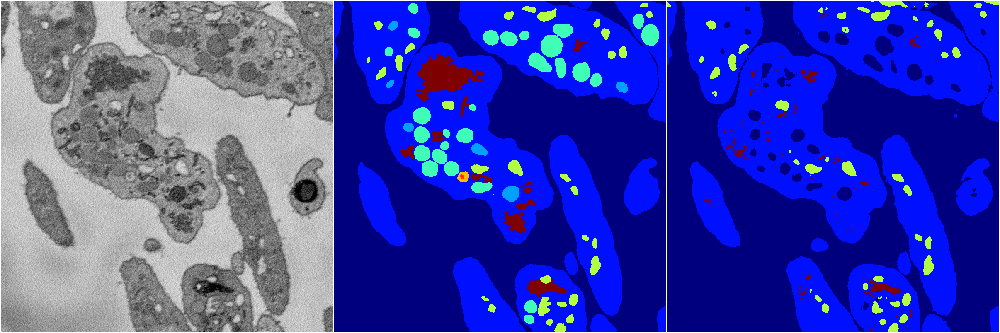
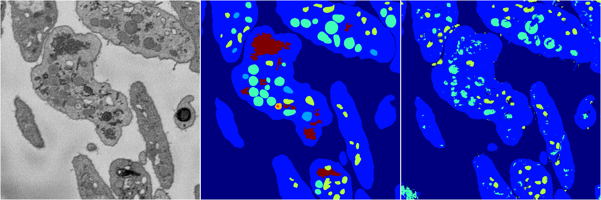

[Back](..)&nbsp;&nbsp;&nbsp;&nbsp;&nbsp;[Home](https://leapmanlab.github.io/snapshots)

---

<a href="4"><h2>random_2d_ed / 1216 / 11 / 4</h2></a>
Created 17 Dec 2018, 02:57:37

<i>Click for more details</i>

**ari**: 0.7615. **miou**: 0.3194. **accuracy**: 0.8987. **n_params**: 7887743.0000. 

---

<a href="3"><h2>random_2d_ed / 1216 / 11 / 3</h2></a>
Created 17 Dec 2018, 02:57:37

<i>Click for more details</i>

**ari**: 0.7590. **miou**: 0.3141. **accuracy**: 0.8921. **n_params**: 7887743.0000. 

---

<a href="2"><h2>random_2d_ed / 1216 / 11 / 2</h2></a>
Created 17 Dec 2018, 02:57:37

<i>Click for more details</i>

**ari**: 0.7945. **miou**: 0.3707. **accuracy**: 0.9118. **n_params**: 7887743.0000. 

---

[Back](..)&nbsp;&nbsp;&nbsp;&nbsp;&nbsp;[Home](https://leapmanlab.github.io/snapshots)

---