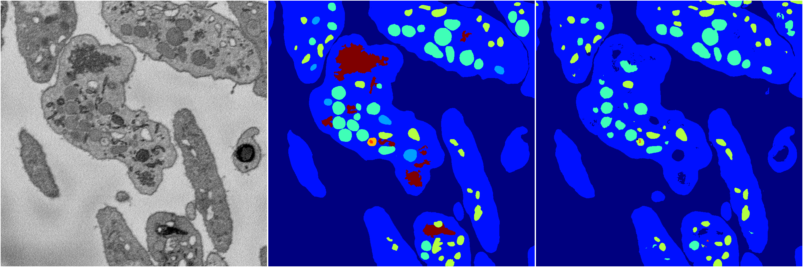
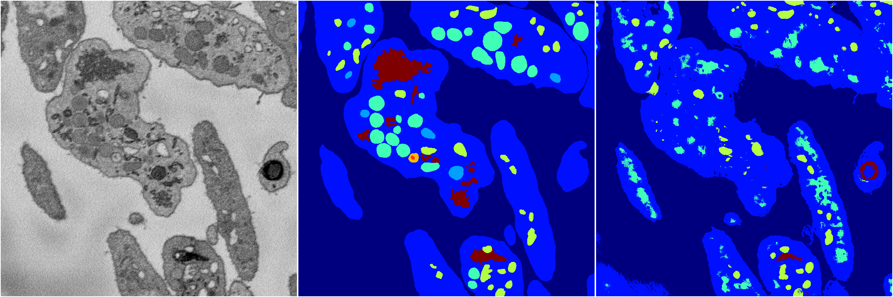
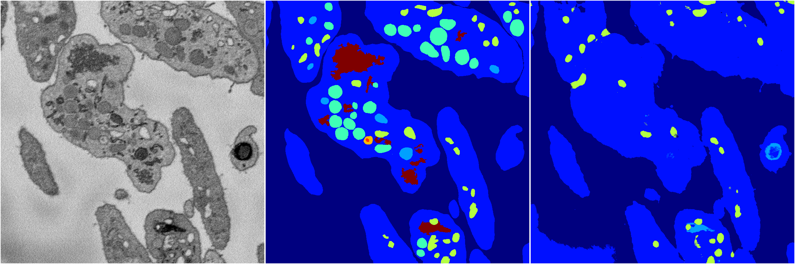

[Back](..)&nbsp;&nbsp;&nbsp;&nbsp;&nbsp;[Home](https://leapmanlab.github.io/snapshots)

---

<a href="0"><h2>random_2d_ed / 1216 / 12 / 0</h2></a>
Created 21 Dec 2018, 01:15:55

<i>Click for more details</i>

**ari**: 0.7906. **miou**: 0.4330. **accuracy**: 0.9113. **n_params**: 4952380.0000. 

---

<a href="3"><h2>random_2d_ed / 1216 / 12 / 3</h2></a>
Created 21 Dec 2018, 01:15:55

<i>Click for more details</i>

**ari**: 0.7029. **miou**: 0.2909. **accuracy**: 0.8637. **n_params**: 4952380.0000. 

---

<a href="1"><h2>random_2d_ed / 1216 / 12 / 1</h2></a>
Created 21 Dec 2018, 01:15:55

<i>Click for more details</i>

**ari**: 0.8200. **miou**: 0.4920. **accuracy**: 0.9204. **n_params**: 4952380.0000. 

---

<a href="4"><h2>random_2d_ed / 1216 / 12 / 4</h2></a>
Created 21 Dec 2018, 01:15:55

<i>Click for more details</i>

**ari**: 0.6891. **miou**: 0.2741. **accuracy**: 0.8747. **n_params**: 4952380.0000. 

---

[Back](..)&nbsp;&nbsp;&nbsp;&nbsp;&nbsp;[Home](https://leapmanlab.github.io/snapshots)

---