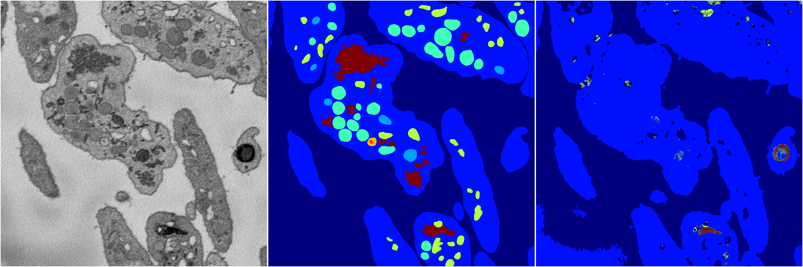
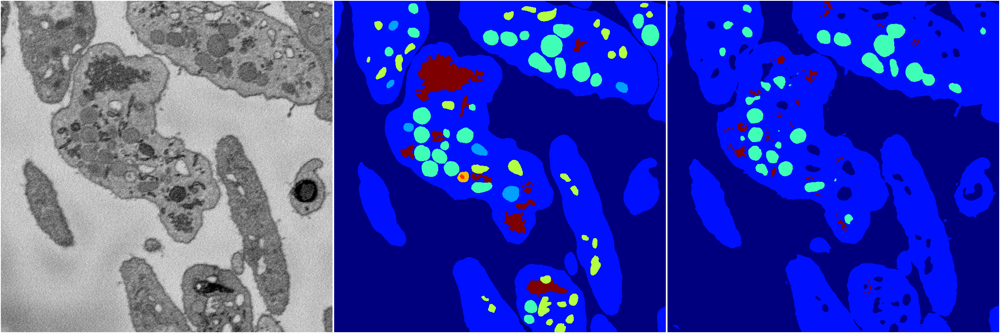

[Back](..)&nbsp;&nbsp;&nbsp;&nbsp;&nbsp;[Home](https://leapmanlab.github.io/snapshots)

---

<a href="1"><h2>random_2d_ed / 1216 / 13 / 1</h2></a>
Created 21 Dec 2018, 01:15:55

<i>Click for more details</i>

**ari**: 0.6189. **miou**: 0.2157. **accuracy**: 0.8553. **n_params**: 39472433.0000. 

---

<a href="4"><h2>random_2d_ed / 1216 / 13 / 4</h2></a>
Created 21 Dec 2018, 01:15:55

<i>Click for more details</i>

**ari**: 0.7079. **miou**: 0.2983. **accuracy**: 0.8862. **n_params**: 39472433.0000. 

---

<a href="2"><h2>random_2d_ed / 1216 / 13 / 2</h2></a>
Created 21 Dec 2018, 01:15:55

<i>Click for more details</i>

**ari**: 0.7594. **miou**: 0.3486. **accuracy**: 0.8978. **n_params**: 39472433.0000. 

---

[Back](..)&nbsp;&nbsp;&nbsp;&nbsp;&nbsp;[Home](https://leapmanlab.github.io/snapshots)

---