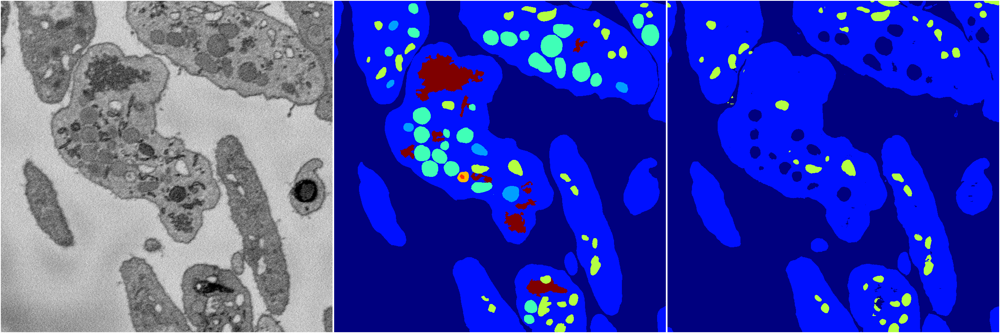
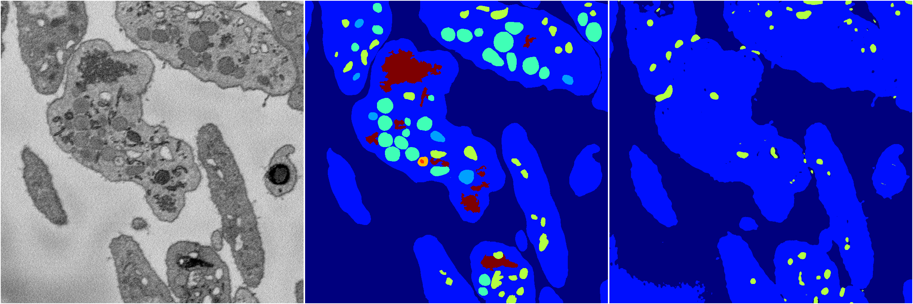

[Back](..)&nbsp;&nbsp;&nbsp;&nbsp;&nbsp;[Home](https://leapmanlab.github.io/snapshots)

---

<a href="4"><h2>random_2d_ed / 1216 / 14 / 4</h2></a>
Created 17 Dec 2018, 23:35:09

<i>Click for more details</i>

**ari**: 0.7381. **miou**: 0.2974. **accuracy**: 0.8867. **n_params**: 7185509.0000. 

---

<a href="2"><h2>random_2d_ed / 1216 / 14 / 2</h2></a>
Created 17 Dec 2018, 23:35:09

<i>Click for more details</i>

**ari**: 0.6331. **miou**: 0.2424. **accuracy**: 0.8532. **n_params**: 7185509.0000. 

---

<a href="1"><h2>random_2d_ed / 1216 / 14 / 1</h2></a>
Created 17 Dec 2018, 23:35:09

<i>Click for more details</i>

**ari**: 0.8023. **miou**: 0.4566. **accuracy**: 0.9126. **n_params**: 7185509.0000. 

---

[Back](..)&nbsp;&nbsp;&nbsp;&nbsp;&nbsp;[Home](https://leapmanlab.github.io/snapshots)

---