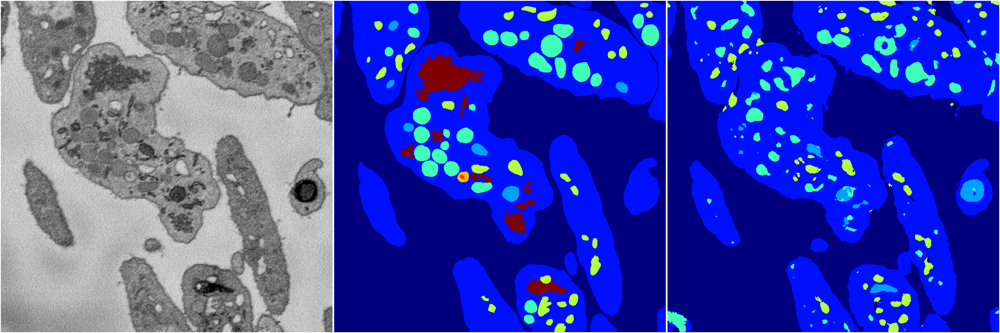
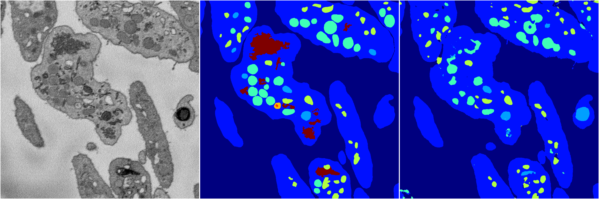
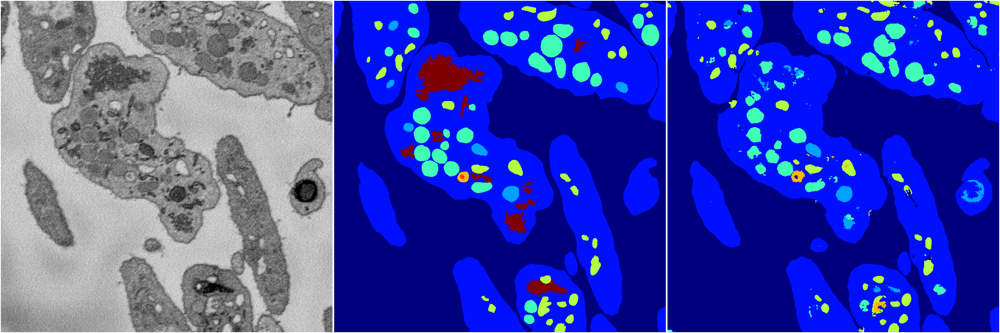
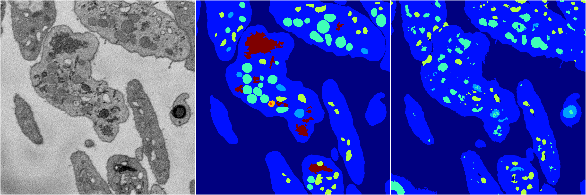

[Back](..)&nbsp;&nbsp;&nbsp;&nbsp;&nbsp;[Home](https://leapmanlab.github.io/snapshots)

---

<a href="0"><h2>random_2d_ed / 1216 / 15 / 0</h2></a>
Created 21 Dec 2018, 01:15:55

<i>Click for more details</i>

**ari**: 0.7558. **miou**: 0.3666. **accuracy**: 0.8859. **n_params**: 908780.0000. 

---

<a href="3"><h2>random_2d_ed / 1216 / 15 / 3</h2></a>
Created 21 Dec 2018, 01:15:55

<i>Click for more details</i>

**ari**: 0.7814. **miou**: 0.4081. **accuracy**: 0.9026. **n_params**: 908780.0000. 

---

<a href="1"><h2>random_2d_ed / 1216 / 15 / 1</h2></a>
Created 21 Dec 2018, 01:15:55

<i>Click for more details</i>

**ari**: 0.7957. **miou**: 0.4642. **accuracy**: 0.9092. **n_params**: 908780.0000. 

---

<a href="4"><h2>random_2d_ed / 1216 / 15 / 4</h2></a>
Created 21 Dec 2018, 01:15:55

<i>Click for more details</i>

**ari**: 0.7423. **miou**: 0.3557. **accuracy**: 0.8820. **n_params**: 908780.0000. 

---

<a href="2"><h2>random_2d_ed / 1216 / 15 / 2</h2></a>
Created 21 Dec 2018, 01:15:55

<i>Click for more details</i>

**ari**: 0.8032. **miou**: 0.4904. **accuracy**: 0.9140. **n_params**: 908780.0000. 

---

[Back](..)&nbsp;&nbsp;&nbsp;&nbsp;&nbsp;[Home](https://leapmanlab.github.io/snapshots)

---