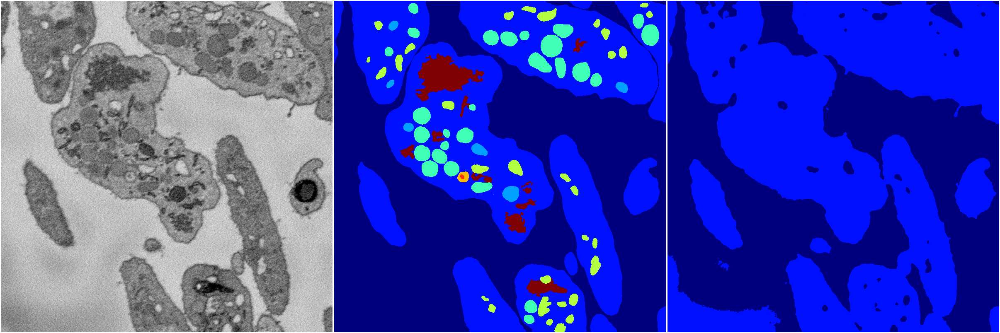
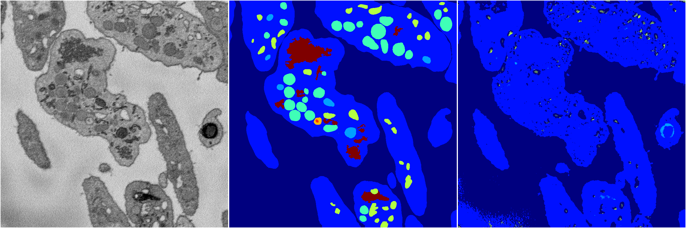
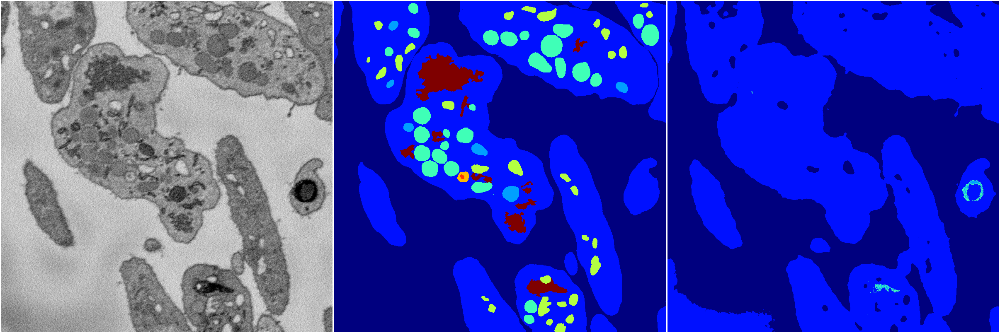
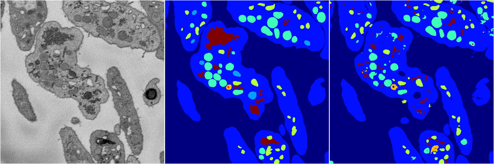

[Back](..)&nbsp;&nbsp;&nbsp;&nbsp;&nbsp;[Home](https://leapmanlab.github.io/snapshots)

---

<a href="4"><h2>random_2d_ed / 1216 / 16 / 4</h2></a>
Created 17 Dec 2018, 02:57:38

<i>Click for more details</i>

**ari**: 0.6146. **miou**: 0.2029. **accuracy**: 0.8451. **n_params**: 2729279.0000. 

---

<a href="3"><h2>random_2d_ed / 1216 / 16 / 3</h2></a>
Created 17 Dec 2018, 02:57:38

<i>Click for more details</i>

**ari**: 0.7981. **miou**: 0.5632. **accuracy**: 0.9133. **n_params**: 2729279.0000. 

---

<a href="2"><h2>random_2d_ed / 1216 / 16 / 2</h2></a>
Created 17 Dec 2018, 02:57:37

<i>Click for more details</i>

**ari**: 0.5881. **miou**: 0.2040. **accuracy**: 0.8329. **n_params**: 2729279.0000. 

---

<a href="1"><h2>random_2d_ed / 1216 / 16 / 1</h2></a>
Created 17 Dec 2018, 02:57:37

<i>Click for more details</i>

**ari**: 0.6292. **miou**: 0.2049. **accuracy**: 0.8484. **n_params**: 2729279.0000. 

---

<a href="0"><h2>random_2d_ed / 1216 / 16 / 0</h2></a>
Created 17 Dec 2018, 02:57:37

<i>Click for more details</i>

**ari**: 0.7816. **miou**: 0.4289. **accuracy**: 0.9042. **n_params**: 2729279.0000. 

---

[Back](..)&nbsp;&nbsp;&nbsp;&nbsp;&nbsp;[Home](https://leapmanlab.github.io/snapshots)

---