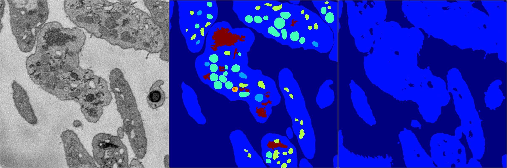
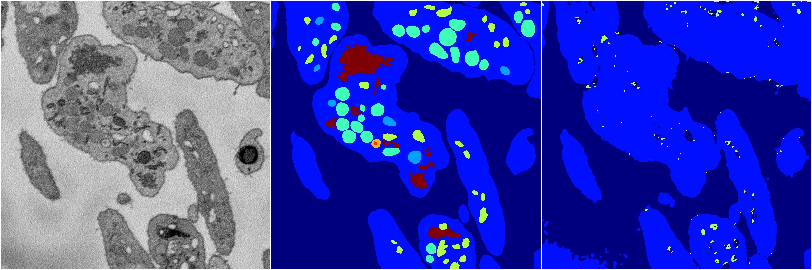

[Back](..)&nbsp;&nbsp;&nbsp;&nbsp;&nbsp;[Home](https://leapmanlab.github.io/snapshots)

---

<a href="4"><h2>random_2d_ed / 1216 / 17 / 4</h2></a>
Created 17 Dec 2018, 02:57:38

<i>Click for more details</i>

**ari**: 0.5330. **miou**: 0.2385. **accuracy**: 0.8594. **n_params**: 4738752.0000. 

---

<a href="3"><h2>random_2d_ed / 1216 / 17 / 3</h2></a>
Created 17 Dec 2018, 02:57:38

<i>Click for more details</i>

**ari**: 0.5118. **miou**: 0.2095. **accuracy**: 0.8634. **n_params**: 4738752.0000. 

---

<a href="2"><h2>random_2d_ed / 1216 / 17 / 2</h2></a>
Created 17 Dec 2018, 02:57:38

<i>Click for more details</i>

**ari**: 0.5145. **miou**: 0.2040. **accuracy**: 0.8520. **n_params**: 4738752.0000. 

---

<a href="0"><h2>random_2d_ed / 1216 / 17 / 0</h2></a>
Created 17 Dec 2018, 02:57:38

<i>Click for more details</i>

**ari**: 0.5143. **miou**: 0.2058. **accuracy**: 0.8553. **n_params**: 4738752.0000. 

---

<a href="1"><h2>random_2d_ed / 1216 / 17 / 1</h2></a>
Created 17 Dec 2018, 02:57:38

<i>Click for more details</i>

**ari**: 0.5245. **miou**: 0.2275. **accuracy**: 0.8623. **n_params**: 4738752.0000. 

---

[Back](..)&nbsp;&nbsp;&nbsp;&nbsp;&nbsp;[Home](https://leapmanlab.github.io/snapshots)

---