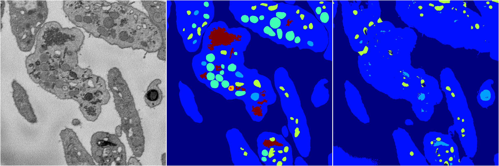
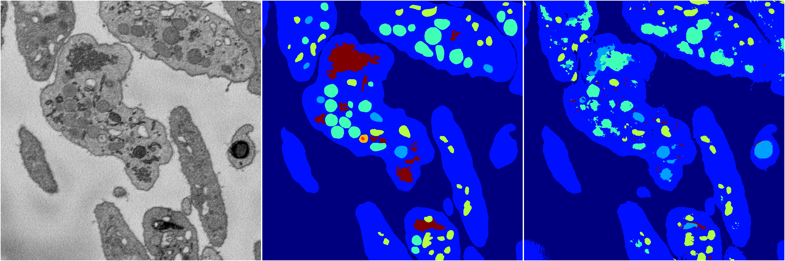
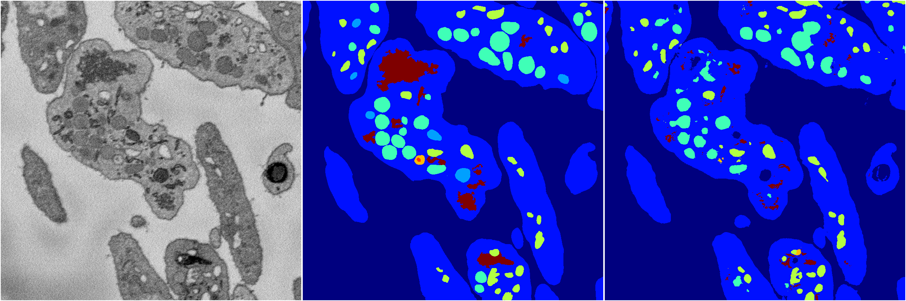
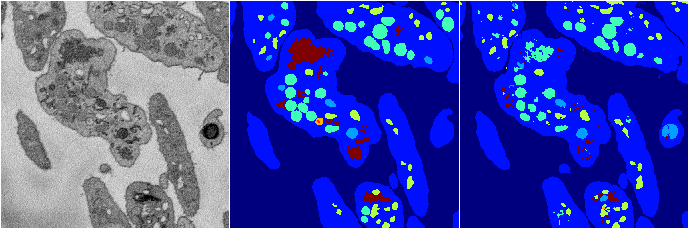

[Back](..)&nbsp;&nbsp;&nbsp;&nbsp;&nbsp;[Home](https://leapmanlab.github.io/snapshots)

---

<a href="4"><h2>random_2d_ed / 1216 / 18 / 4</h2></a>
Created 17 Dec 2018, 02:57:38

<i>Click for more details</i>

**ari**: 0.7159. **miou**: 0.2915. **accuracy**: 0.8802. **n_params**: 17558442.0000. 

---

<a href="3"><h2>random_2d_ed / 1216 / 18 / 3</h2></a>
Created 17 Dec 2018, 02:57:38

<i>Click for more details</i>

**ari**: 0.7905. **miou**: 0.3859. **accuracy**: 0.9012. **n_params**: 17558442.0000. 

---

<a href="2"><h2>random_2d_ed / 1216 / 18 / 2</h2></a>
Created 17 Dec 2018, 02:57:38

<i>Click for more details</i>

**ari**: 0.7972. **miou**: 0.4954. **accuracy**: 0.9108. **n_params**: 17558442.0000. 

---

<a href="1"><h2>random_2d_ed / 1216 / 18 / 1</h2></a>
Created 17 Dec 2018, 02:57:38

<i>Click for more details</i>

**ari**: 0.8145. **miou**: 0.5440. **accuracy**: 0.9188. **n_params**: 17558442.0000. 

---

<a href="0"><h2>random_2d_ed / 1216 / 18 / 0</h2></a>
Created 17 Dec 2018, 02:57:38

<i>Click for more details</i>

**ari**: 0.8052. **miou**: 0.4969. **accuracy**: 0.9133. **n_params**: 17558442.0000. 

---

[Back](..)&nbsp;&nbsp;&nbsp;&nbsp;&nbsp;[Home](https://leapmanlab.github.io/snapshots)

---