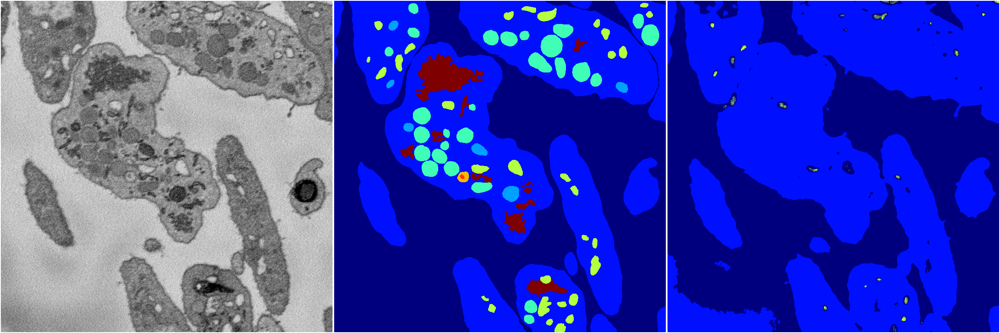
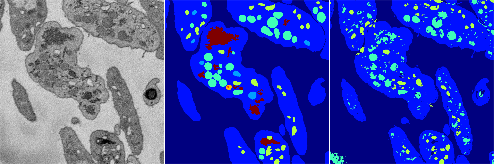
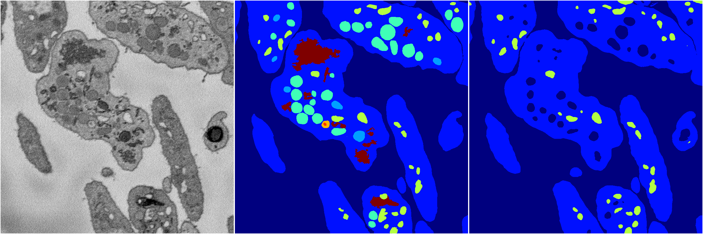

[Back](..)&nbsp;&nbsp;&nbsp;&nbsp;&nbsp;[Home](https://leapmanlab.github.io/snapshots)

---

<a href="4"><h2>random_2d_ed / 1216 / 19 / 4</h2></a>
Created 21 Dec 2018, 14:17:42

<i>Click for more details</i>

**ari**: 0.7565. **miou**: 0.3491. **accuracy**: 0.8947. **n_params**: 2651161.0000. 

---

<a href="3"><h2>random_2d_ed / 1216 / 19 / 3</h2></a>
Created 21 Dec 2018, 14:17:42

<i>Click for more details</i>

**ari**: 0.6400. **miou**: 0.2128. **accuracy**: 0.8587. **n_params**: 2651161.0000. 

---

<a href="2"><h2>random_2d_ed / 1216 / 19 / 2</h2></a>
Created 21 Dec 2018, 14:17:42

<i>Click for more details</i>

**ari**: 0.7915. **miou**: 0.3669. **accuracy**: 0.9050. **n_params**: 2651161.0000. 

---

<a href="1"><h2>random_2d_ed / 1216 / 19 / 1</h2></a>
Created 21 Dec 2018, 14:17:42

<i>Click for more details</i>

**ari**: 0.7463. **miou**: 0.3192. **accuracy**: 0.8820. **n_params**: 2651161.0000. 

---

<a href="0"><h2>random_2d_ed / 1216 / 19 / 0</h2></a>
Created 21 Dec 2018, 14:17:42

<i>Click for more details</i>

**ari**: 0.7602. **miou**: 0.2999. **accuracy**: 0.8961. **n_params**: 2651161.0000. 

---

[Back](..)&nbsp;&nbsp;&nbsp;&nbsp;&nbsp;[Home](https://leapmanlab.github.io/snapshots)

---