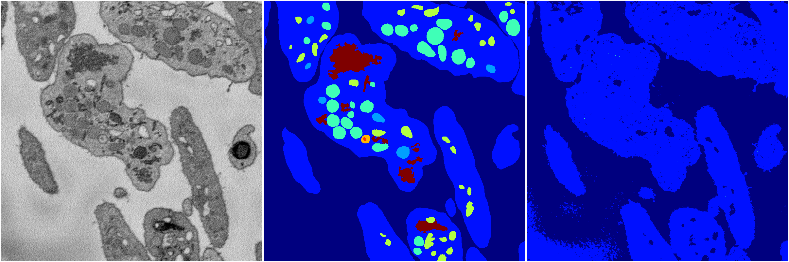
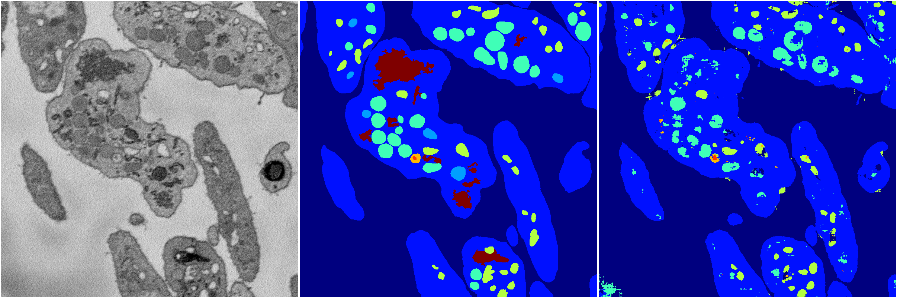
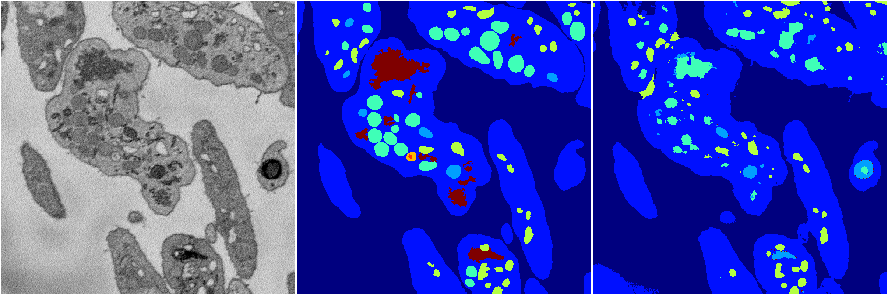

[Back](..)&nbsp;&nbsp;&nbsp;&nbsp;&nbsp;[Home](https://leapmanlab.github.io/snapshots)

---

<a href="4"><h2>random_2d_ed / 1216 / 2 / 4</h2></a>
Created 21 Dec 2018, 14:17:41

<i>Click for more details</i>

**ari**: 0.6126. **miou**: 0.2018. **accuracy**: 0.8489. **n_params**: 10570496.0000. 

---

<a href="0"><h2>random_2d_ed / 1216 / 2 / 0</h2></a>
Created 21 Dec 2018, 14:17:41

<i>Click for more details</i>

**ari**: 0.7628. **miou**: 0.3823. **accuracy**: 0.8943. **n_params**: 10570496.0000. 

---

<a href="2"><h2>random_2d_ed / 1216 / 2 / 2</h2></a>
Created 21 Dec 2018, 14:17:41

<i>Click for more details</i>

**ari**: 0.6081. **miou**: 0.2035. **accuracy**: 0.8473. **n_params**: 10570496.0000. 

---

<a href="1"><h2>random_2d_ed / 1216 / 2 / 1</h2></a>
Created 21 Dec 2018, 14:17:41

<i>Click for more details</i>

**ari**: 0.7545. **miou**: 0.3598. **accuracy**: 0.8901. **n_params**: 10570496.0000. 

---

<a href="3"><h2>random_2d_ed / 1216 / 2 / 3</h2></a>
Created 21 Dec 2018, 14:17:41

<i>Click for more details</i>

**ari**: 0.8087. **miou**: 0.4978. **accuracy**: 0.9174. **n_params**: 10570496.0000. 

---

[Back](..)&nbsp;&nbsp;&nbsp;&nbsp;&nbsp;[Home](https://leapmanlab.github.io/snapshots)

---