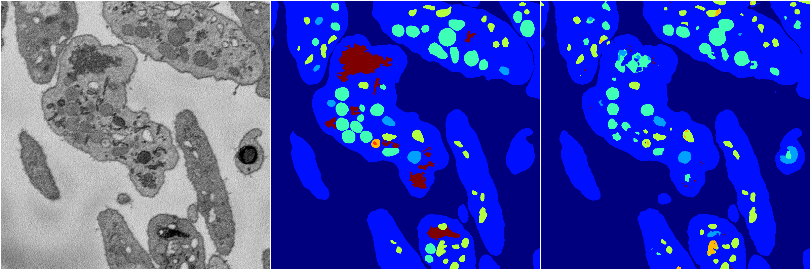
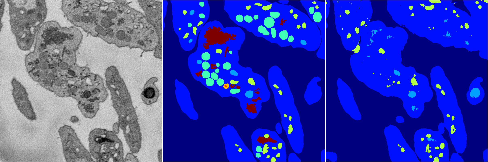
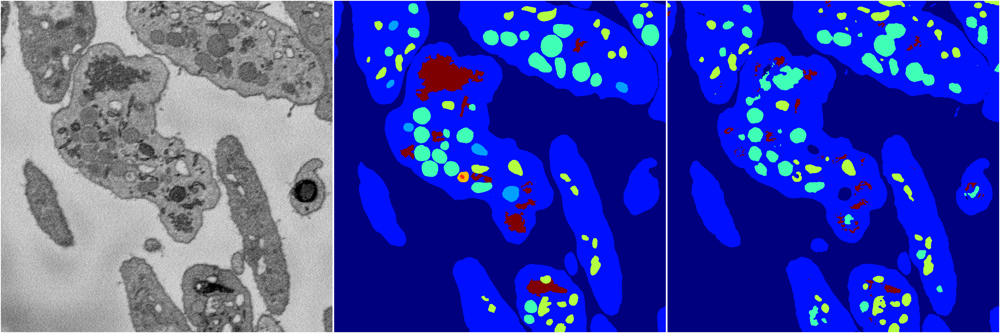
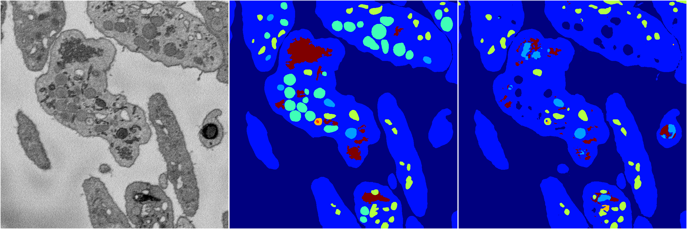

[Back](..)&nbsp;&nbsp;&nbsp;&nbsp;&nbsp;[Home](https://leapmanlab.github.io/snapshots)

---

<a href="3"><h2>random_2d_ed / 1216 / 20 / 3</h2></a>
Created 17 Dec 2018, 23:35:09

<i>Click for more details</i>

**ari**: 0.8189. **miou**: 0.4828. **accuracy**: 0.9241. **n_params**: 12901938.0000. 

---

<a href="4"><h2>random_2d_ed / 1216 / 20 / 4</h2></a>
Created 17 Dec 2018, 23:35:09

<i>Click for more details</i>

**ari**: 0.7593. **miou**: 0.3270. **accuracy**: 0.9014. **n_params**: 12901938.0000. 

---

<a href="2"><h2>random_2d_ed / 1216 / 20 / 2</h2></a>
Created 17 Dec 2018, 23:35:09

<i>Click for more details</i>

**ari**: 0.8026. **miou**: 0.3856. **accuracy**: 0.9164. **n_params**: 12901938.0000. 

---

<a href="1"><h2>random_2d_ed / 1216 / 20 / 1</h2></a>
Created 17 Dec 2018, 23:35:09

<i>Click for more details</i>

**ari**: 0.7916. **miou**: 0.4055. **accuracy**: 0.9107. **n_params**: 12901938.0000. 

---

<a href="0"><h2>random_2d_ed / 1216 / 20 / 0</h2></a>
Created 17 Dec 2018, 23:35:09

<i>Click for more details</i>

**ari**: 0.8138. **miou**: 0.5073. **accuracy**: 0.9218. **n_params**: 12901938.0000. 

---

[Back](..)&nbsp;&nbsp;&nbsp;&nbsp;&nbsp;[Home](https://leapmanlab.github.io/snapshots)

---