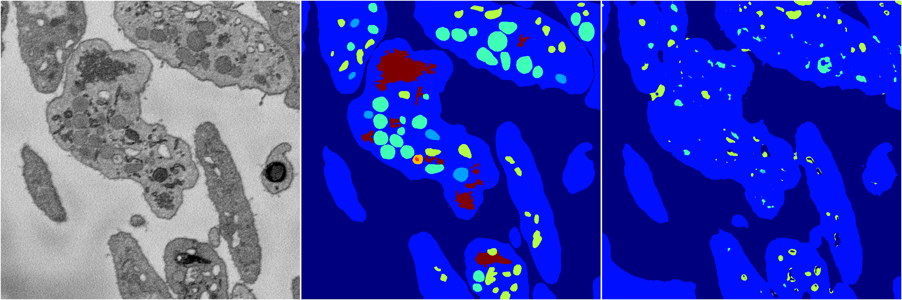
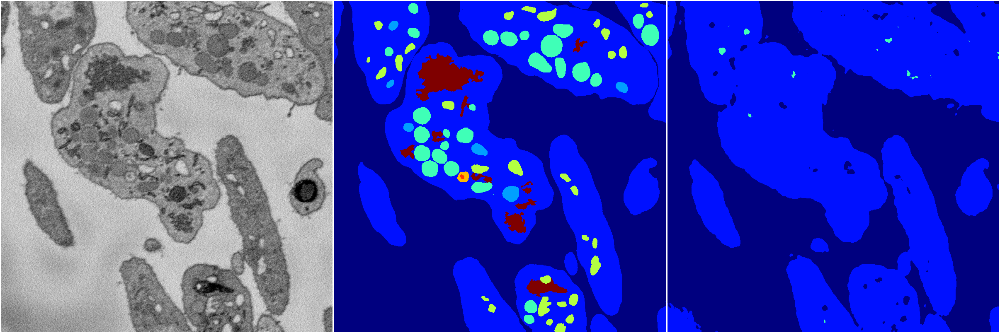
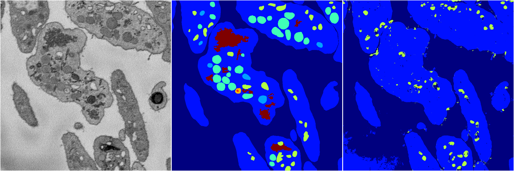
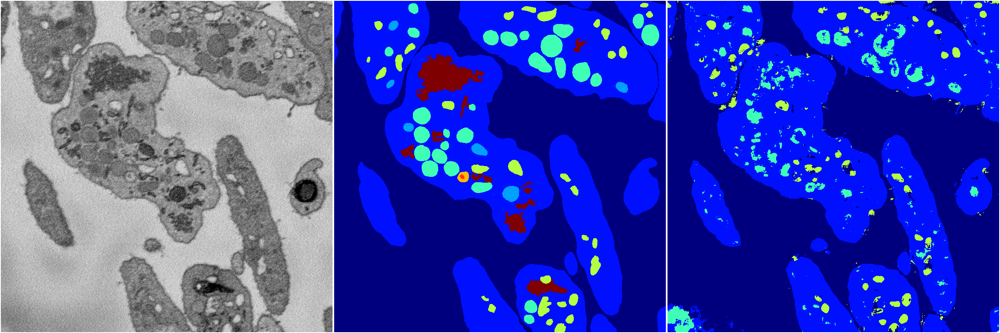

[Back](..)&nbsp;&nbsp;&nbsp;&nbsp;&nbsp;[Home](https://leapmanlab.github.io/snapshots)

---

<a href="4"><h2>random_2d_ed / 1216 / 21 / 4</h2></a>
Created 21 Dec 2018, 14:17:42

<i>Click for more details</i>

**ari**: 0.7143. **miou**: 0.2693. **accuracy**: 0.8788. **n_params**: 2459732.0000. 

---

<a href="3"><h2>random_2d_ed / 1216 / 21 / 3</h2></a>
Created 21 Dec 2018, 14:17:42

<i>Click for more details</i>

**ari**: 0.7329. **miou**: 0.2471. **accuracy**: 0.8840. **n_params**: 2459732.0000. 

---

<a href="2"><h2>random_2d_ed / 1216 / 21 / 2</h2></a>
Created 21 Dec 2018, 14:17:42

<i>Click for more details</i>

**ari**: 0.6942. **miou**: 0.2667. **accuracy**: 0.8751. **n_params**: 2459732.0000. 

---

<a href="1"><h2>random_2d_ed / 1216 / 21 / 1</h2></a>
Created 21 Dec 2018, 14:17:42

<i>Click for more details</i>

**ari**: 0.7512. **miou**: 0.3057. **accuracy**: 0.8882. **n_params**: 2459732.0000. 

---

<a href="0"><h2>random_2d_ed / 1216 / 21 / 0</h2></a>
Created 21 Dec 2018, 14:17:42

<i>Click for more details</i>

**ari**: 0.7559. **miou**: 0.3620. **accuracy**: 0.8896. **n_params**: 2459732.0000. 

---

[Back](..)&nbsp;&nbsp;&nbsp;&nbsp;&nbsp;[Home](https://leapmanlab.github.io/snapshots)

---