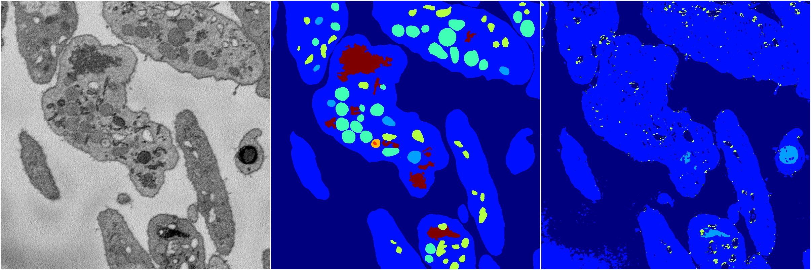
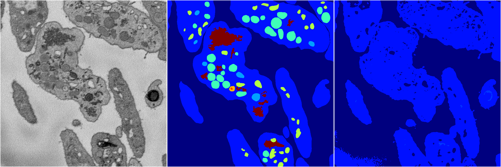
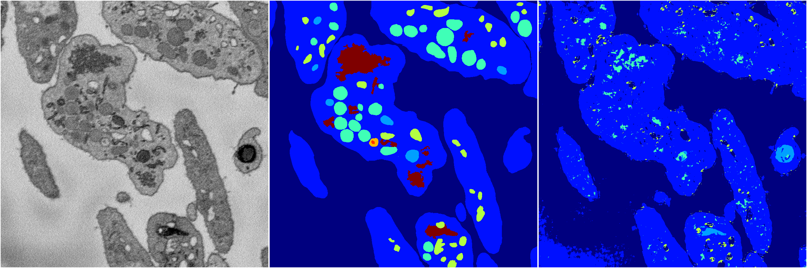

[Back](..)&nbsp;&nbsp;&nbsp;&nbsp;&nbsp;[Home](https://leapmanlab.github.io/snapshots)

---

<a href="4"><h2>random_2d_ed / 1216 / 22 / 4</h2></a>
Created 17 Dec 2018, 23:35:08

<i>Click for more details</i>

**ari**: 0.5868. **miou**: 0.2327. **accuracy**: 0.8533. **n_params**: 17463387.0000. 

---

<a href="3"><h2>random_2d_ed / 1216 / 22 / 3</h2></a>
Created 17 Dec 2018, 23:35:08

<i>Click for more details</i>

**ari**: 0.5660. **miou**: 0.2038. **accuracy**: 0.8509. **n_params**: 17463387.0000. 

---

<a href="1"><h2>random_2d_ed / 1216 / 22 / 1</h2></a>
Created 17 Dec 2018, 23:35:08

<i>Click for more details</i>

**ari**: 0.5953. **miou**: 0.2407. **accuracy**: 0.8513. **n_params**: 17463387.0000. 

---

<a href="0"><h2>random_2d_ed / 1216 / 22 / 0</h2></a>
Created 17 Dec 2018, 23:35:08

<i>Click for more details</i>

**ari**: 0.7662. **miou**: 0.3786. **accuracy**: 0.9129. **n_params**: 17463387.0000. 

---

[Back](..)&nbsp;&nbsp;&nbsp;&nbsp;&nbsp;[Home](https://leapmanlab.github.io/snapshots)

---