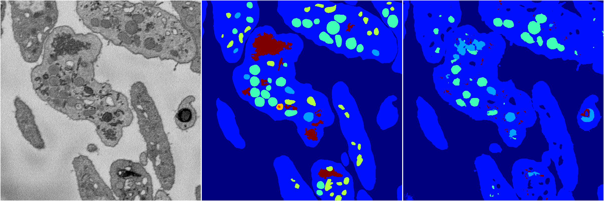
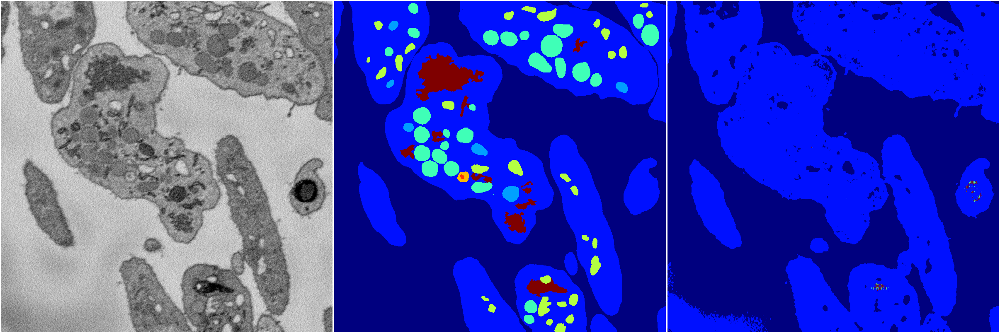
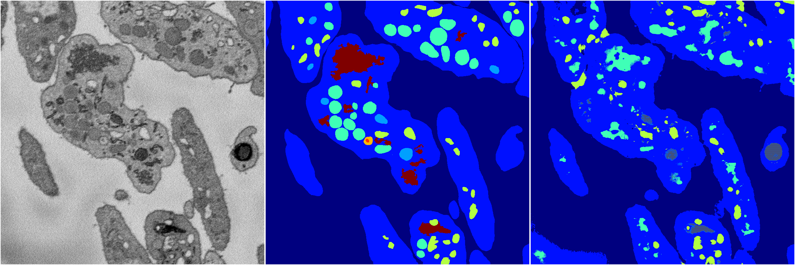

[Back](..)&nbsp;&nbsp;&nbsp;&nbsp;&nbsp;[Home](https://leapmanlab.github.io/snapshots)

---

<a href="2"><h2>random_2d_ed / 1216 / 24 / 2</h2></a>
Created 21 Dec 2018, 01:15:55

<i>Click for more details</i>

**ari**: 0.7101. **miou**: 0.3419. **accuracy**: 0.8824. **n_params**: 2595144.0000. 

---

<a href="0"><h2>random_2d_ed / 1216 / 24 / 0</h2></a>
Created 21 Dec 2018, 01:15:55

<i>Click for more details</i>

**ari**: 0.6630. **miou**: 0.2074. **accuracy**: 0.8642. **n_params**: 2595144.0000. 

---

<a href="3"><h2>random_2d_ed / 1216 / 24 / 3</h2></a>
Created 21 Dec 2018, 01:15:55

<i>Click for more details</i>

**ari**: 0.7437. **miou**: 0.3213. **accuracy**: 0.8782. **n_params**: 2595144.0000. 

---

<a href="1"><h2>random_2d_ed / 1216 / 24 / 1</h2></a>
Created 21 Dec 2018, 01:15:55

<i>Click for more details</i>

**ari**: 0.8096. **miou**: 0.4809. **accuracy**: 0.9174. **n_params**: 2595144.0000. 

---

<a href="4"><h2>random_2d_ed / 1216 / 24 / 4</h2></a>
Created 21 Dec 2018, 01:15:55

<i>Click for more details</i>

**ari**: 0.7421. **miou**: 0.3067. **accuracy**: 0.8791. **n_params**: 2595144.0000. 

---

[Back](..)&nbsp;&nbsp;&nbsp;&nbsp;&nbsp;[Home](https://leapmanlab.github.io/snapshots)

---