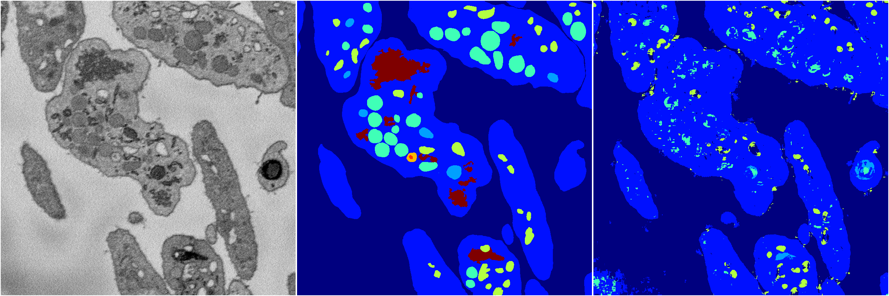
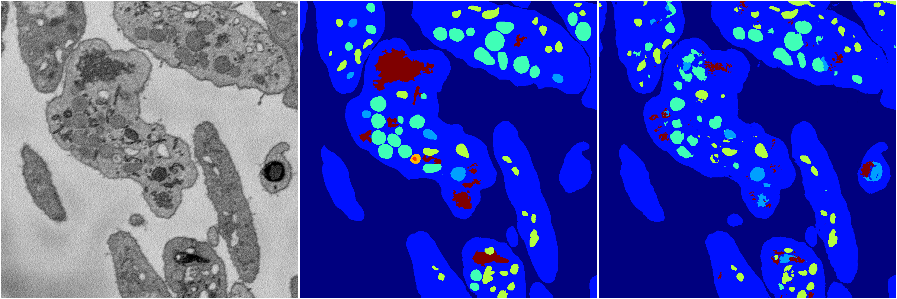
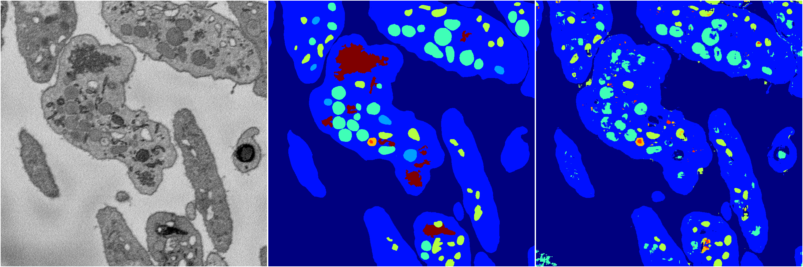
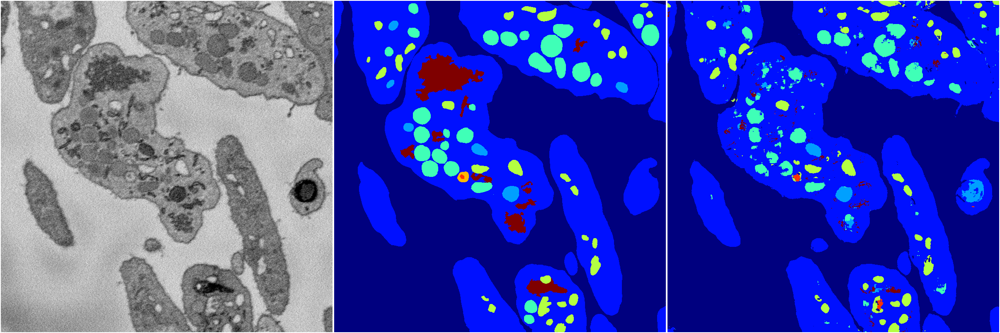
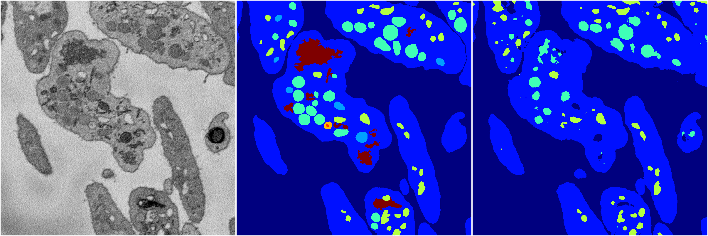

[Back](..)&nbsp;&nbsp;&nbsp;&nbsp;&nbsp;[Home](https://leapmanlab.github.io/snapshots)

---

<a href="0"><h2>random_2d_ed / 1216 / 25 / 0</h2></a>
Created 21 Dec 2018, 01:15:55

<i>Click for more details</i>

**ari**: 0.6897. **miou**: 0.2845. **accuracy**: 0.8753. **n_params**: 10166160.0000. 

---

<a href="3"><h2>random_2d_ed / 1216 / 25 / 3</h2></a>
Created 21 Dec 2018, 01:15:55

<i>Click for more details</i>

**ari**: 0.7873. **miou**: 0.4392. **accuracy**: 0.9119. **n_params**: 10166160.0000. 

---

<a href="1"><h2>random_2d_ed / 1216 / 25 / 1</h2></a>
Created 21 Dec 2018, 01:15:55

<i>Click for more details</i>

**ari**: 0.7390. **miou**: 0.3686. **accuracy**: 0.8886. **n_params**: 10166160.0000. 

---

<a href="4"><h2>random_2d_ed / 1216 / 25 / 4</h2></a>
Created 21 Dec 2018, 01:15:55

<i>Click for more details</i>

**ari**: 0.7752. **miou**: 0.4412. **accuracy**: 0.9061. **n_params**: 10166160.0000. 

---

<a href="2"><h2>random_2d_ed / 1216 / 25 / 2</h2></a>
Created 21 Dec 2018, 01:15:55

<i>Click for more details</i>

**ari**: 0.7525. **miou**: 0.3392. **accuracy**: 0.8971. **n_params**: 10166160.0000. 

---

[Back](..)&nbsp;&nbsp;&nbsp;&nbsp;&nbsp;[Home](https://leapmanlab.github.io/snapshots)

---