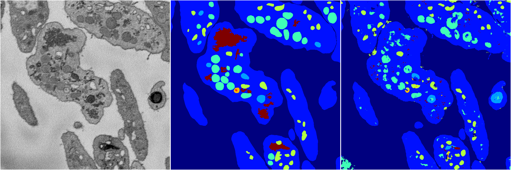
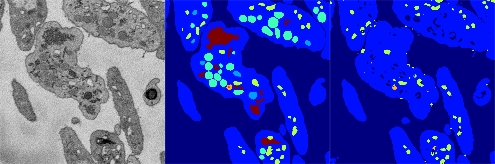
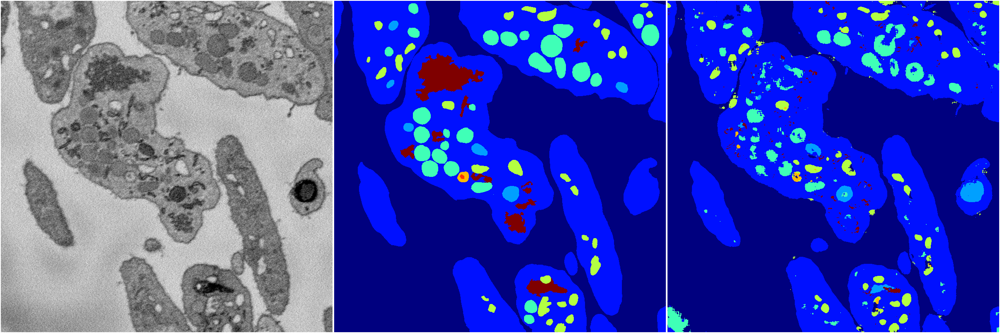
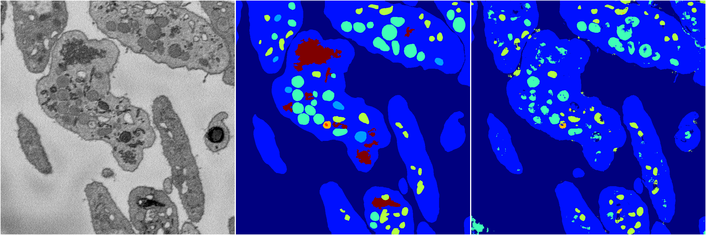

[Back](..)&nbsp;&nbsp;&nbsp;&nbsp;&nbsp;[Home](https://leapmanlab.github.io/snapshots)

---

<a href="0"><h2>random_2d_ed / 1216 / 26 / 0</h2></a>
Created 21 Dec 2018, 01:15:55

<i>Click for more details</i>

**ari**: 0.7574. **miou**: 0.4243. **accuracy**: 0.8885. **n_params**: 864610.0000. 

---

<a href="3"><h2>random_2d_ed / 1216 / 26 / 3</h2></a>
Created 21 Dec 2018, 01:15:55

<i>Click for more details</i>

**ari**: 0.6943. **miou**: 0.3081. **accuracy**: 0.8657. **n_params**: 864610.0000. 

---

<a href="1"><h2>random_2d_ed / 1216 / 26 / 1</h2></a>
Created 21 Dec 2018, 01:15:55

<i>Click for more details</i>

**ari**: 0.7573. **miou**: 0.4291. **accuracy**: 0.8896. **n_params**: 864610.0000. 

---

<a href="4"><h2>random_2d_ed / 1216 / 26 / 4</h2></a>
Created 21 Dec 2018, 01:15:55

<i>Click for more details</i>

**ari**: 0.7408. **miou**: 0.3603. **accuracy**: 0.8804. **n_params**: 864610.0000. 

---

<a href="2"><h2>random_2d_ed / 1216 / 26 / 2</h2></a>
Created 21 Dec 2018, 01:15:55

<i>Click for more details</i>

**ari**: 0.7613. **miou**: 0.4433. **accuracy**: 0.8891. **n_params**: 864610.0000. 

---

[Back](..)&nbsp;&nbsp;&nbsp;&nbsp;&nbsp;[Home](https://leapmanlab.github.io/snapshots)

---