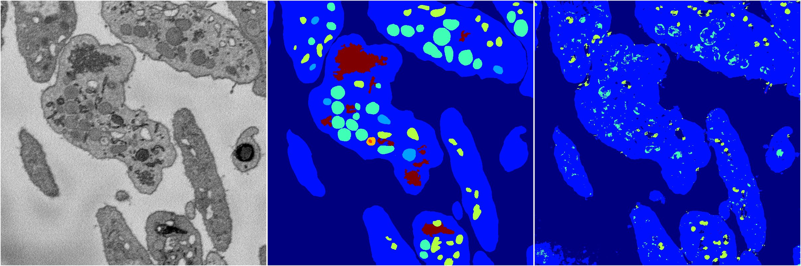
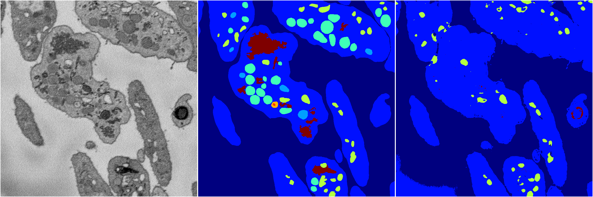
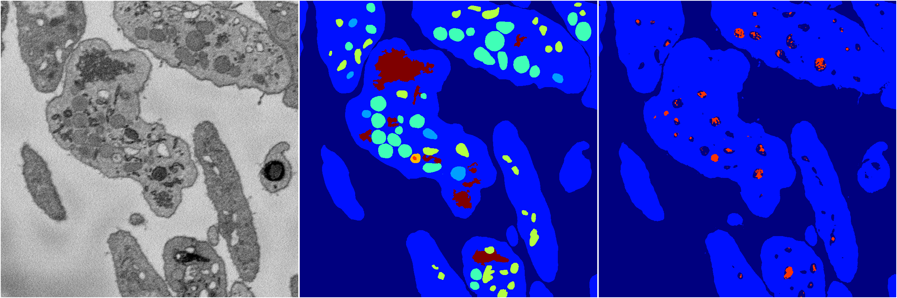
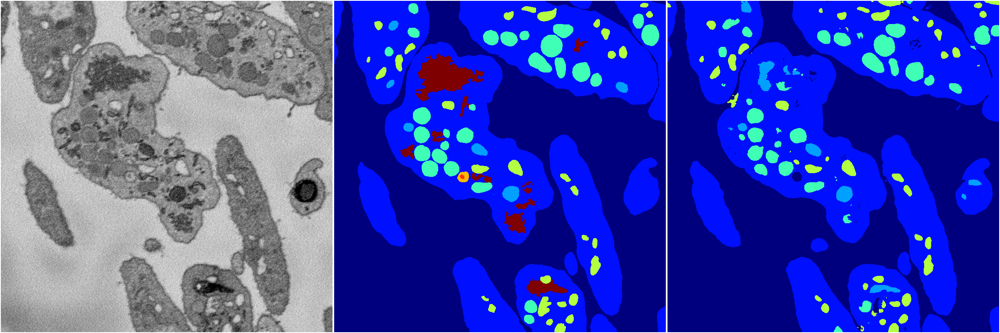

[Back](..)&nbsp;&nbsp;&nbsp;&nbsp;&nbsp;[Home](https://leapmanlab.github.io/snapshots)

---

<a href="4"><h2>random_2d_ed / 1216 / 27 / 4</h2></a>
Created 21 Dec 2018, 14:17:42

<i>Click for more details</i>

**ari**: 0.7256. **miou**: 0.5195. **accuracy**: 0.8926. **n_params**: 2348709.0000. 

---

<a href="3"><h2>random_2d_ed / 1216 / 27 / 3</h2></a>
Created 21 Dec 2018, 14:17:42

<i>Click for more details</i>

**ari**: 0.7109. **miou**: 0.2689. **accuracy**: 0.8755. **n_params**: 2348709.0000. 

---

<a href="2"><h2>random_2d_ed / 1216 / 27 / 2</h2></a>
Created 21 Dec 2018, 14:17:42

<i>Click for more details</i>

**ari**: 0.7180. **miou**: 0.2799. **accuracy**: 0.8850. **n_params**: 2348709.0000. 

---

<a href="1"><h2>random_2d_ed / 1216 / 27 / 1</h2></a>
Created 21 Dec 2018, 14:17:42

<i>Click for more details</i>

**ari**: 0.7348. **miou**: 0.2218. **accuracy**: 0.8830. **n_params**: 2348709.0000. 

---

<a href="0"><h2>random_2d_ed / 1216 / 27 / 0</h2></a>
Created 21 Dec 2018, 14:17:42

<i>Click for more details</i>

**ari**: 0.8162. **miou**: 0.4432. **accuracy**: 0.9208. **n_params**: 2348709.0000. 

---

[Back](..)&nbsp;&nbsp;&nbsp;&nbsp;&nbsp;[Home](https://leapmanlab.github.io/snapshots)

---