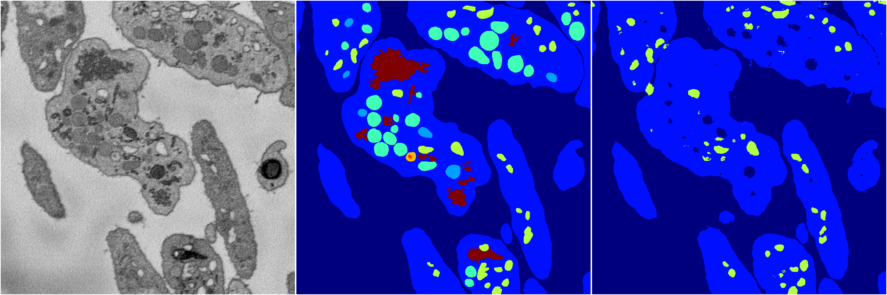
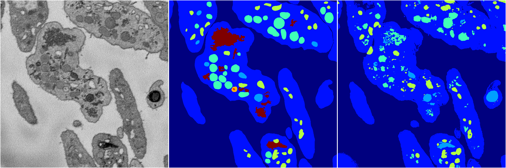

[Back](..)&nbsp;&nbsp;&nbsp;&nbsp;&nbsp;[Home](https://leapmanlab.github.io/snapshots)

---

<a href="3"><h2>random_2d_ed / 1216 / 28 / 3</h2></a>
Created 21 Dec 2018, 01:15:55

<i>Click for more details</i>

**ari**: 0.6014. **miou**: 0.2412. **accuracy**: 0.8602. **n_params**: 2168126.0000. 

---

<a href="1"><h2>random_2d_ed / 1216 / 28 / 1</h2></a>
Created 21 Dec 2018, 01:15:55

<i>Click for more details</i>

**ari**: 0.6529. **miou**: 0.2729. **accuracy**: 0.8746. **n_params**: 2168126.0000. 

---

<a href="4"><h2>random_2d_ed / 1216 / 28 / 4</h2></a>
Created 21 Dec 2018, 01:15:55

<i>Click for more details</i>

**ari**: 0.6946. **miou**: 0.2888. **accuracy**: 0.8849. **n_params**: 2168126.0000. 

---

<a href="2"><h2>random_2d_ed / 1216 / 28 / 2</h2></a>
Created 21 Dec 2018, 01:15:55

<i>Click for more details</i>

**ari**: 0.6798. **miou**: 0.3491. **accuracy**: 0.8733. **n_params**: 2168126.0000. 

---

<a href="0"><h2>random_2d_ed / 1216 / 28 / 0</h2></a>
Created 21 Dec 2018, 01:15:55

<i>Click for more details</i>

**ari**: 0.7481. **miou**: 0.3988. **accuracy**: 0.9016. **n_params**: 2168126.0000. 

---

[Back](..)&nbsp;&nbsp;&nbsp;&nbsp;&nbsp;[Home](https://leapmanlab.github.io/snapshots)

---