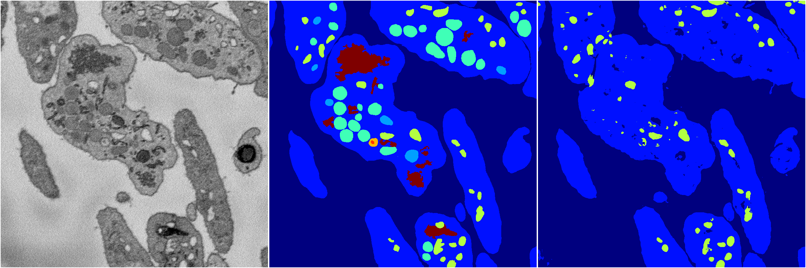
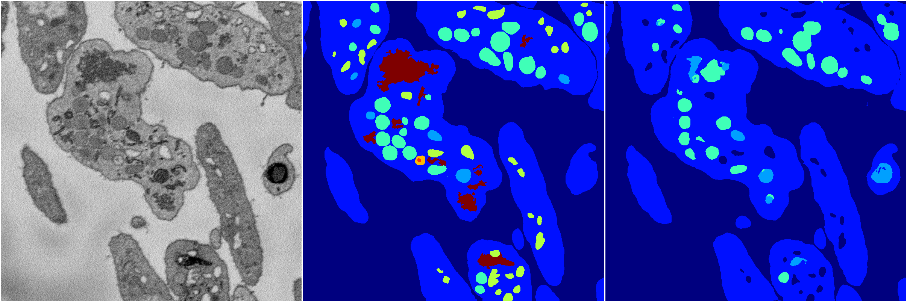
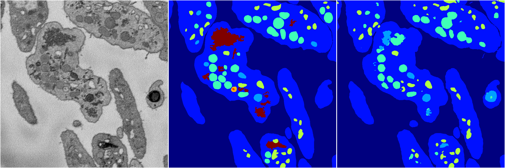

[Back](..)&nbsp;&nbsp;&nbsp;&nbsp;&nbsp;[Home](https://leapmanlab.github.io/snapshots)

---

<a href="3"><h2>random_2d_ed / 1216 / 29 / 3</h2></a>
Created 21 Dec 2018, 01:15:55

<i>Click for more details</i>

**ari**: 0.8074. **miou**: 0.4140. **accuracy**: 0.9108. **n_params**: 6396968.0000. 

---

<a href="1"><h2>random_2d_ed / 1216 / 29 / 1</h2></a>
Created 21 Dec 2018, 01:15:55

<i>Click for more details</i>

**ari**: 0.7344. **miou**: 0.2897. **accuracy**: 0.8879. **n_params**: 6396968.0000. 

---

<a href="4"><h2>random_2d_ed / 1216 / 29 / 4</h2></a>
Created 21 Dec 2018, 01:15:55

<i>Click for more details</i>

**ari**: 0.8010. **miou**: 0.4987. **accuracy**: 0.9088. **n_params**: 6396968.0000. 

---

<a href="2"><h2>random_2d_ed / 1216 / 29 / 2</h2></a>
Created 21 Dec 2018, 01:15:55

<i>Click for more details</i>

**ari**: 0.7775. **miou**: 0.3340. **accuracy**: 0.8992. **n_params**: 6396968.0000. 

---

<a href="0"><h2>random_2d_ed / 1216 / 29 / 0</h2></a>
Created 21 Dec 2018, 01:15:55

<i>Click for more details</i>

**ari**: 0.8131. **miou**: 0.4182. **accuracy**: 0.9139. **n_params**: 6396968.0000. 

---

[Back](..)&nbsp;&nbsp;&nbsp;&nbsp;&nbsp;[Home](https://leapmanlab.github.io/snapshots)

---