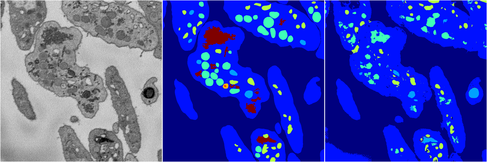
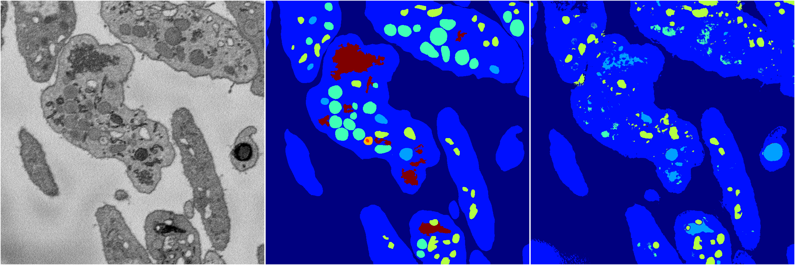
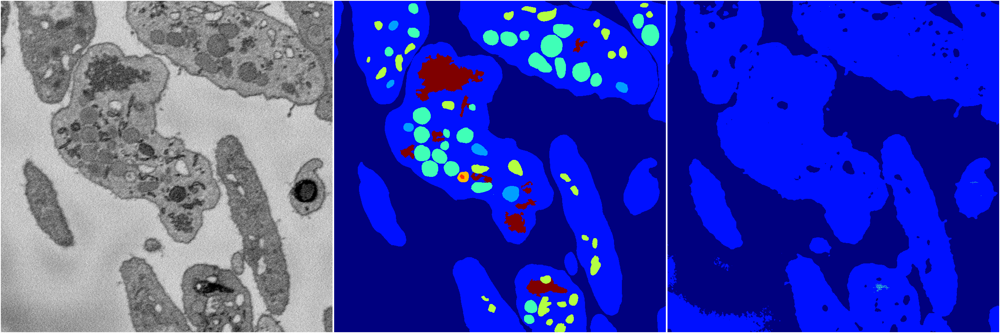

[Back](..)&nbsp;&nbsp;&nbsp;&nbsp;&nbsp;[Home](https://leapmanlab.github.io/snapshots)

---

<a href="4"><h2>random_2d_ed / 1216 / 3 / 4</h2></a>
Created 21 Dec 2018, 14:17:41

<i>Click for more details</i>

**ari**: 0.6847. **miou**: 0.3269. **accuracy**: 0.8665. **n_params**: 12984814.0000. 

---

<a href="3"><h2>random_2d_ed / 1216 / 3 / 3</h2></a>
Created 21 Dec 2018, 14:17:41

<i>Click for more details</i>

**ari**: 0.6174. **miou**: 0.2064. **accuracy**: 0.8530. **n_params**: 12984814.0000. 

---

<a href="1"><h2>random_2d_ed / 1216 / 3 / 1</h2></a>
Created 21 Dec 2018, 14:17:41

<i>Click for more details</i>

**ari**: 0.7753. **miou**: 0.4011. **accuracy**: 0.9033. **n_params**: 12984814.0000. 

---

<a href="2"><h2>random_2d_ed / 1216 / 3 / 2</h2></a>
Created 21 Dec 2018, 14:17:41

<i>Click for more details</i>

**ari**: 0.6911. **miou**: 0.3225. **accuracy**: 0.8725. **n_params**: 12984814.0000. 

---

<a href="0"><h2>random_2d_ed / 1216 / 3 / 0</h2></a>
Created 21 Dec 2018, 14:17:41

<i>Click for more details</i>

**ari**: 0.6047. **miou**: 0.2022. **accuracy**: 0.8499. **n_params**: 12984814.0000. 

---

[Back](..)&nbsp;&nbsp;&nbsp;&nbsp;&nbsp;[Home](https://leapmanlab.github.io/snapshots)

---