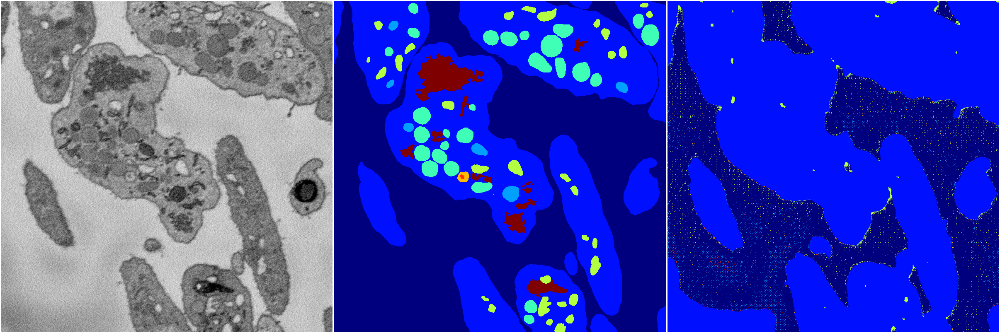
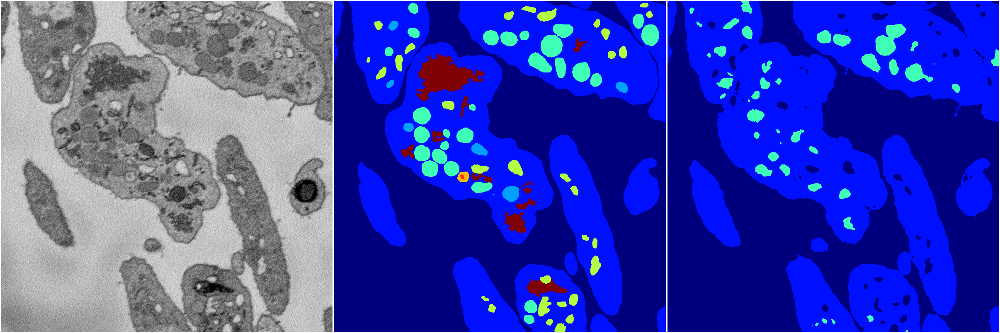
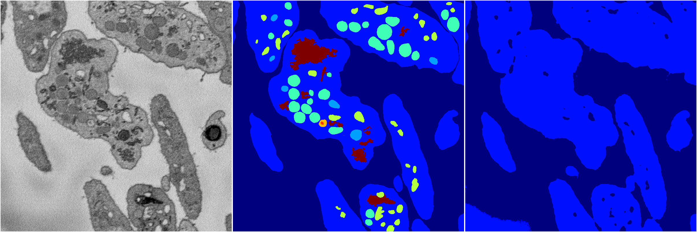

[Back](..)&nbsp;&nbsp;&nbsp;&nbsp;&nbsp;[Home](https://leapmanlab.github.io/snapshots)

---

<a href="0"><h2>random_2d_ed / 1216 / 30 / 0</h2></a>
Created 21 Dec 2018, 01:15:55

<i>Click for more details</i>

**ari**: 0.3476. **miou**: 0.1914. **accuracy**: 0.8027. **n_params**: 3396005.0000. 

---

<a href="3"><h2>random_2d_ed / 1216 / 30 / 3</h2></a>
Created 21 Dec 2018, 01:15:55

<i>Click for more details</i>

**ari**: 0.5615. **miou**: 0.3158. **accuracy**: 0.8643. **n_params**: 3396005.0000. 

---

<a href="1"><h2>random_2d_ed / 1216 / 30 / 1</h2></a>
Created 21 Dec 2018, 01:15:55

<i>Click for more details</i>

**ari**: 0.6673. **miou**: 0.2532. **accuracy**: 0.8755. **n_params**: 3396005.0000. 

---

<a href="4"><h2>random_2d_ed / 1216 / 30 / 4</h2></a>
Created 21 Dec 2018, 01:15:55

<i>Click for more details</i>

**ari**: 0.6721. **miou**: 0.3346. **accuracy**: 0.8892. **n_params**: 3396005.0000. 

---

<a href="2"><h2>random_2d_ed / 1216 / 30 / 2</h2></a>
Created 21 Dec 2018, 01:15:55

<i>Click for more details</i>

**ari**: 0.5911. **miou**: 0.2090. **accuracy**: 0.8625. **n_params**: 3396005.0000. 

---

[Back](..)&nbsp;&nbsp;&nbsp;&nbsp;&nbsp;[Home](https://leapmanlab.github.io/snapshots)

---