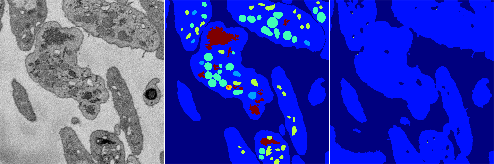
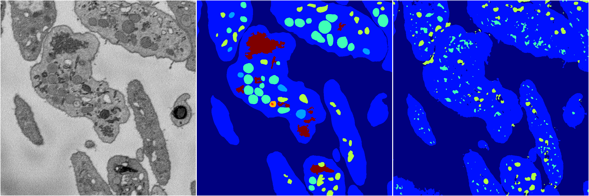
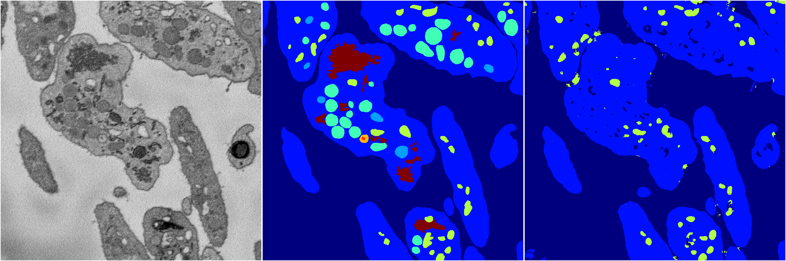
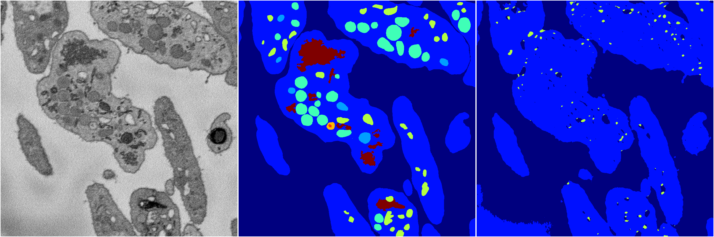

[Back](..)&nbsp;&nbsp;&nbsp;&nbsp;&nbsp;[Home](https://leapmanlab.github.io/snapshots)

---

<a href="4"><h2>random_2d_ed / 1216 / 31 / 4</h2></a>
Created 17 Dec 2018, 23:35:09

<i>Click for more details</i>

**ari**: 0.5971. **miou**: 0.2025. **accuracy**: 0.8376. **n_params**: 308520.0000. 

---

<a href="2"><h2>random_2d_ed / 1216 / 31 / 2</h2></a>
Created 17 Dec 2018, 23:35:09

<i>Click for more details</i>

**ari**: 0.6800. **miou**: 0.2767. **accuracy**: 0.8559. **n_params**: 308520.0000. 

---

<a href="3"><h2>random_2d_ed / 1216 / 31 / 3</h2></a>
Created 17 Dec 2018, 23:35:09

<i>Click for more details</i>

**ari**: 0.6890. **miou**: 0.2766. **accuracy**: 0.8654. **n_params**: 308520.0000. 

---

<a href="1"><h2>random_2d_ed / 1216 / 31 / 1</h2></a>
Created 17 Dec 2018, 23:35:09

<i>Click for more details</i>

**ari**: 0.6122. **miou**: 0.2143. **accuracy**: 0.8400. **n_params**: 308520.0000. 

---

<a href="0"><h2>random_2d_ed / 1216 / 31 / 0</h2></a>
Created 17 Dec 2018, 23:35:09

<i>Click for more details</i>

**ari**: 0.7635. **miou**: 0.4085. **accuracy**: 0.8923. **n_params**: 308520.0000. 

---

[Back](..)&nbsp;&nbsp;&nbsp;&nbsp;&nbsp;[Home](https://leapmanlab.github.io/snapshots)

---